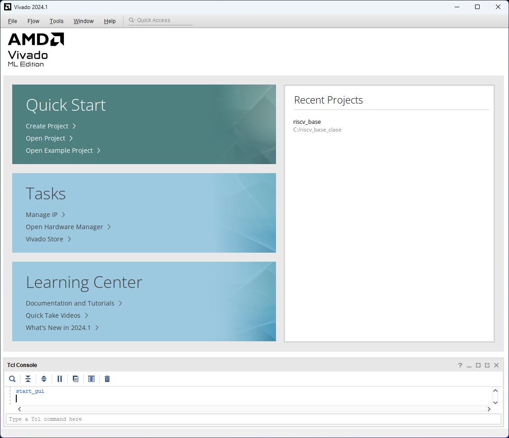
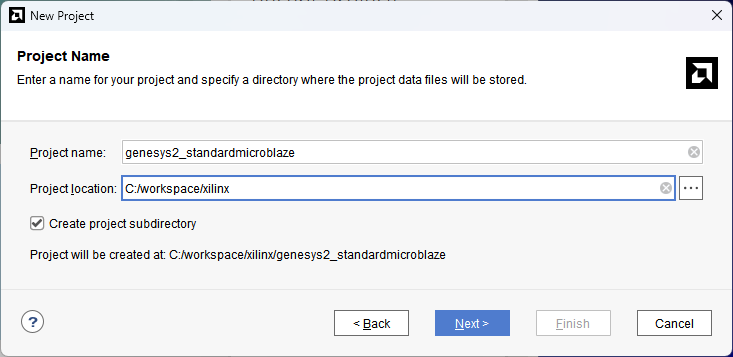
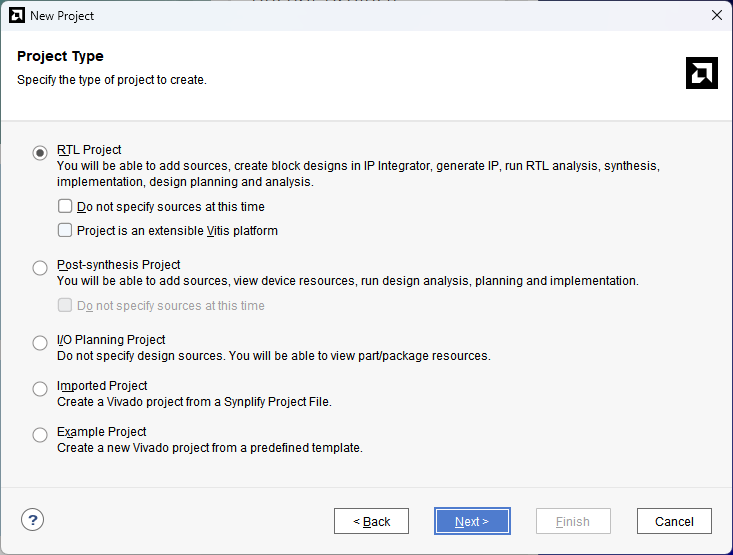
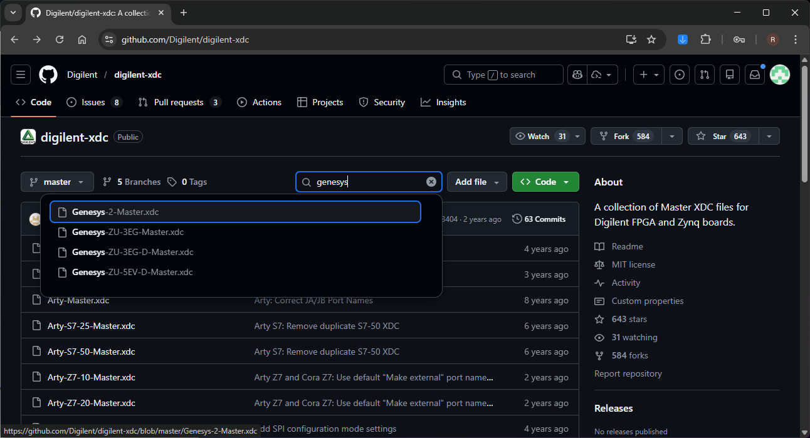
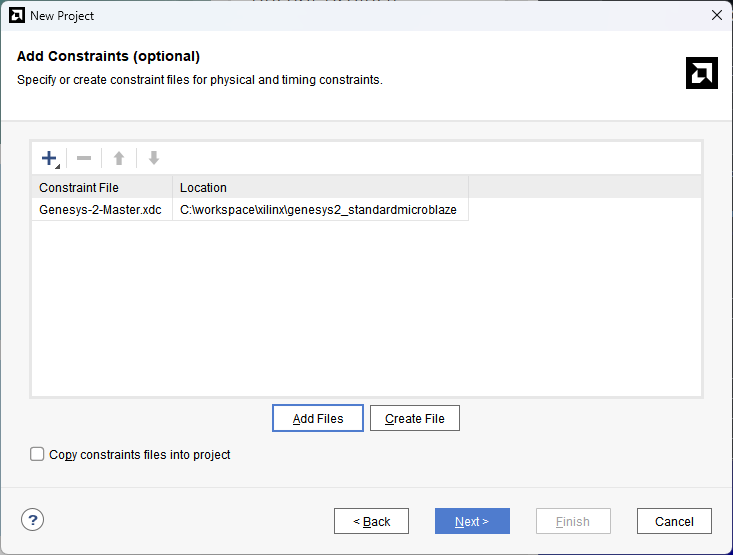
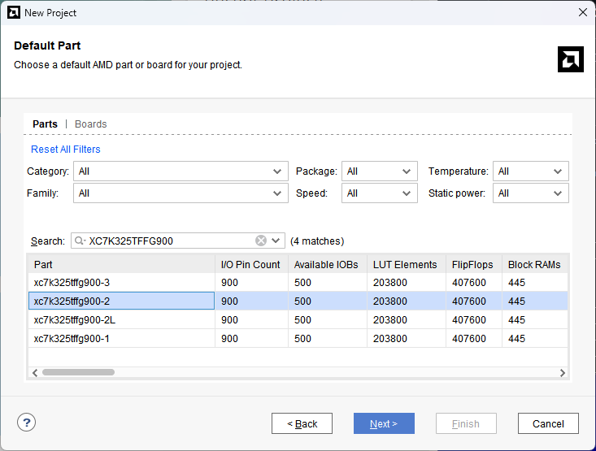
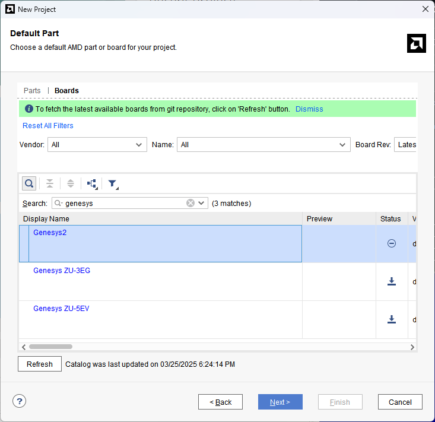
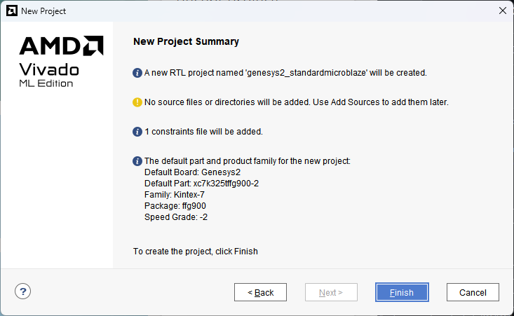
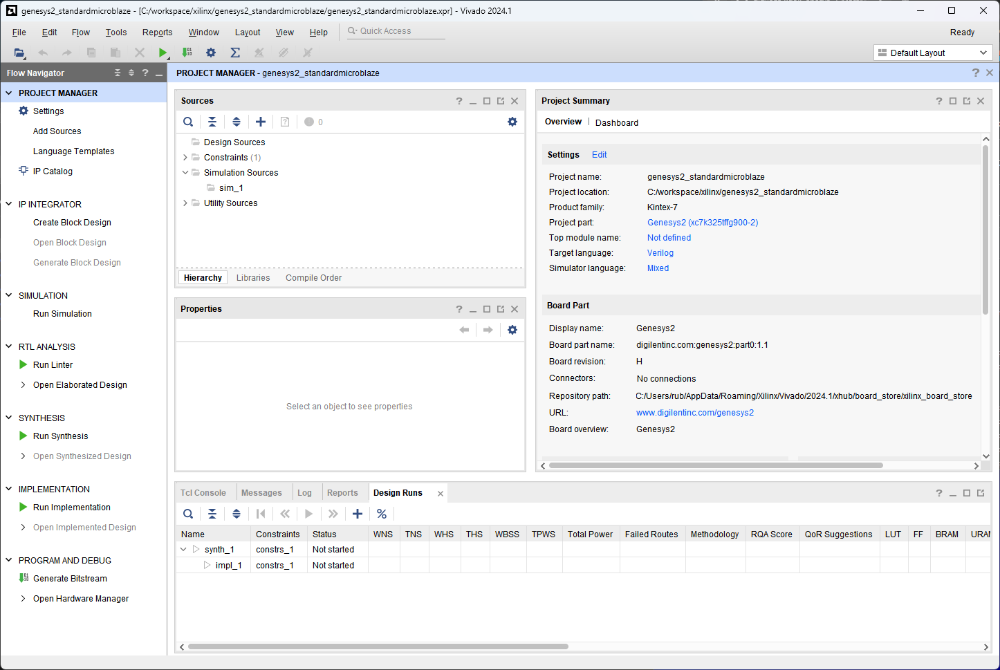

[← Back to Chapter 1](chapter-1-architecture.md)

<h2>Open Vivado</h2>

<em>Figure 1. Vivado quick start panel.</em>
 

<h2>Create a New Project</h2>

Select Create Project, this will guide you through the options to create a new project. Name it `genesys2_standardmicroblaze`

<em>Figure 2. Name and folder for the hardware project.</em>
 

<h2>RTL Project</h2>

Select RTL Project as the project type.

<em>Figure 3. RTL Project.</em>
 

<h2>Add Constraint File</h2>

This example we do not add design files. We add the constrain file downloaded from [Genesys2 Digilent git page](https://github.com/Digilent/digilent-xdc).

<em>Figure 4. GitHub of Digilent's Genesys2 board.</em>
 

<h2>Add Constraint File</h2>

Add the constraint file to your project.

<em>Figure 5. Adding new constrain file.</em>
 

<h2>Select the FPGA Part</h2>

Select the Part (FPGA). In the [Digilent web page](https://digilent.com/reference/programmable-logic/genesys-2/start) you can locate the part: XC7K325TFFG900-2.

<em>Figure 6. Selecting the part.</em>
 

<h2>Select the FPGA Board</h2>

Alternatively, you can select the board (Genesys2). Refresh the catalogue to update the boards available.

<em>Figure 7. Selecting the genesys2 board.</em>
 

<h2>Project Summary</h2>

Review the project summary before completing.

<em>Figure 8. Project Summary.</em>
 

<h2>New Project Screen</h2>

The project has been created successfully. You now see the main Vivado IDE window.

<em>Figure 9. Main window of Vivado IDE for the new hardware project.</em>
 

  <button id="prevBtn">Previous</button>
  

    1 of 9
  

  <button id="nextBtn">Next</button>

[Next: Step 2](chapter-1-step-2.md)