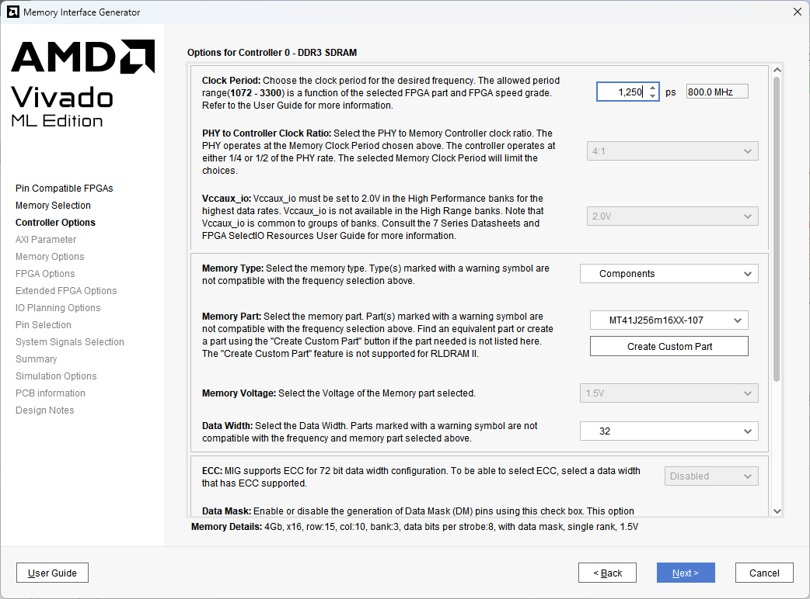
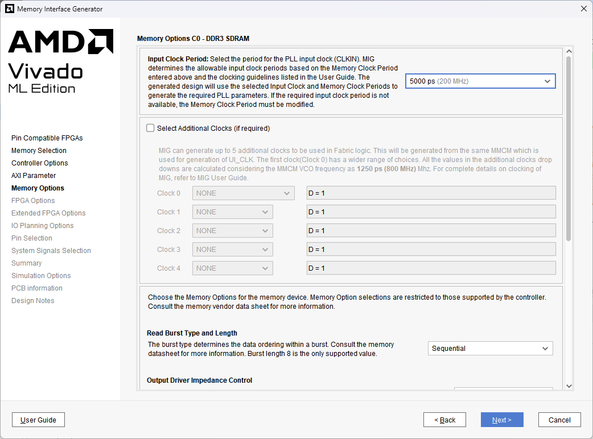

[← Previous: Step 9](chapter-1-step-9.md)

<h2>Configure DDR3 Frequency</h2>

In the Genesys2 board, the input clock frequency is 100MHz. The DDR3 can run up to 800MHz, enabling fast memory access and efficient processing of the MicroBlaze. Modify the frequency clock to `800MHz`. This allows the MicroBlaze to operate at frequencies up to 800MHz/8 = 100MHz.

<em>Figure 37. Change the frequency.</em>
 

<h2>Set Input Clock Period</h2>

Select `5000ps` (200MHz) as the `Input Clock Period`.

<em>Figure 38. Selecting Input Clock Period.</em>
 

<h2>Complete MIG Configuration</h2>

Click `Next` to proceed through the following options. Then `Validate` and `Generate` the `MIG` controller to apply all configuration changes.

  <button id="prevBtn">Previous</button>
  

    1 of 2
  

  <button id="nextBtn">Next</button>

---

[Next: Step 11](chapter-1-step-11.md)
