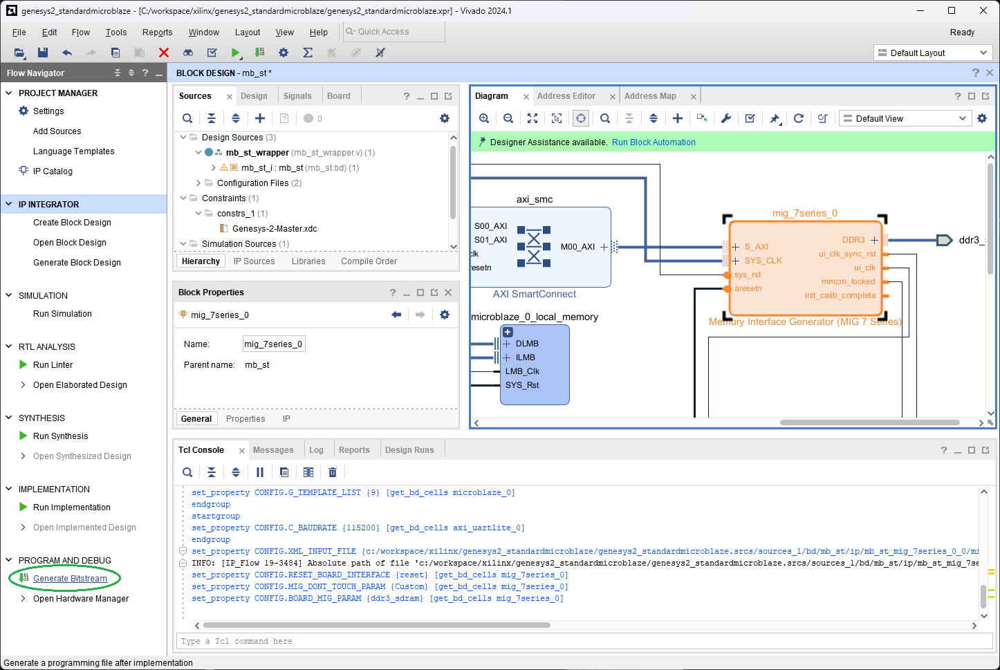
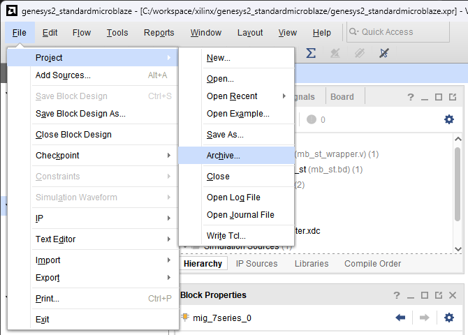

[← Previous: Step 10](chapter-1-step-10.md)

<h2>Generate Bitstream</h2>

By selecting Generate bitstream, all the synthesis process will start. This may take 5 to 20 minutes depending on your system performance.

<em>Figure 39. Generate bitstream.</em>
 

<h2>Archive Project</h2>

Save the Project. There are many options to save it. Go to `File` > `Project` > `Archive`.

<em>Figure 40. Archive Project.</em>
 

<h2>Save Archive</h2>

TCL scripts are available. Select a name for your project and archive it. Check `Include run results` to accelerate further compilations.

<em>Figure 41. Archive Project Options.</em>
 

  <button id="prevBtn">Previous</button>
  

    1 of 3
  

  <button id="nextBtn">Next</button>

---

[Next: Chapter Summary](chapter-1-architecture.md)
