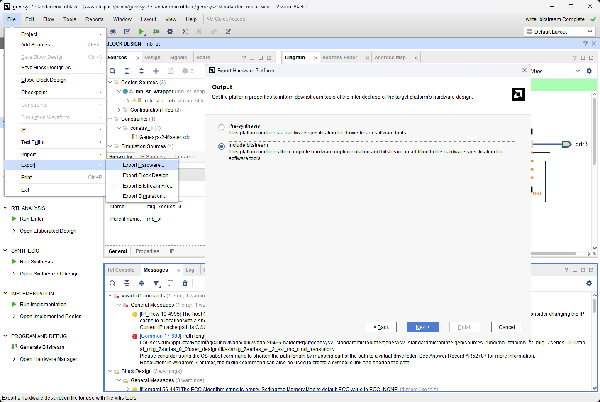

[Previous: Step 11](chapter-1-step-11.md)

<link rel="stylesheet" href="./static/step-navigation.css" />

<h2>Export Hardware</h2>

To program applications to run in the MicroBlaze architecture, a `XSA` file must be created. Select `File` > `Export` > `Export Hardware`. Select `Include bitstream` option and write a name for your architecture (mb_std_system).

<em>Figure 42. Export hardware and include bitstream.</em>

  <button id="prevBtn">Previous</button>
  

    1 of 1
  

  <button id="nextBtn">Next</button>

---

[Next: Step 13](chapter-1-step-13.md)
