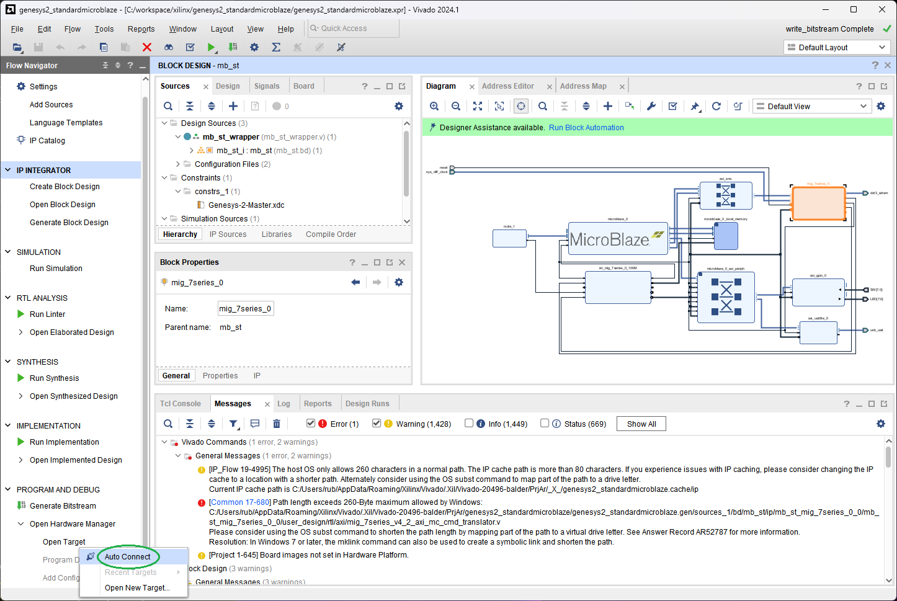
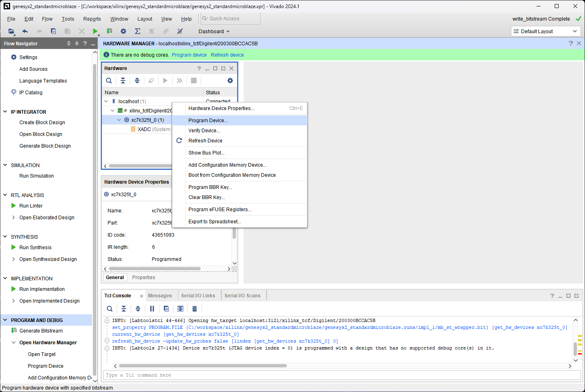

[← Previous: Step 12](chapter-1-step-12.md)

<h2>Open Hardware Manager</h2>

Make sure that the board is connected with the JTAG to your computer running Vivado. Turn on the SDK, then select `Open Hardware Manager` > `Open Target` > `Auto Connect`.

<em>Figure 43. Open Hardware.</em>
 

<h2>Program Device</h2>

The system should detect the Genesys2 board with the XC7k325T device. Download the bitstream into the Genesys2 by right clicking the device, `Program Device` and selecting the bitstream file.

<em>Figure 44. Program Device.</em>

Now you are ready to create the applications, but before, we should improve the architecture by using timers and interruptions.

  <button id="prevBtn">Previous</button>
  

    1 of 2
  

  <button id="nextBtn">Next</button>

---

[Back to Chapter 1](chapter-1-architecture.md)
