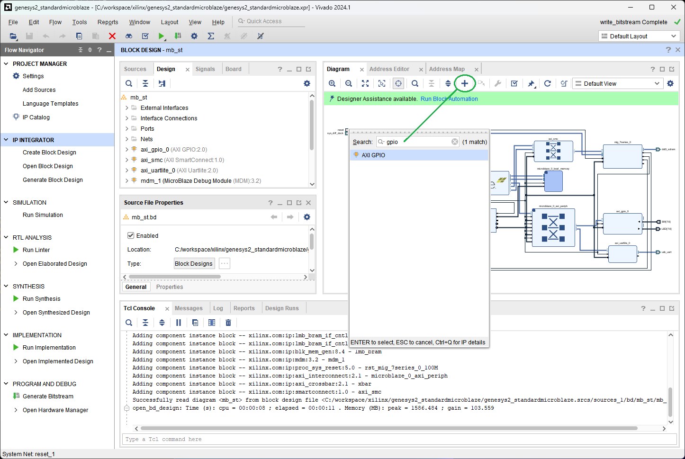
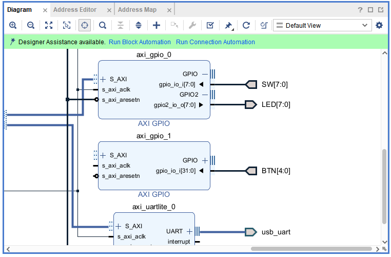
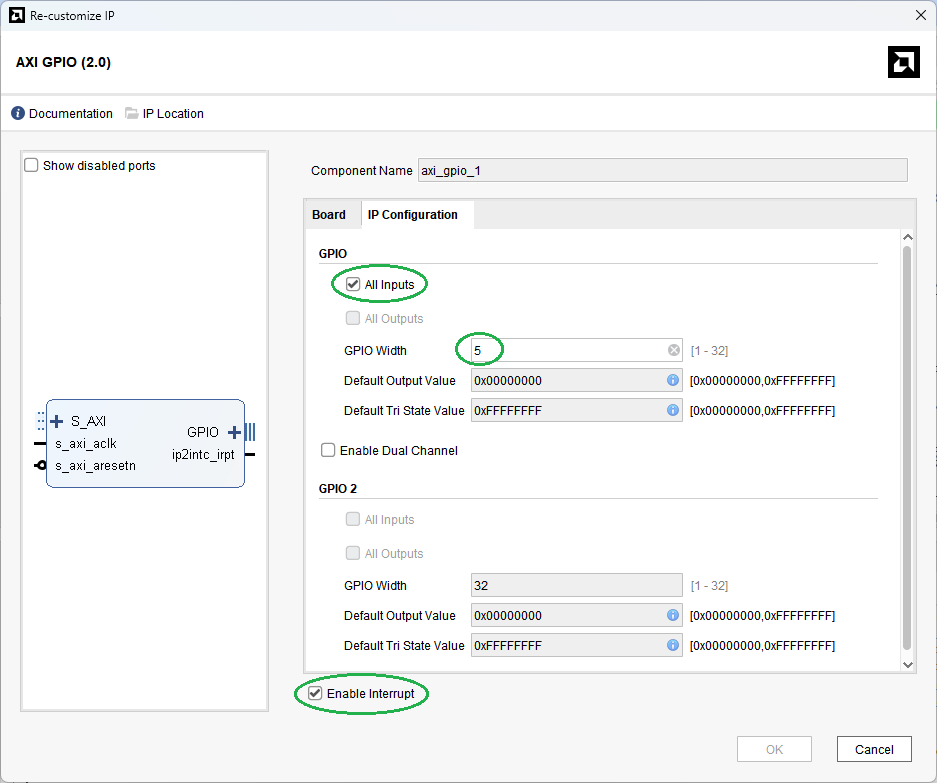

[← Previous: Step 13](chapter-1-step-13.md)

<h2>Add AXI GPIO for BTN</h2>

Add a new `AXI GPIO` IP to the Diagram for the BTN interface.

<em>Figure 45. New AXI GPIO for the pushbuttons.</em>
 

<h2>Add BTN Input Port</h2>

Add a new input port connection `BTN` with 5 bits. Follow the same process as in [Step 7](chapter-1-step-7.md).

<em>Figure 46. Input Port Connection.</em>
 

<h2>Configure AXI GPIO</h2>

Edit the `AXI GPIO` properties as `Custom` and `All inputs` (see Step 7) and check `Enable Interrupt`.

<em>Figure 47. Editing the parameters of AXI GPIO for the pushbuttons.</em>

Remember to uncomment the pin names for BTN connection at the constraint file, as seen in the [Step 6](chapter-1-step-6.md).

  <button id="prevBtn">Previous</button>
  

    1 of 3
  

  <button id="nextBtn">Next</button>

---

[Next: Step 15](chapter-1-step-15.md)
