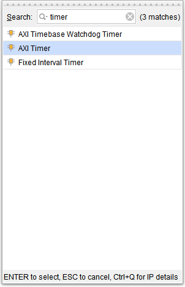
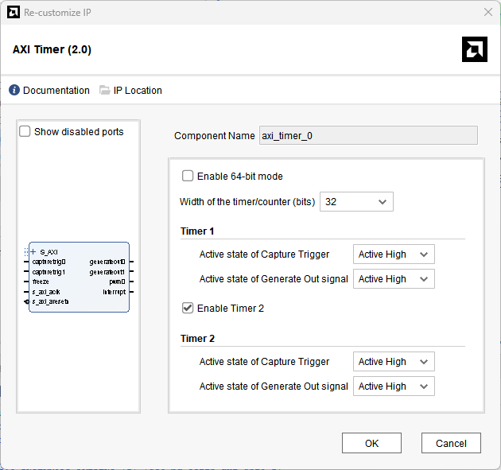

[Previous: Step 14](chapter-1-step-14.md)

<link rel="stylesheet" href="./static/step-navigation.css" />

<h2>Add AXI Timers</h2>

Add two `AXI Timer` modules.

<em>Figure 48. Adding new AXI Timers.</em>
 

<h2>Configure AXI Timers</h2>

Configure the `AXI Timer` values.

<em>Figure 49. Check the values for the AXI timers.</em>

  <button id="prevBtn">Previous</button>
  

    1 of 2
  

  <button id="nextBtn">Next</button>

---

[Next: Step 16](chapter-1-step-16.md)
