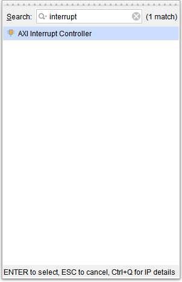

[Previous: Step 15](chapter-1-step-15.md)

<link rel="stylesheet" href="./static/step-navigation.css" />

<h2>Add AXI Interrupt Controller</h2>

Add one `AXI Interrupt Controller` module.

<em>Figure 50. New Interrupt Controller.</em>

  <button id="prevBtn">Previous</button>
  

    1 of 1
  

  <button id="nextBtn">Next</button>

---

[Next: Step 17](chapter-1-step-17.md)
