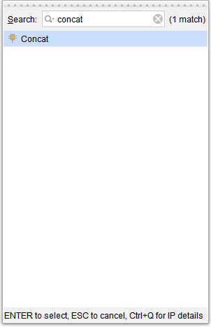
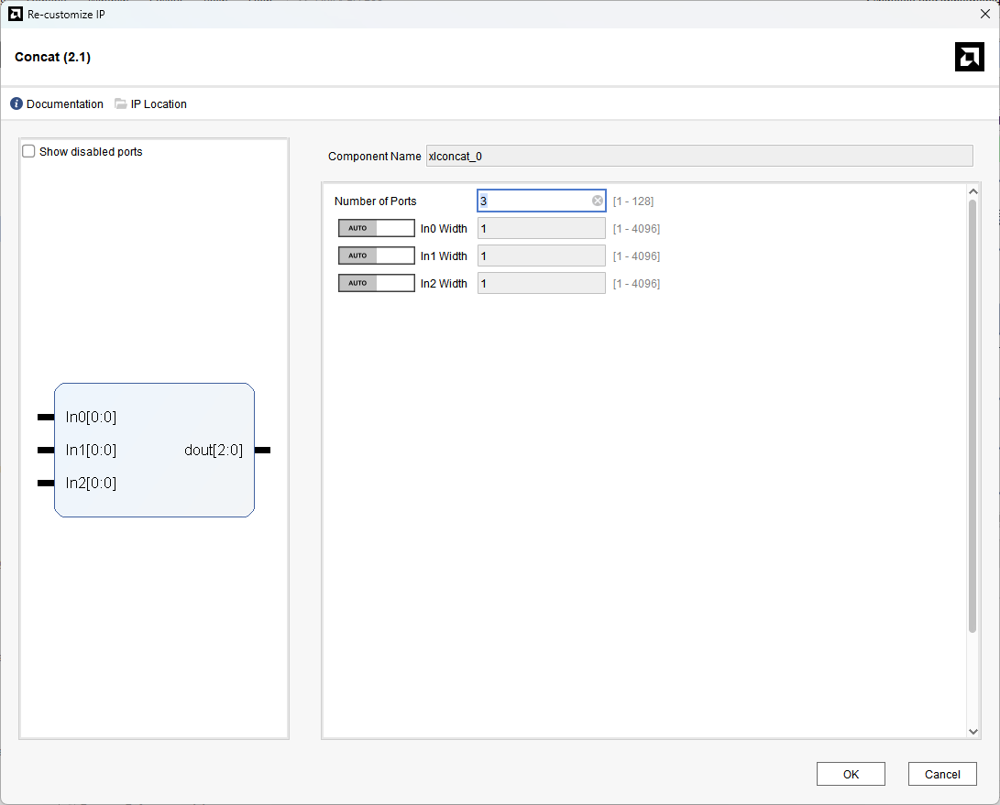
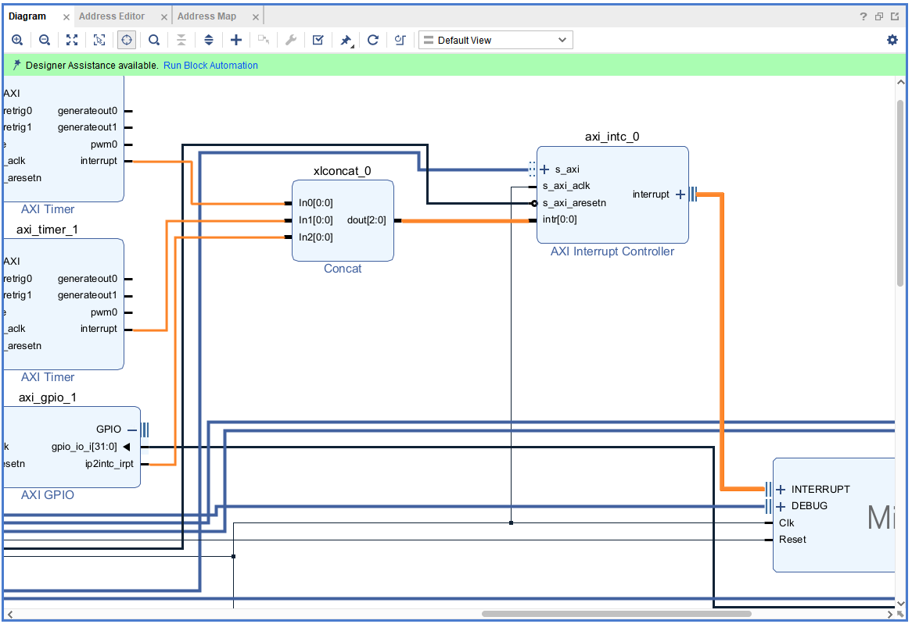

[Previous: Step 17](chapter-1-step-17.md)

<link rel="stylesheet" href="./static/step-navigation.css" />

<h2>Add Concat IP</h2>

Add a `Concat` IP module.

<em>Figure 51. New Concat Block.</em>
 

<h2>Configure Concat Inputs</h2>

Edit the Concat module properties with 3 inputs.

<em>Figure 52. Editing the Concat for 3 inputs.</em>
 

<h2>Connect Interrupt Signals</h2>

Connect the output interrupt from `AXI Timers` and `BTN` to the Concat inputs. Connect the output from the `Concat` to the input interrupt of `AXI Interrupt Controller`. Connect the output of the `AXI Interrupt Controller` to the input interrupt bus of the `MicroBlaze` processor.

<em>Figure 53. Interrupt connections.</em>

  <button id="prevBtn">Previous</button>
  

    1 of 3
  

  <button id="nextBtn">Next</button>

---

[Next: Step 19](chapter-1-step-19.md)
