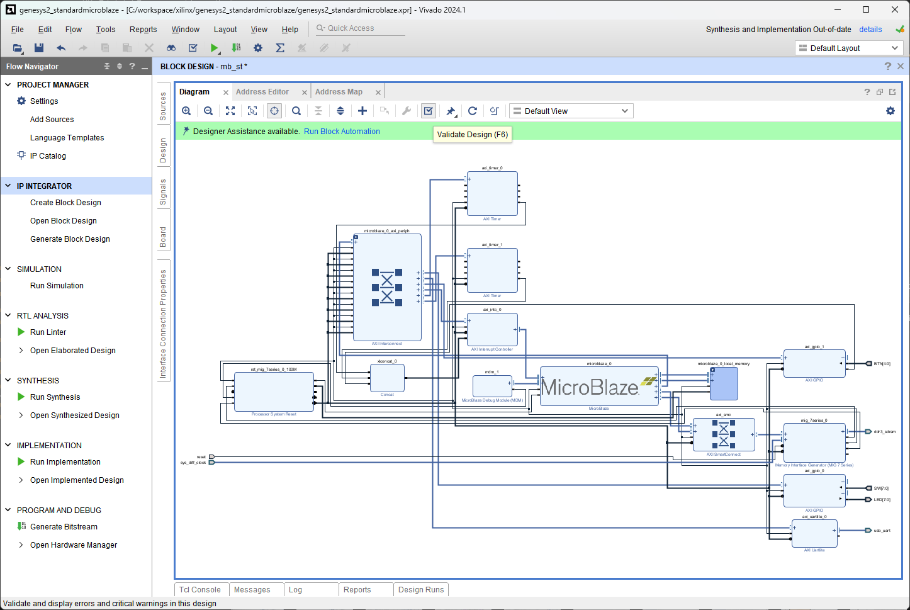
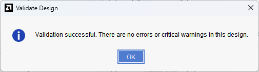

[Previous: Step 18](chapter-1-step-18.md)

<link rel="stylesheet" href="./static/step-navigation.css" />

<h2>Validate Design</h2>

Use the `Validate Design` button.

<em>Figure 54. Validating the design.</em>
 

<h2>Confirm Results</h2>

If all the modules and connections are OK, you will get a confirmation message.

<em>Figure 55. Expected result.</em>

Remember to update the HDL wrapper, as seen in the [Step 5](chapter-1-step-5.md).

  <button id="prevBtn">Previous</button>
  

    1 of 2
  

  <button id="nextBtn">Next</button>

---

[Next: Step 20](chapter-1-step-20.md)
