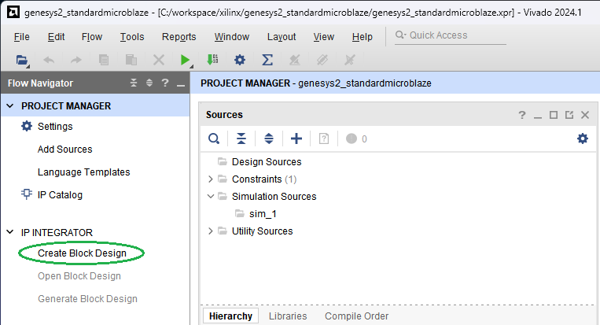
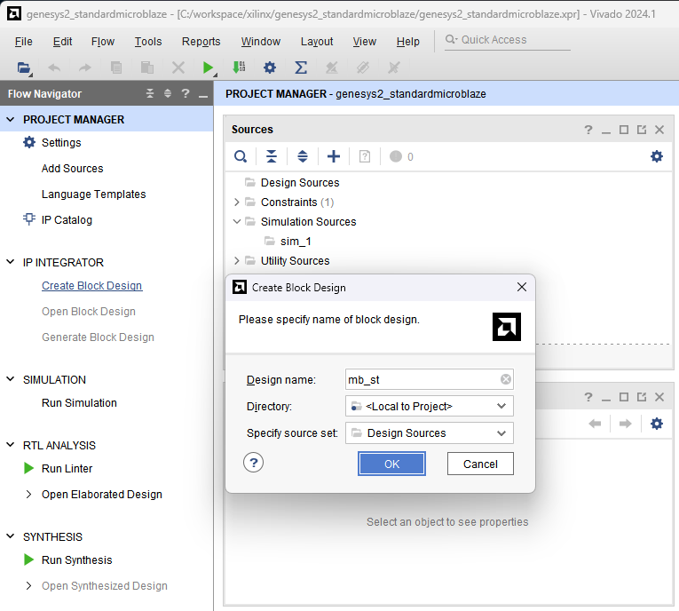
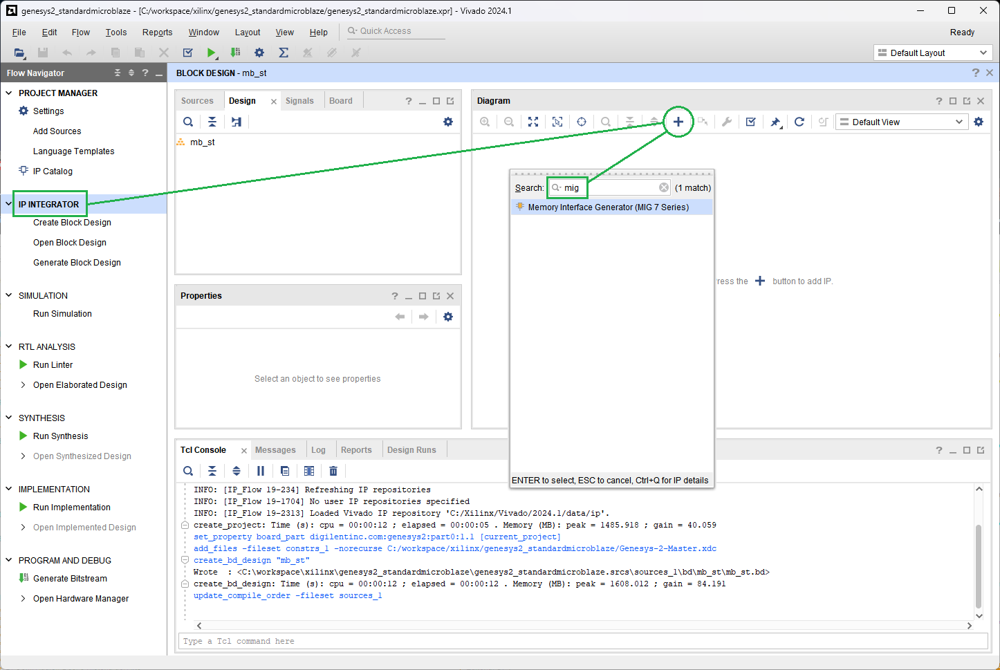
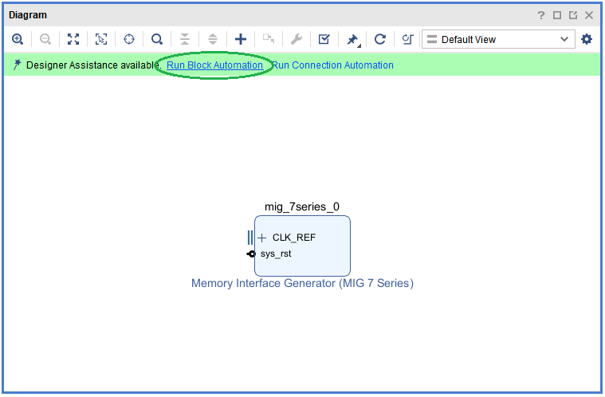
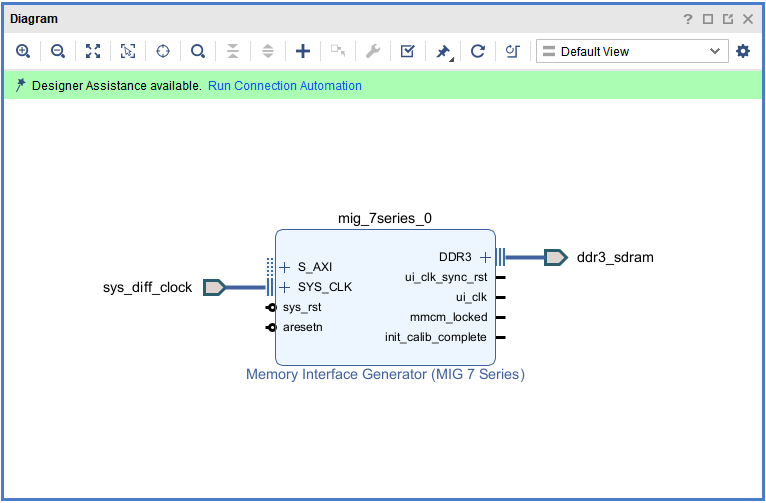
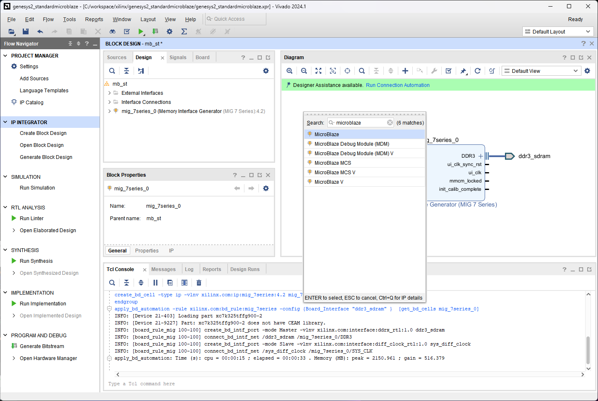
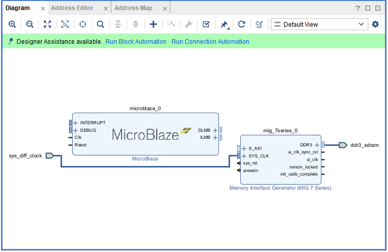
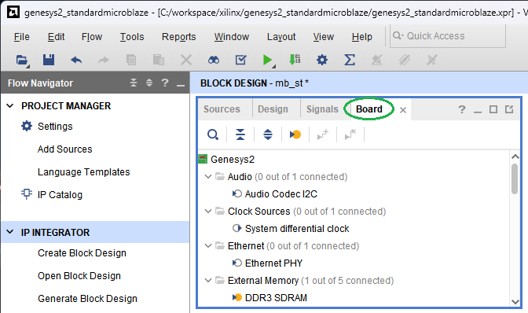
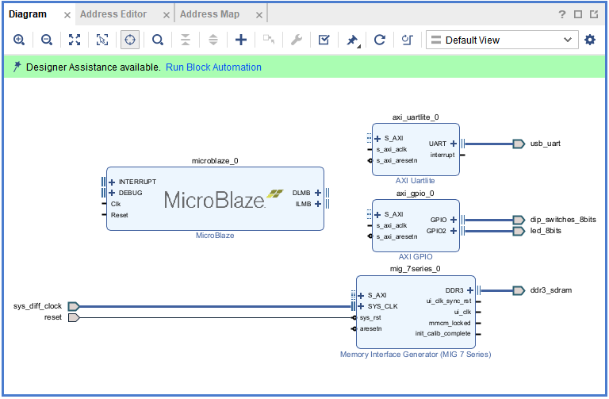

[Previous: Step 1](chapter-1-step-1.md)

<h2>Create Block Design</h2>

From `Flow Navigator`, under `IP INTEGRATOR`, select `Create Block Design`.

<em>Figure 10. Vivado IP Integrator.</em>
 

<h2>Specify Design Name</h2>

Specify the IP subsystem design name. For this step, you can use `mb_st` (MicroBlaze Standalone) as the `Design name`. Leave the `Directory` field set to its default value of `Local to Project`. Leave the `Specify source set` drop-down list set to its default value of `Design Sources`. Click `OK` in the `Create Block Design` dialog box, shown in the following figure.

<em>Figure 11. Creating a Block Design.</em>
 

<h2>Add MIG IP</h2>

In the `IP INTEGRATOR` diagram area, right-click and select `Add IP`. The IP integrator Catalog opens. Alternatively, you can also select the `Add IP` icon in the middle of the canvas. Search for the `Memory Interface Generator`.

<em>Figure 12. MIG IP.</em>
 

<h2>Run Block Automation</h2>

Click Run Block Automation.

<em>Figure 13. Run Block Automation.</em>
 

<h2>MIG Connected</h2>

After Block Automation runs, the `MIG` is connected.

<em>Figure 14. MIG connected.</em>
 

<h2>Add `MicroBlaze` IP</h2>

Add new IP MicroBlaze:

<em>Figure 15. MicroBlaze IP.</em>
 

<h2>MicroBlaze and MIG Connected</h2>

After adding MicroBlaze, you will see both the MicroBlaze IP and MIG are still not connected:

<em>Figure 16. MicroBlaze IP and MIG.</em>
 

<h2>Open Board Window</h2>

There are several ways to use an existing interface in IP integrator. Use the Board window to instantiate some of the interfaces that are present on the Genesys2 board.

<em>Figure 17. Using the Board Window.</em>
 

<h2>Add UART and Switches from Board</h2>

In the `Board` window, notice that the DDR3 SDRAM interface is connected as shown by the yellow circle.

From the `Board` window, select `USB UART` under the `UART` folder, and drag and drop it into the block design canvas. This instantiates the `AXI Uartlite` IP on the block design. 

Likewise, from the `Board` window, select `8 SWITCHES` under the `GPIO` folder, and drag and drop it into the block design canvas. This instantiates the `AXI GPIO` IP on the block design and connects it to the on-board switches.

<h2>Add Reset Connection</h2>

Next, from the `Board` window, select `Reset` under the `Reset` folder, and drag and drop it into the block design canvas. This connects the CPU push button reset to the `MIG` IP.

<h2>Merge LEDs with GPIO</h2>

Now, drag and drop `8 LEDs` into the same `GPIO` for the switches, this will merge both LEDs and SWs in the same AXI_GPIO.

<em>Figure 18. Canvas with MB, UART, GPIO and Reset for the DDR3 Memory System.</em>
 

  <button id="prevBtn">Previous</button>
  

    1 of 9
  

  <button id="nextBtn">Next</button>

---

[Next: Step 3](chapter-1-step-3.md)
