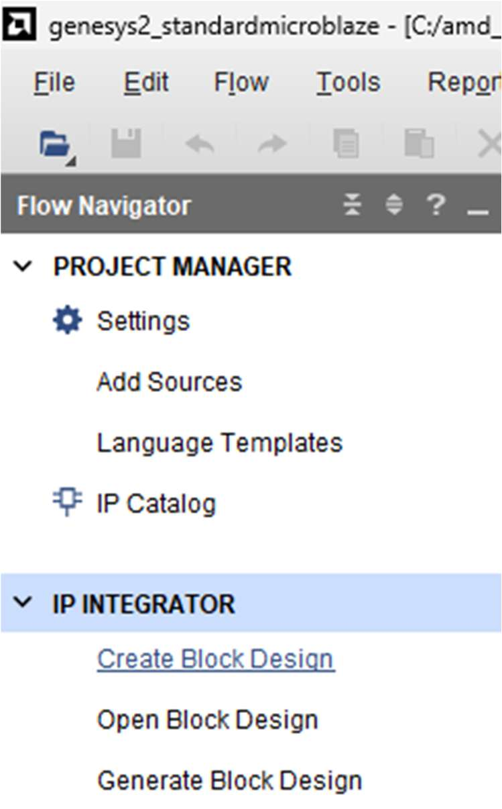
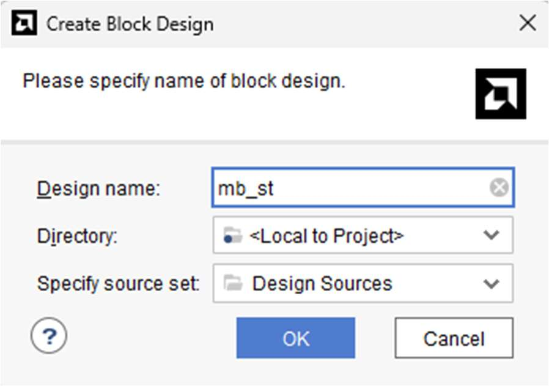
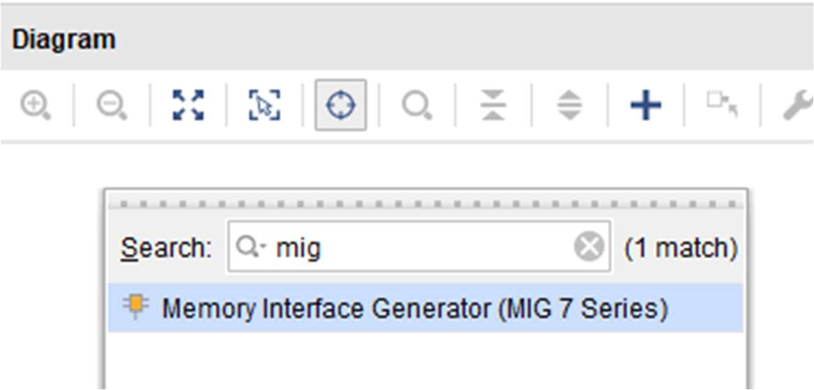
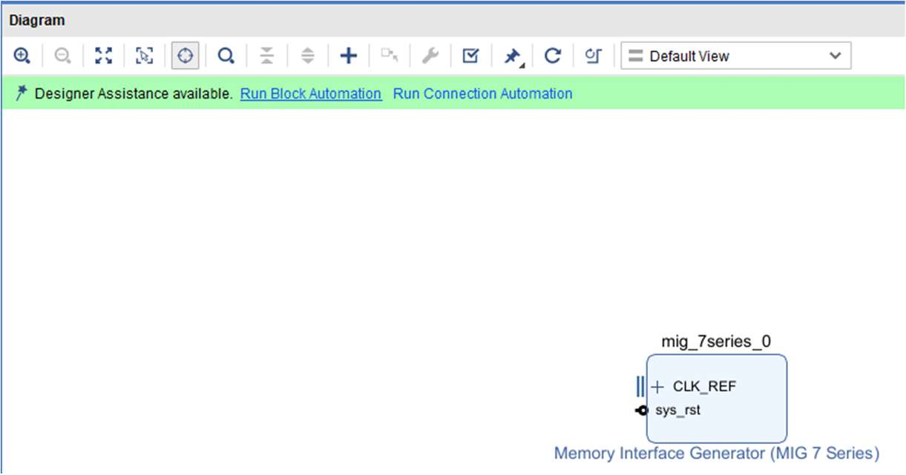
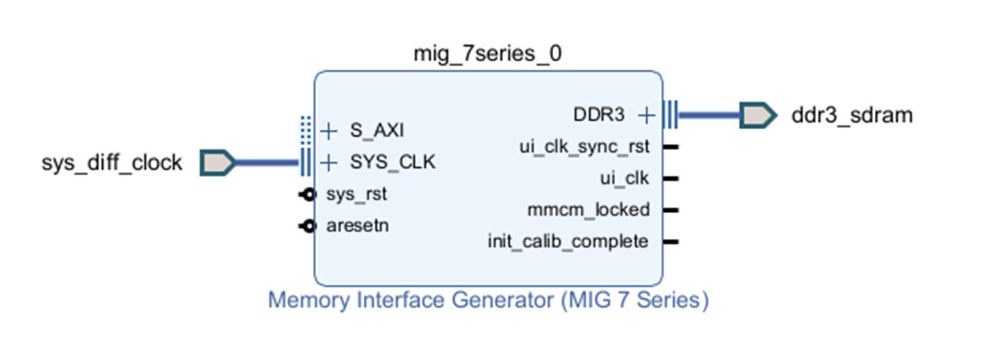
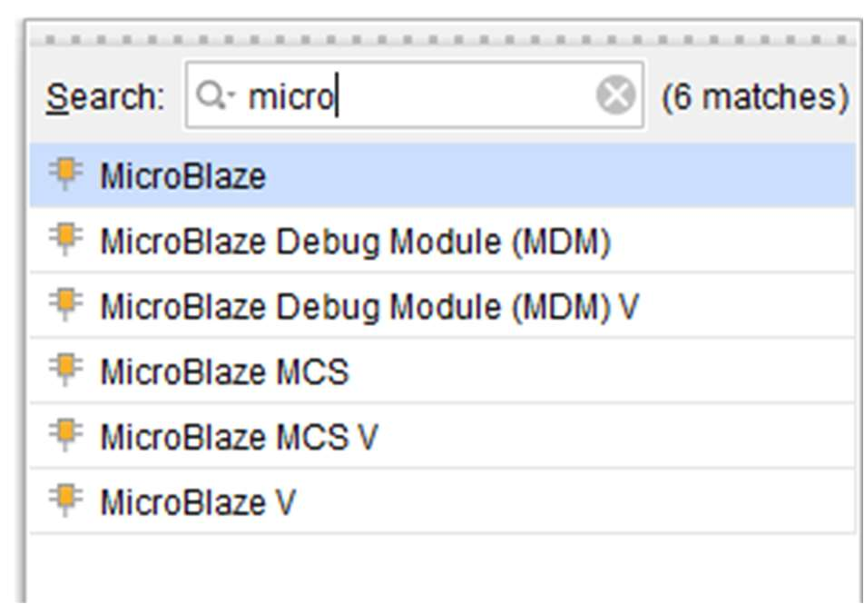
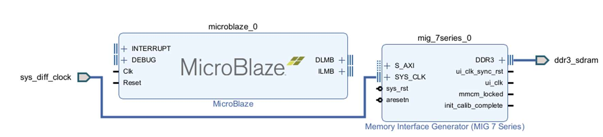
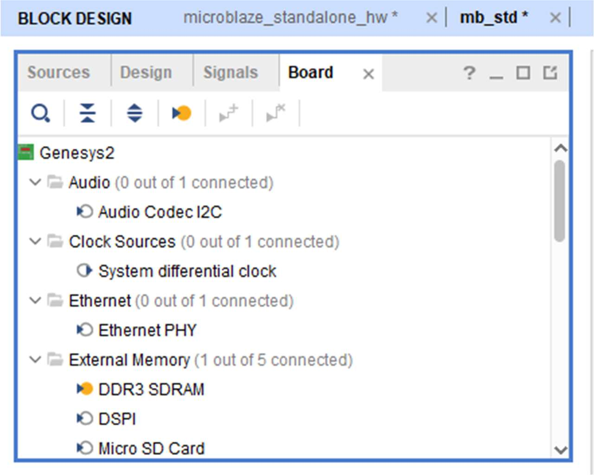
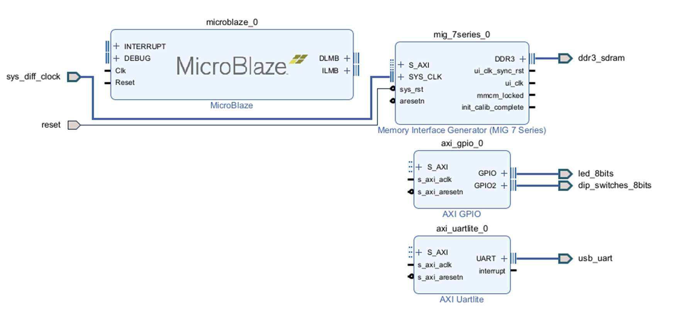

[← Previous: Step 1](chapter-1-step-1.md)

<h2>Step 1: Create Block Design</h2>

From Flow Navigator, under IP integrator, select Create Block Design. Same menu can be expanded on IP Integrator tab.

<em>Figure 9. Vivado IP Integrator.</em>

<h2>Step 2: Specify Design Name</h2>

Specify the IP subsystem design name. For this step, you can use mb_st as the Design name (MicroBlaze Standalone). Leave the Directory field set to its default value of `Local to Project`. Leave the Specify source set drop-down list set to its default value of Design Sources. Click OK in the Create Block Design dialog box, shown in the following figure.

<em>Figure 10. Creating a Block Design.</em>

<h2>Step 3: Add MIG IP</h2>

In the IP integrator diagram area, right-click and select Add IP. The IP integrator Catalog opens. Alternatively, you can also select the Add IP icon in the middle of the canvas.

<em>Figure 11. MIG IP.</em>

<h2>Step 4: Run Block Automation</h2>

Click Run Block Automation.

<em>Figure 12. Run Block Automation.</em>

<h2>Step 5: MIG Connected</h2>

After Block Automation runs the MIG is connected.

<em>Figure 13. MIG connected.</em>

<h2>Step 6: Add MicroBlaze IP</h2>

Then add new IP MicroBlaze:

<em>Figure 14. MicroBlaze IP.</em>

<em>Figure 15.MicroBlaze IP and MIG.</em>

<h2>Step 7: Use Board Window</h2>

There are several ways to use an existing interface in IP integrator. Use the Board window to instantiate some of the interfaces that are present on the Genesys2 board.

<em>Figure 16. Using the Board Window.</em>

In the Board window, notice that the DDR3 SDRAM interface is connected as shown by the yellow circle.

From the Board window, select UART under the Miscellaneous folder, and drag and drop it into the block design canvas. This instantiates the AXI Uartlite IP on the block design. 

Likewise, from the Board window, select SWITCHES under the General Purpose Input or Output folder, and drag and drop it into the block design canvas. This instantiates the GPIO IP on the block design and connects it to the on-board switches.

Next, from the Board window, select FPGA Reset under the Reset folder, and drag and drop it into the block design canvas. This connects the CPU push button reset to the MIG core IP.

<h2>Step 8: Merge LEDs with GPIO</h2>

Now, drag and drop LEDs into the same GPIO for the switches, this will merge both LEDs and SWs in the same AXI_GPIO.

<em>Figure 17. Canvas with MB, UART, GPIO and Reset for the DDR3 Memory System.</em>

  <button id="prevBtn">Previous</button>
  

    Step 1 of 8
  

  <button id="nextBtn">Next</button>

---

[Next: Step 3](chapter-1-step-3.md)
