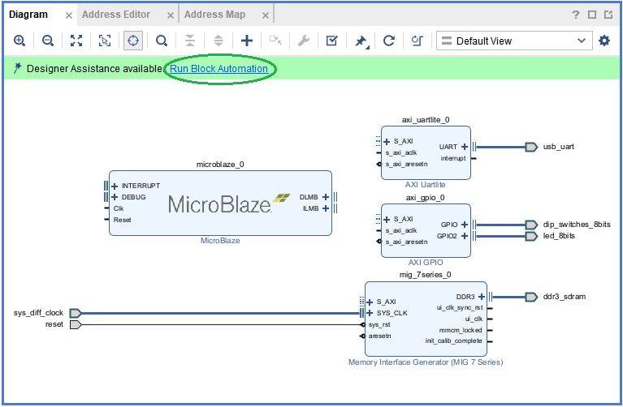
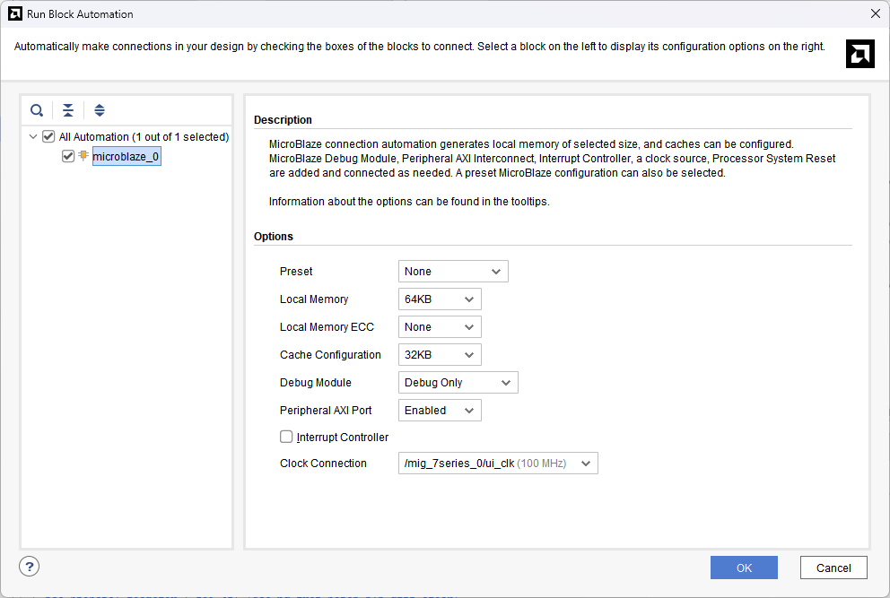

[Previous: Step 2](chapter-1-step-2.md)

<h2>Run Block Automation</h2>

Click `Run Block Automation` as shown below:

<em>Figure 19. Run Block Automation.</em>
 

<h2>Configure Run Block Automation Options</h2>

On the `Run Block Automation` dialog box, select the following values:
- Leave Preset as the default value: `None`.
- Set Local Memory to `64KB`.
- Leave the Local Memory ECC as the default value: `None`.
- Set Cache Configuration to `32KB`.
- Set Debug Module to `Debug Only`.
- Leave the Peripheral AXI Port option as the default value: `Enabled`.
- Leave the Interrupt Controller option unchecked.
- Leave the Clock source option set to `/mig_7series_0/ui_clk (100 MHz)`.

<em>Figure 20. Run Block Automation options.</em>
 

<h2>Complete Block Automation</h2>

Click OK. This generates a basic MicroBlaze system in the IP integrator diagram area. The system is successfully created with all required IP blocks and connections configured automatically.

  <button id="prevBtn">Previous</button>
  

    1 of 2
  

  <button id="nextBtn">Next</button>

---

[Next: Step 4](chapter-1-step-4.md)
