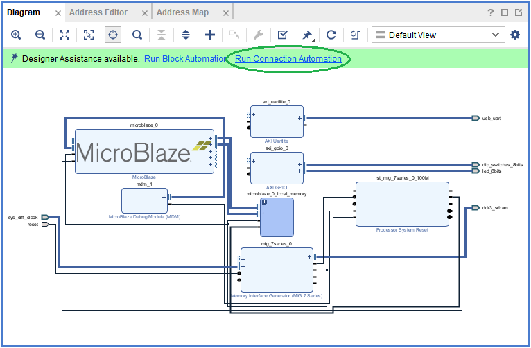
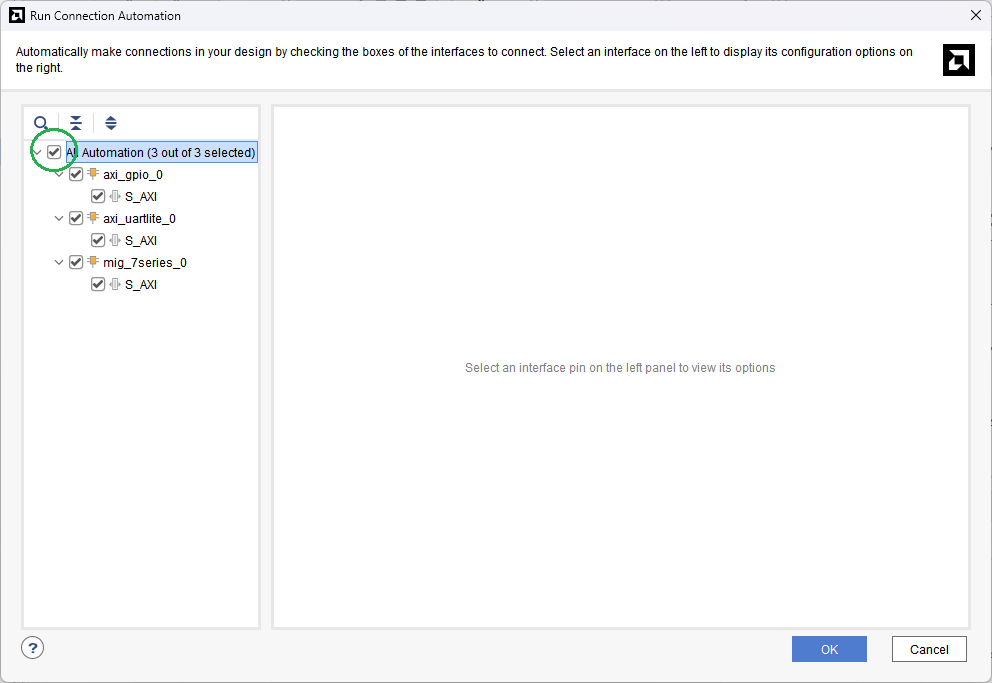
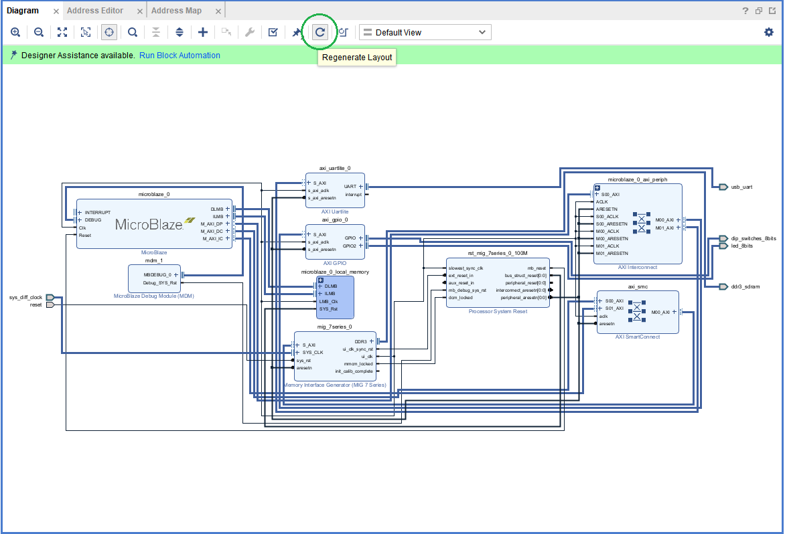
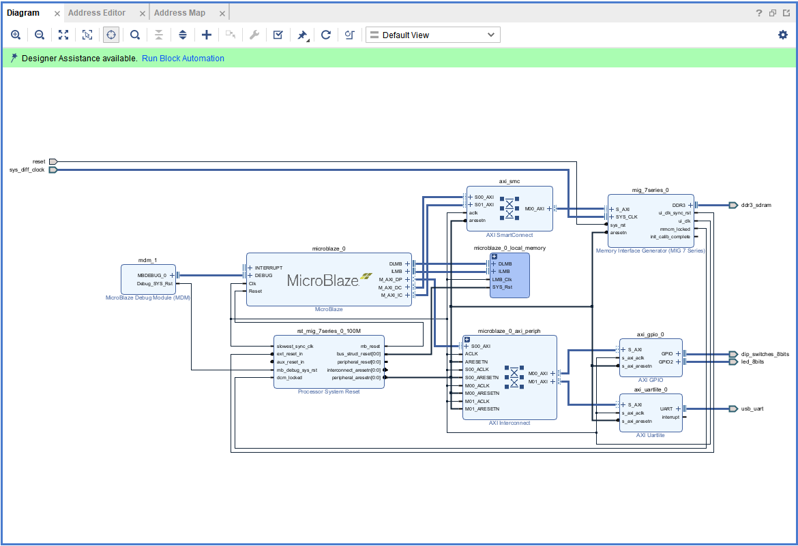
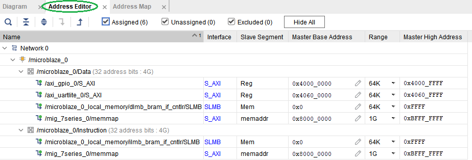

[Previous: Step 3](chapter-1-step-3.md)

<h2>Run Connection Automation</h2>

`Run Connection Automation` provides several options that you can select to make connections. This section will walk you through the first connection, and then you will use the same procedure to make the rest of the required connections for this tutorial.

<em>Figure 21. Run Connection Automation.</em>
 

<h2>Select All Automation</h2>

Check the `All Automation` option in the left panel of the dialog box as shown in the following figure. This selects all interfaces to run Connection Automation for.

<em>Figure 22. Run Connection Automation Options.</em>
 

<h2>Regenerate Layout (Optional)</h2>

If you need to delete an IP block, you can click and delete it. Then select `Regenerate Layout` to reorganize the blocks on the canvas.

<em>Figure 23. Regenerate Layout.</em>
 

<h2>View Complete MicroBlaze System</h2>

At this point, your IP integrator diagram area should look like the following figure. All connections have been made automatically.

<em>Figure 24. MicroBlaze System.</em>
 

<h2>Check Memory Map</h2>

Now you can check the `Memory Map` of your system. This shows the address space allocated to each peripheral.

<em>Figure 25. Memory Map.</em>
 

  <button id="prevBtn">Previous</button>
  

    1 of 5
  

  <button id="nextBtn">Next</button>

---

[Next: Step 5](chapter-1-step-5.md)
