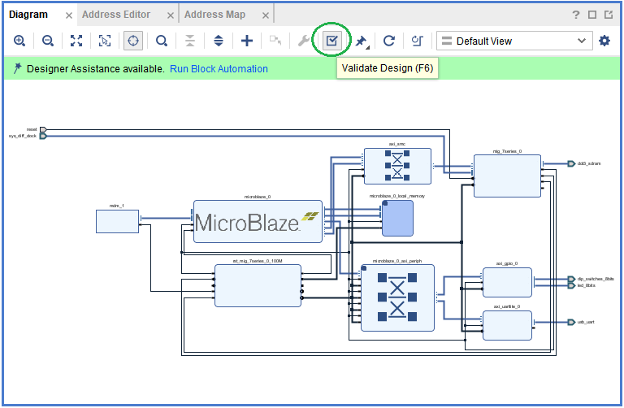
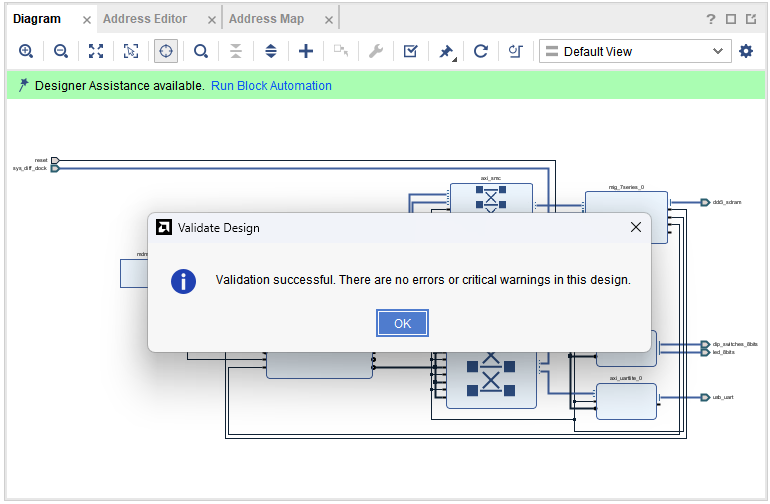
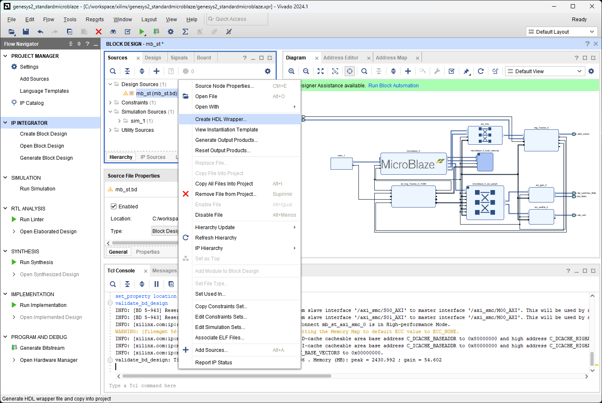

[← Previous: Step 4](chapter-1-step-4.md)

<h2>Validate Design</h2>

Select Validate Design. This will check for design and connection errors.

<em>Figure 26. Validate Design.</em>
 

<h2>Successful Validation</h2>

If the design is correct, you will see a successful validation message. This confirms that all connections are properly configured and there are no errors.

<em>Figure 27. Successful validation.</em>
 

<h2>Create HDL Wrapper</h2>

After the design validation step, we will proceed with creating a HDL System Wrapper. Click on the Sources tab and find your block design. Right click on your block design and click Create HDL Wrapper. Let Vivado manage wrapper and auto-update and click OK.

<em>Figure 28. Create a HDL wrapper.</em>
 

This will create a top module in Verilog and will allow you to generate a bitstream.

  <button id="prevBtn">Previous</button>
  

    1 of 3
  

  <button id="nextBtn">Next</button>

---

[Next: Step 6](chapter-1-step-6.md)
