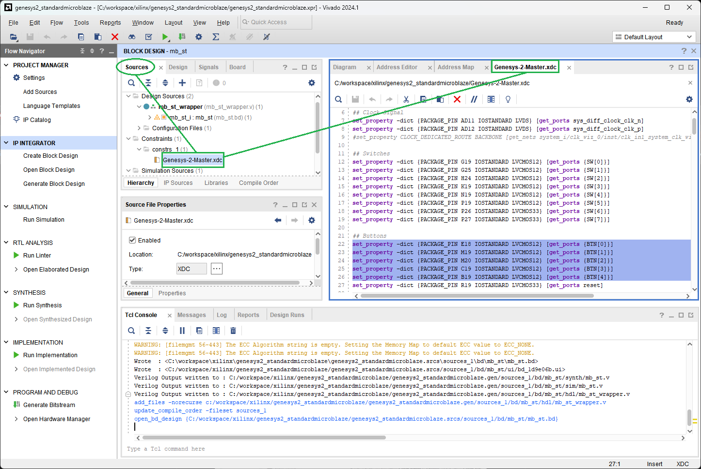

[Previous: Step 5](chapter-1-step-5.md)

<h2>Edit Constraints File</h2>

Digilent constraints file represents all the pins connections available in the Genesys2 board. All the peripherals on the board are connected to the FPGA. Not all of them are connected in our design so comment all lines that do not contain `clock`, `UART`, `SW`, `LED` or `pushbuttons`.

<em>Figure 29. Edition of constraints file.</em>
 

  <button id="prevBtn">Previous</button>
  

    1 of 1
  

  <button id="nextBtn">Next</button>

---

[Next: Step 7](chapter-1-step-7.md)
