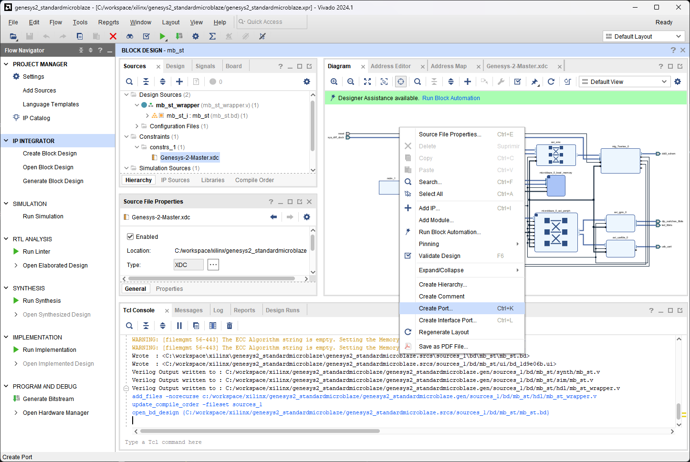
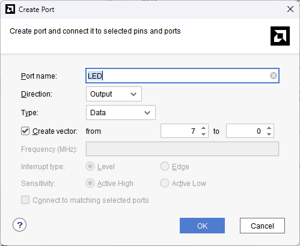
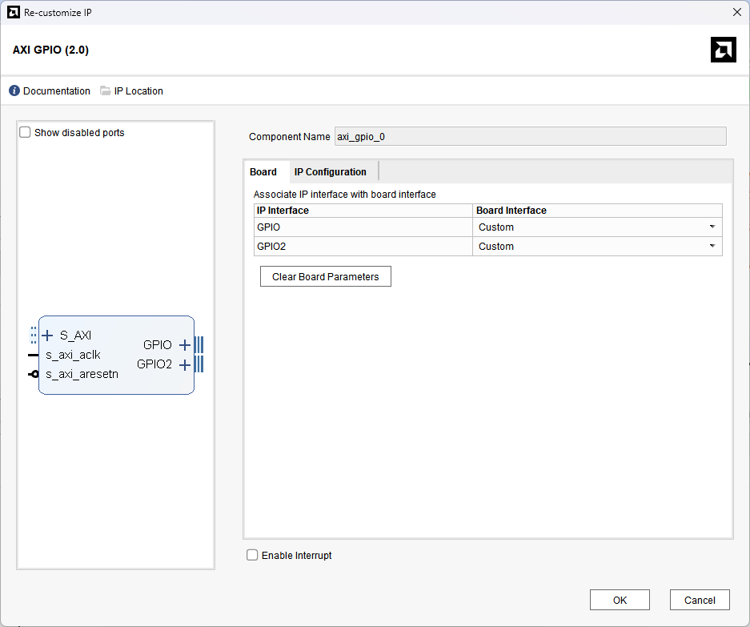
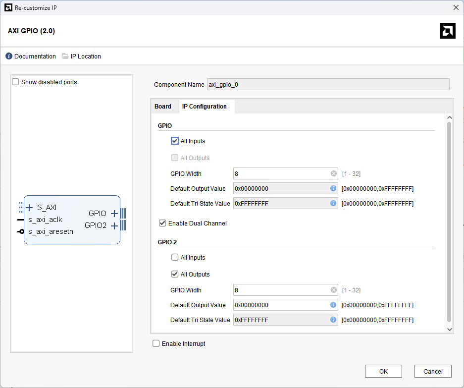
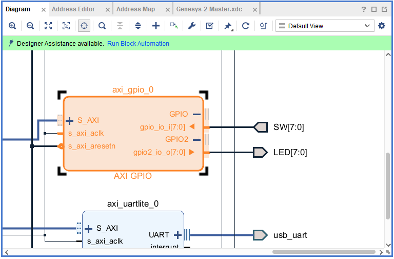

[← Previous: Step 6](chapter-1-step-6.md)

<h2>Create Port for LED</h2>

The name of the ports and direction in the `AXI_GPIO` must match with the constrains file. Delete the `LEDs` port, right click in the `Design` canvas and select `Create Port`.

<em>Figure 30. Creating a port.</em>
 

<h2>Configure LED Port</h2>

Select the options for LEDs Port:
- Name it `LED` (as in the constrains file)
- Set Direction as `Output`
- Set Type as `Data`
- Check Create vector option from `7 to 0`
- Click OK

<em>Figure 31. LED output port.</em>
 

Repeat the process to create the SW as inputs.

<h2>Configure AXI GPIO - Board Tab</h2>

Edit the `AXI_GPIO` with double click. On the `Board` tab, set the `Board interface` options to `Custom`.

<em>Figure 32. AXI GPIO Board configuration.</em>
 

<h2>Configure AXI GPIO - IP Configuration Tab</h2>

On the `IP Configuration` tab, set the `SW` as `All Inputs` and the `LED` port as `All Outputs`.

<em>Figure 33. AXI GPIO IP Configuration.</em>
 

<h2>Connect Ports to AXI GPIO</h2>

Make sure to connect the new labels to the corresponding `AXI_GPIO` port.

<em>Figure 34. AXI GPIO with SW and LED buses.</em>
 

  <button id="prevBtn">Previous</button>
  

    1 of 5
  

  <button id="nextBtn">Next</button>

---

[Next: Step 8](chapter-1-step-8.md)
