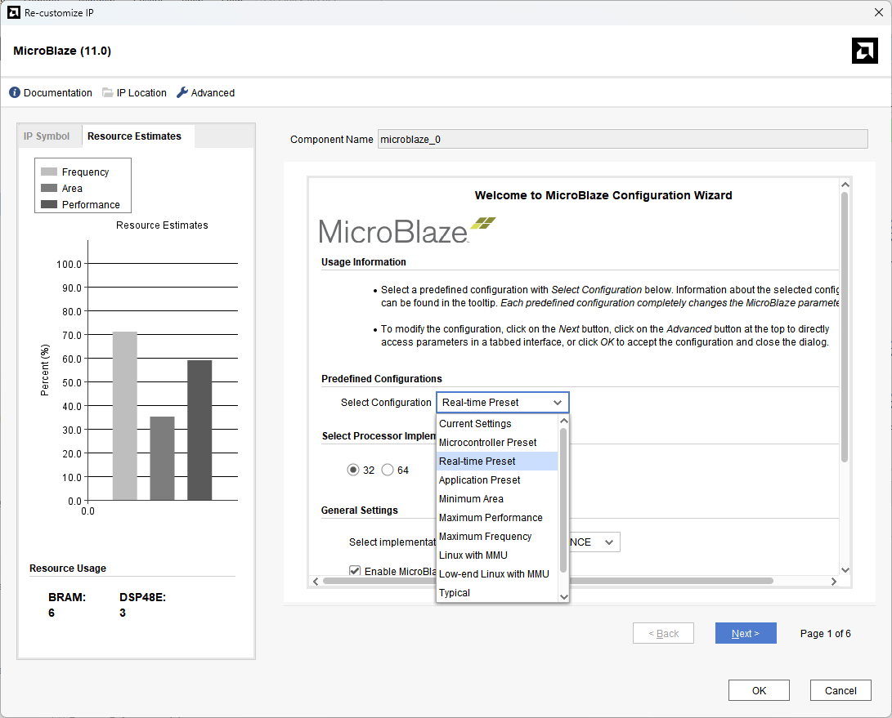

[Previous: Step 7](chapter-1-step-7.md)

<link rel="stylesheet" href="./static/step-navigation.css" />

<h2>Open MicroBlaze Configuration</h2>

Double click on the `Microblaze` IP and select the `Predefined Configuration`.

<em>Figure 35. Real-time Preset.</em>
 

<h2>Apply Real-Time Preset</h2>

The Real-Time preset option is optimized for deterministic programming and for RTOS. Select this preset to configure the MicroBlaze for real-time applications.

Select the default values in the following windows and apply the configuration.

  <button id="prevBtn">Previous</button>
  

    1 of 1
  

  <button id="nextBtn">Next</button>

---

[Next: Step 9](chapter-1-step-9.md)
