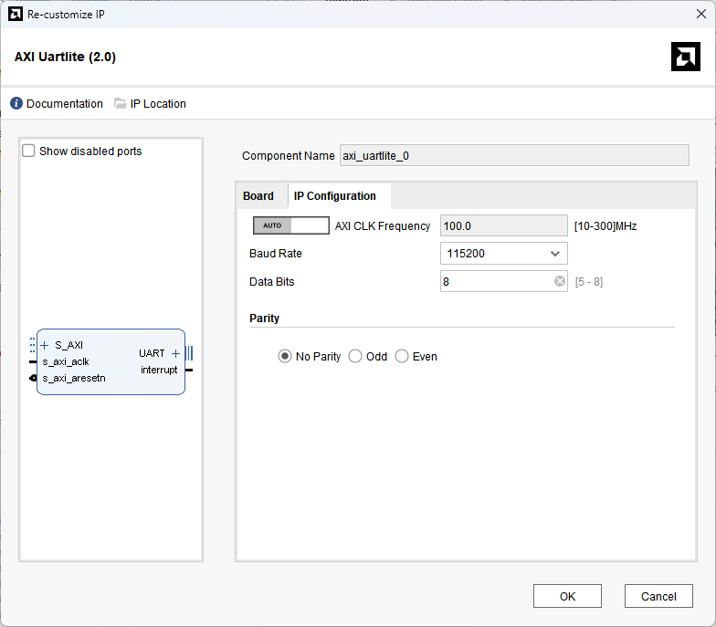

[Previous: Step 8](chapter-1-step-8.md)

<link rel="stylesheet" href="./static/step-navigation.css" />

<h2>Configure UART Lite Baudrate</h2>

Double click the `AXI Uartlite` module and select the baudrate option. This is the communication speed between the MicroBlaze and your host computer.

<em>Figure 36. Uart Lite Options.</em>
 

  <button id="prevBtn">Previous</button>
  

    1 of 1
  

  <button id="nextBtn">Next</button>

---

[Next: Step 10](chapter-1-step-10.md)
