[Back to Index](index.md)

---

One thing a programmer needs to know is the web pages than can be useful to read, study or copy examples to learn about the AMD products and embedded software applications. The officials from AMD are:

BareMetal

https://xilinx-wiki.atlassian.net/wiki/spaces/A/pages/18841745/Baremetal+Drivers+and+Libraries

Specific driver for a peripheral implementation the link moves to Xilinx (AMD) github:

https://github.com/Xilinx/embeddedsw/tree/master/XilinxProcessorIPLib/drivers

FreeRTOS

https://xilinx-wiki.atlassian.net/wiki/spaces/A/pages/18842141/FreeRTOS

General Xilinx FPGA Wiki

https://xilinx-wiki.atlassian.net/wiki/spaces/A/overview

Drivers for Intellectual Properties (IPs)

https://www.xilinx.com/products/intellectual-property.html

In case to look for GPIO:

https://www.xilinx.com/products/intellectual-property/nav-interface-interconnect/nav-axi-infrastructure.html

Genesys 2 board Examples Projects (Digilent)

https://digilent.com/reference/programmable-logic/genesys-2/demos/start?srsltid=AfmBOoqlkKBwlWdxqCKJZg7MvGugNzdp79s66YtSQYMNS4Cw4rl9kuL3

## [Exercise 1: Hello MicroBlaze](chapter-2-exercise-1.md)
Objectives:
 Familiarize yourself with the VITIS environment, programming, and
debugging.
 Understand the system startup process in main().
 Learn about some important libraries.
Step 1. Create a new Platform.
Open the Vitis IDE.
Select File/New Platform

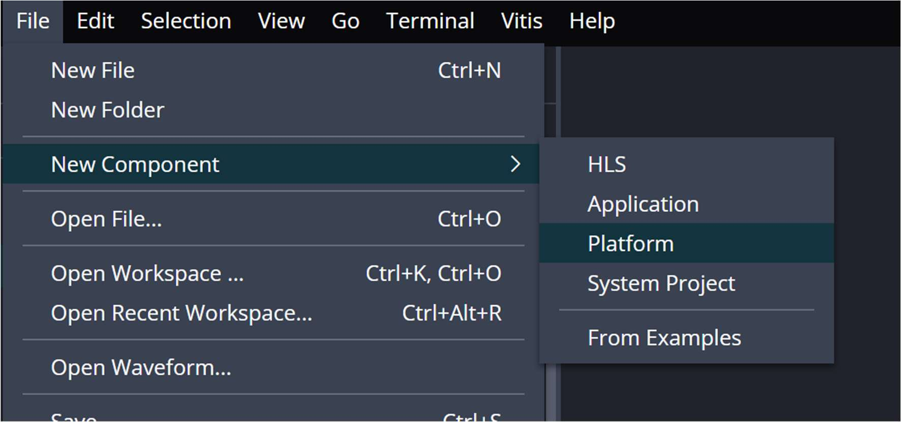

Figure 56. Creating a new platform in Vitis IDE.

Then write a name for the platform: genesys2_std_microblaze
Then select the XSA file you created from Vivado. This file describes the hardware
architecture of your project. If you modify the architecture once the platform has
been created, you can still change the XSA file without loss of the work done on the
platform.
Select the microprocessor and the Operating System. At this time select the
standalone to work with BareMetal applications.
@Marcos Martínez Peiró, Feb 25. Pag 33

---

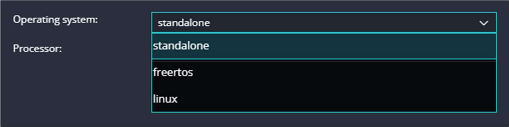

Figure 57. Standalone, FreeRTOS and Linux OS for the Platform.

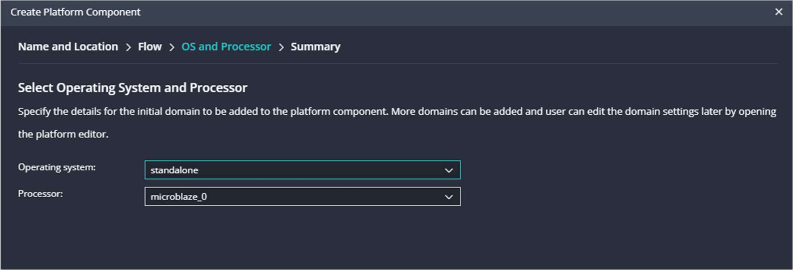

Figure 58. Processor and Operating System.

Once the platform has been created compile it. Look at the structure of the
platform, this represents the lower layers of software: the BSP (Board Support
Package) with the drivers that connect the peripheral and the Microblaze processor.
To compile the platform, select in the Flow window Build to compile. In the same
window, by selecting the wheel the setting JSON file open, this file is under the
setting folder and represent the settings for the platform compilation process.
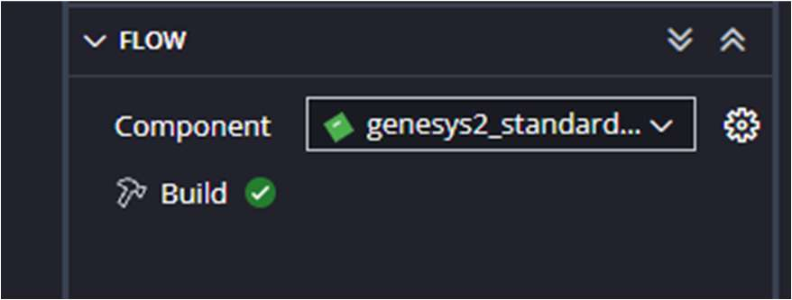

Figure 59. Building the platform.

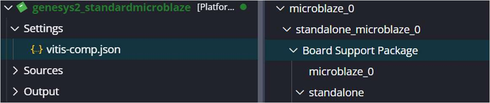

Figure 60. Settings file for the platform

@Marcos Martínez Peiró, Feb 25. Pag 34

---

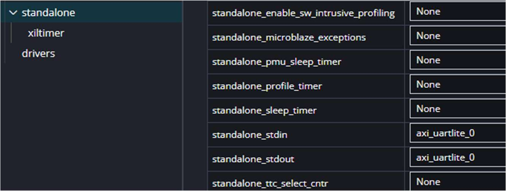

Figure 61. UART selection as stdout and stdin for the platform.

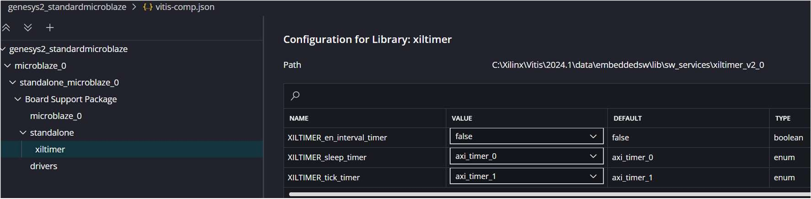

Figure 62. Sleep timer timer and tick timer for the platform.

Now we are ready to create applications over the platform thus creating a complete
software layer architecture.
Step 1. Create a new Application.
Open Vitis environment.
NOTE: the starting point consider that you have already created a Platform.
Now there are two options: create from the scratch or use templates from
examples.
@Marcos Martínez Peiró, Feb 25. Pag 35

---

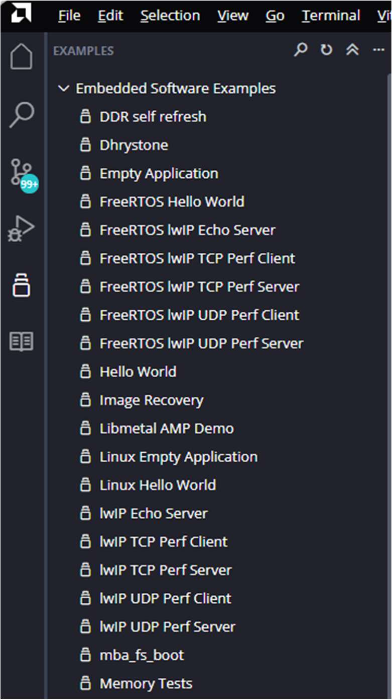

Figure 63. Examples from the Vitis IDE.

Select Hello_World Example and call the new component
Genesys2_BareMetal_App.
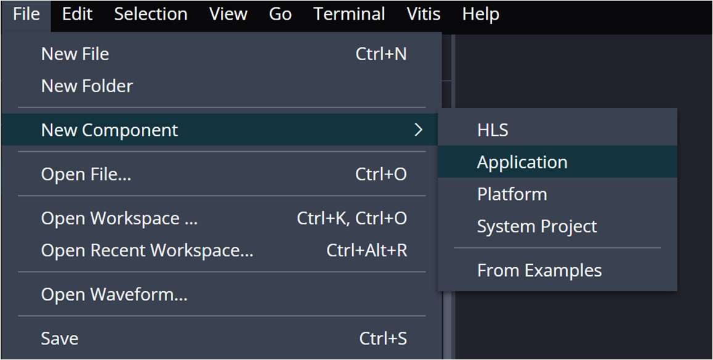

Figure 64. Creating an application from the scratch.

Select the Platform to work on (the one you created in the previous exercise).
Once the application has been created look into the settings folder and select the
setting for the application.
@Marcos Martínez Peiró, Feb 25. Pag 36

---

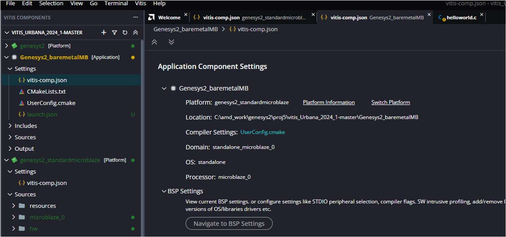

Figure 65. Settings for the application.

The setting allows us to change the XSA file by selecting the Switch Platform (this
only is used when exist a modification on the hardware structure from Vivado)
Check the Platform Information to verify the hardware structure of our system.
Check the Compiler Setting where you can select di(cid:431)erent compiler optimization
methods.
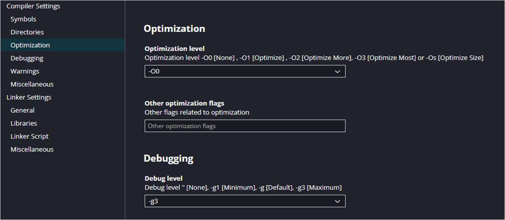

Figure 66. Compiler Setting.

Once the setting is understood, investigate the C files under the folder Sources.
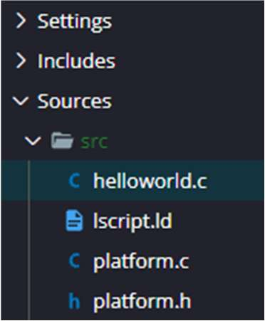

Figure 67. Source files.

Open the helloworld.c example.
@Marcos Martínez Peiró, Feb 25. Pag 37

---

One of the issues working on predefined examples is the inclusion of many macros
and libraries than waste size and thus memory in our embedded application. Is a
good practice to learn from the examples but to adapt to your own application and
peripherals.
Step 2. Modify the helloworld example.
Comment some lines of code:
//#include <stdio.h>
//#include "platform.h"
#include "xil_printf.h"
int main()
{
// init_platform();
xil_printf("Hello World\n\r");
xil_printf("Successfully ran Hello World application");
// cleanup_platform();
return 0;
}
Instead of using the stdio library where the printf is defined, better to use a reduced
version of the printf called xil_printf() that come from xil_printf.h
The functions init_platform() and cleanup_platform() call a predefined UART that
does not match the one we use in the architecture (uart_lite). The files platform.c
and platform.h could be erased from the application.
1. Select BUILD to compile the code.

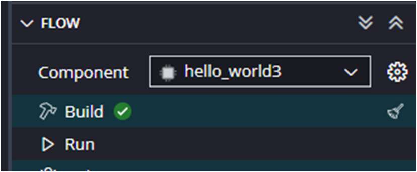

Figure 68. Compiling in VITIS.

2. Then select the DEBUG session:
@Marcos Martínez Peiró, Feb 25. Pag 38

---
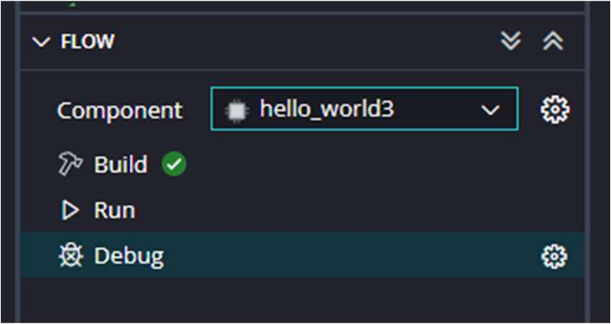

Figure 69. Debug session.

Before to DEBUG select the configuration wheel settings to shows the options in
the debugger session.
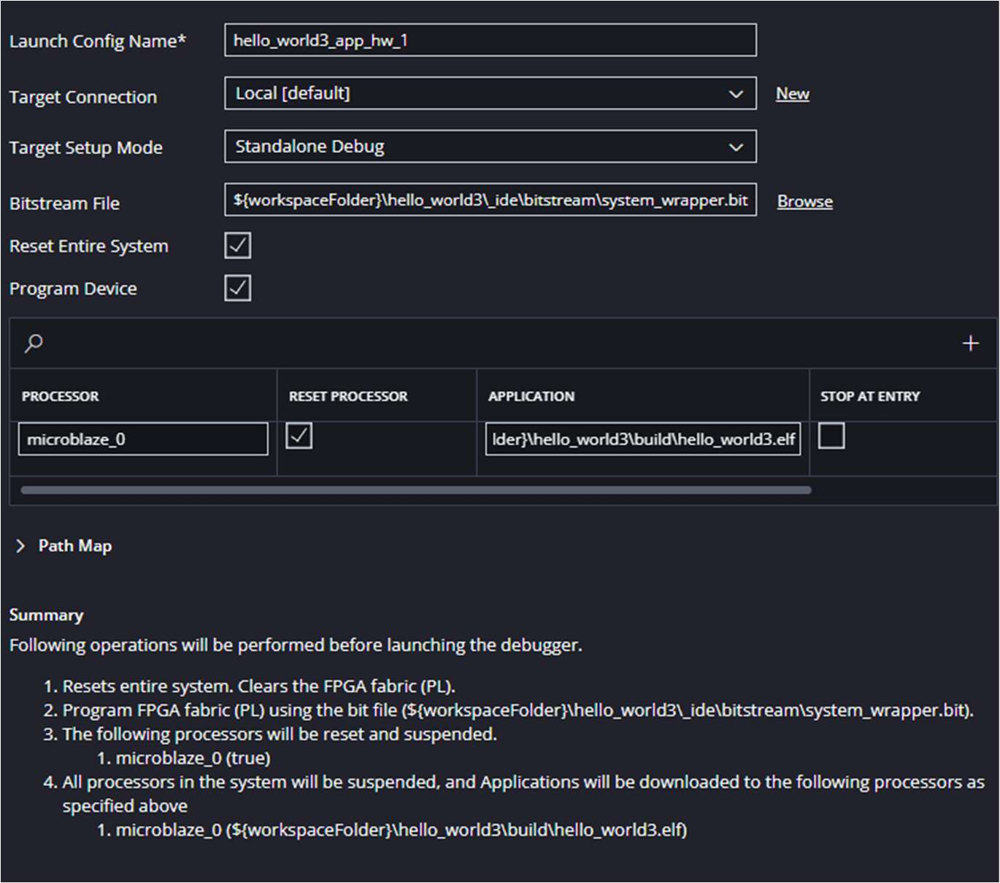

Figure 70. Settings for the debugger session.

If the FPGA was programmed from Vivado you can unselect the Program Device
and Reset Entire System. If not, select both options. Once the board has been
programmed you can unselect for next sessions of debugger.
Reset the processor is recommended to initialize the running of MicroBlaze.
3. Then click on DEBUG, after some second the DEBUG sessions start.

Figure 71. Continuous run, step and restart.

@Marcos Martínez Peiró, Feb 25. Pag 39

---

You can use StepOver to debug each code line. You can insert Breakpoints as usual
in a debugger environment.
Open a serial terminal in your computer and look the received messages (configure
the serial port according with the AXI_UART defined in the architecture).
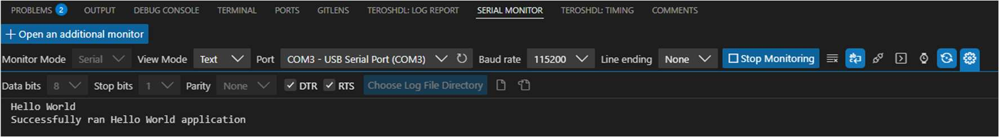

Figure 72. Serial Monitor in VSC.

TIP
When working with a UART on a MicroBlaze system, there are key di(cid:431)erences between xil_printf() and printf(),
mainly in terms of e(cid:431)iciency and implementation.
1. Dependency on Standard Library
printf(): Part of the C standard library (newlib), which supports advanced format conversions but
can increase code size and execution time in embedded systems like MicroBlaze.
xil_printf(): A lightweight function provided by Xilinx, optimized for embedded systems. It does not
depend on newlib, making it more e(cid:431)icient in terms of memory and performance.
2. Format Handling
printf(): Supports all standard C format specifiers, such as %f (floating point), %x (hexadecimal), %o
(octal), etc.
xil_printf(): Does not support floating point (%f), making it more e(cid:431)icient for resource-constrained
systems.
3. Code Size
printf(): Can significantly increase the compiled code size due to the inclusion of newlib functions,
which may be problematic in memory-limited systems.
xil_printf(): Much more compact and e(cid:431)icient in terms of memory usage because it is optimized for
Xilinx hardware.
4. UART Output
printf(): Requires stdout to be redirected to UART, which may need additional configuration.
xil_printf(): Already optimized to send data directly to UART in Xilinx embedded systems.
When to Use Each?
If you need e(cid:431)iciency and smaller code size, use xil_printf().
If you need advanced formatting (such as floating point support), use printf(), but be aware of the higher
resource consumption.
In MicroBlaze-based embedded systems, xil_printf() is generally recommended unless you specifically
require the advanced formatting features of printf().
ATTENTION: If VIVADO JTAG is still connected to the board as Target Connected
some issues could appear if VITIS try to program the board. You must select one
of the two options: VITIS or VIVADO to program your FPGA. If you will program
without modify your architecture better to program from VITIS so disconnect
previously the Hardware Platform from VIVADO®.
@Marcos Martínez Peiró, Feb 25. Pag 40

---

Step 3. Messages in a forever loop.
We will include a new library to use the usleep() function. Include the library
“sleep.h” and create a while loop.
int main()
{
u32 i = 0;
while(1){
xil_printf("Hello World\n\r");
xil_printf("Successfully ran Hello World application number %d\n\r",i);
i++;
usleep(1000000); // sleep for 1 second
}
return 0;
}
Compile and debug.
NOTE:
If your hardware does not contain an AXI_Timer, the timer used is the inner
MicroBlaze timer. The time response of the usleep() function is highly dependent of
the MicroBlaze frequency operation from your Vivado Design.
@Marcos Martínez Peiró, Feb 25. Pag 41

---

Exercise 2. Managing GPIO. Part I.
The exercise works on the GPIO of our architecture: the LEDS and switches. The
objective is to read and write on the GPIOs and understand the libraries and drivers
of the GPIO.
Step 1. Libraries
Include next libraries
#include "xgpio.h" // XGpio
#include "xil_types.h" // u16, u32
#include "xparameters.h" // XPAR_AXI_GPIO_0_BASEADDR
#include "xstatus.h" // XST_SUCCESS
TIP: Encapsulating code by conditional compilation.
Use #ifdef and #endif to create new examples on the same code.
#define GPIO_EXAMPLE
#ifdef GPIO_EXAMPLE
#endif // GPIO_EXAMPLE
These are the libraries needed for the GPIO control exercise:
a) xgpio.h to use the read and write function for the GPIO.
b) xparameter.h describes the contents of the hardware architecture
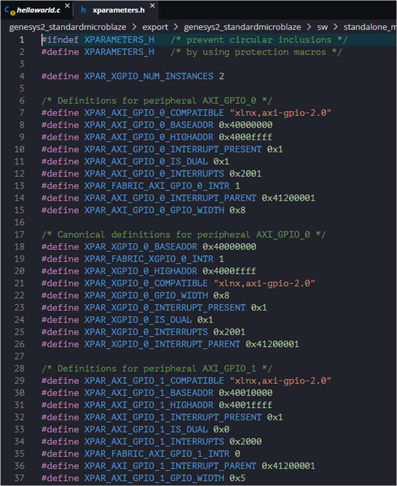

Figure 73. xparameter file.

@Marcos Martínez Peiró, Feb 25. Pag 42

---

Step 2. Constant and prototype functions.
Write constant and prototype functions needed for GPIO control.
XGpio Gpio_sw_led; /* The Instance of the GPIO Driver */
#define SW_CHANNEL 1 // Switches are connected to channel 1
#define LED_CHANNEL 2 // LEDs are connected to channel 2
#define LED_DELAY 1000000 // Delay in microseconds
#define NUMBER_OF_SW 8 // Number of switches
Why switches are on channel 1 and LEDs on channel 2?
Step 3. Initialization of GPIO in main().
Before the while() loop write next initialization values.
int Status;
u32 SW_read;
u32 LED_write;
/* Initialize the GPIO driver */
Status = XGpio_Initialize(&Gpio_sw_led, XPAR_AXI_GPIO_0_BASEADDR);
if (Status != XST_SUCCESS) {
xil_printf("Gpio Initialization Failed\r\n");
return XST_FAILURE;
}
/* SW are inputs */
XGpio_SetDataDirection(&Gpio_sw_led,SW_CHANNEL,0x0000FFFF);
/* LED are outputs */
XGpio_SetDataDirection(&Gpio_sw_led,LED_CHANNEL,0x00);
Look into the functions’ code to understand the GPIO driver functionality.
Step 4. Into the while(): reading and writing GPIO.
Modify the code in the loop.
xil_printf("Successfully ran GPIO example number %d\n\r",i);
i++;
/* Read Switches */
SW_read = XGpio_DiscreteRead(&Gpio_sw_led, SW_CHANNEL);
xil_printf("\n\r Valor de SW: %lu \n\r", (unsigned long) SW_read);
@Marcos Martínez Peiró, Feb 25. Pag 43

---

/* Set the LED to the value of the switches */
LED_write = SW_read;
/* Set the corresponding LEDs to the same level as its switch is indicating */
XGpio_DiscreteWrite(&Gpio_sw_led, LED_CHANNEL, LED_write);
usleep(LED_DELAY);
Step 5: Compile and Debug
Use the DEBUG session to look at the memory region of the GPIO switches.
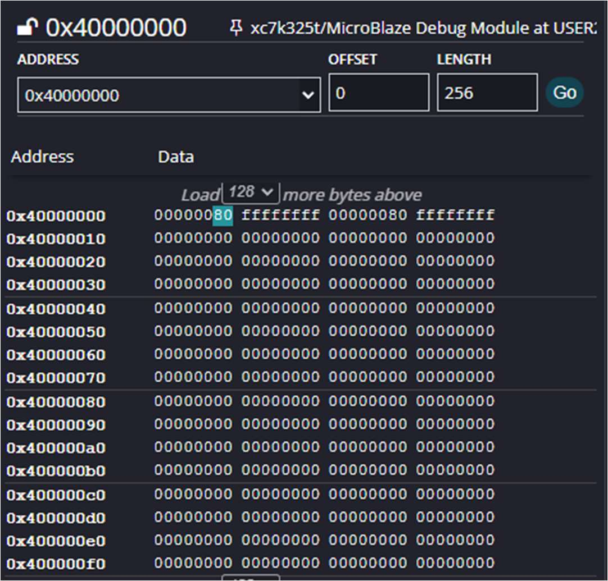

Figure 74. Debugging memory region.

By debugging step-by-step try to modify the switches in each iteration to read the
peripheral memory region.
Change switches and look at the LEDs on the Genesys2 board.
@Marcos Martínez Peiró, Feb 25. Pag 44

---

Exercise 3. Managing GPIO. Part II.
Let’s play with the LEDs lights.
Specifications:
a) when all switches are o(cid:431), LEDs toggle between 0xAA and 0x55 with a delay
of 100ms between both values.
b) When a switch is ON, LEDs start toggle from LED0 to LED7 with a delay of
100ms (LED0 light on, then after 1s LED0 lights o(cid:431) and LED1 lights on and
so on). When LED7 lights on then toggle from LED7 to LED0, changing the
direction.
Program the code, compile and debug.
Use the step-to-step debugging and watch local variables to expand the
debugging capabilities.
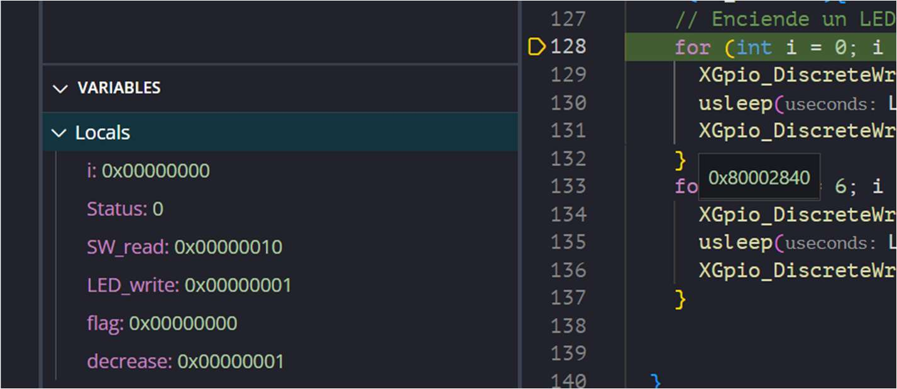

Figure 75. Local Variables in the Vitis Debugger.

An additional debugging is to show the disassembly of the C code. In the C code
line click on the right button of the mouse and a menu expands.
@Marcos Martínez Peiró, Feb 25. Pag 45

---

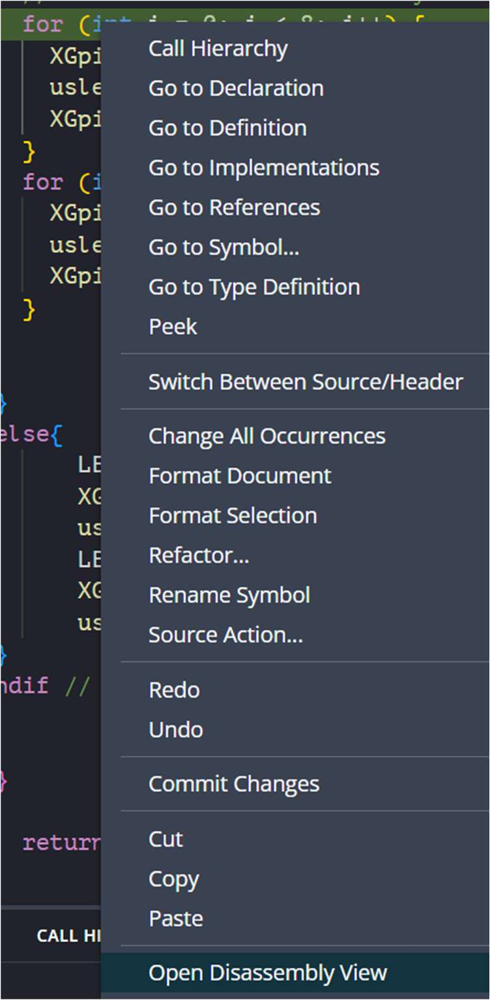

Figure 76. Disassembly option in the debugger.

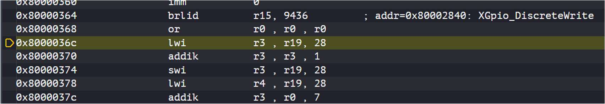

Figure 77. Disassembly of the C code.

Show the result to the teacher!
@Marcos Martínez Peiró, Feb 25. Pag 46

---

Exercise 4. Managing GPIO. Part III. Pushbutton and interruptions.
The objective now is to manage interruptions from pushbuttons.
When a Pushbutton is pressed a message indicating the value of BTN is displayed.
The pushbuttons in the Genesys2 board are connected to GND so when one of them
are pressed a high state or positive edge generates an interruption in the MicroBlaze
processor through the AXI Interruption Controller.
First, a review of the memory address of the GPIO register for BTN is recommended
to clarify all concepts for interruptions.
The macro XGPIO_IR_CH1_MASK with value
#define XPAR_XGPIO_1_BASEADDR 0x40010000
Is described in the file xparameters.h that represents the memory map of our
hardware architecture.
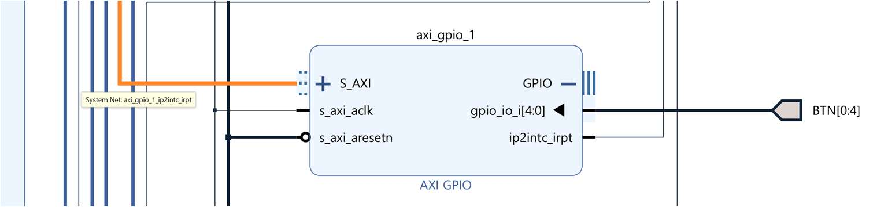

Figure 78. Axi GPIO 1 with the connection of BTNs.

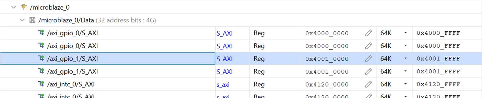

Figure 79. Memory map for the axi_gpio_1.

@Marcos Martínez Peiró, Feb 25. Pag 47

---
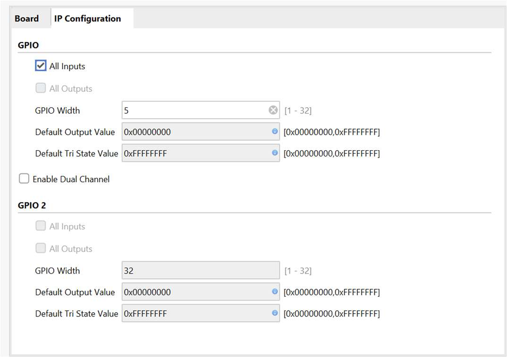

Figure 80. Configuration of AXI_GPIO_1 for the BTNs.

Step 1. Include libraries and constants.
To manage the interruptions from interrupt controller and Microblaze processor
several libraries are needed. Do not forget maintaining previous created libraries.
#include "xgpio.h" // XGpio
#include "xil_types.h" // u16, u32
#include "xparameters.h" // Architecture definition
#include "xstatus.h" // XST_SUCCESS
#include "xil_exception.h" // Xil_ExceptionEnable
#include "xinterrupt_wrap.h" // XIntc_Initialize
The constants needed for the example are:
/************************** Constant Definitions *****************************/
XGpio Gpio_sw_led; // The Instance of the GPIO Driver
XGpio Gpio_btn; // The instance of the GPIO Driver for key buttons
XGpio_Config *ConfigPtr_btn; // Pointer to the configuration of the GPIO
#define SW_CHANNEL 1 // Switches are connected to channel 1
#define LED_CHANNEL 2 // LEDs are connected to channel 2
#define LED_DELAY 1000000 // Delay in microseconds -> 1s
#define NUMBER_OF_SW 8 // Number of switches
#define LED_DELAY_2 100000 // Delay in microseconds -> 0.1s
Step 2. Definitions, types and prototype functions.
To create the ISR, some macro definitions are needed.
/***** Interruption macros *********************************************/
#define BUTTON_INTERRUPT XGPIO_IR_CH1_MASK // Interrupt mask for channel 1
#define INTERRUPT_CONTROL_VALUE 0x7 // Enable all interrupts
#define XGPIO_BTN_AXI_BASEADDRESS XPAR_XGPIO_1_BASEADDR // Base addr of the GPIO BTN
@Marcos Martínez Peiró, Feb 25. Pag 48

---

#define BTN_CHANNEL 1 // Channel of the BTN
/* Pushbutton debouncing*/
#define BTN_DEBOUNCE_TIME 100000 // Debounce time in microseconds
Step 3. Global variables and function prototypes.
Global variables are those that can be shared in and out of the ISR function with full visibility.
/******** Global variables *********************************************/
u32 DataRead_btn; // Data read from the push buttons, global variable
static volatile u32 IntrFlag; // Interrupt Handler Flag
u32 delay_interrupt; // Delay to wait for interrupt
/************************** Function Prototypes ******************************/
void Gpio_Btn_Handler(void *CallBackRef);
Step 4. Initialization section in main().
Variables and GPIO initialization for the example, at the beginning of main().
int Status;
u32 Register;
/* Initialize the GPIO driver */
Status = XGpio_Initialize(&Gpio_btn, XPAR_AXI_GPIO_1_BASEADDR);
if (Status != XST_SUCCESS) {
xil_printf("Gpio Initialization Failed\r\n");
return XST_FAILURE;
}
/* BTN are inputs */
XGpio_SetDataDirection(&Gpio_btn,BTN_CHANNEL,0x000000FF); // BTN are inputs
/* Register the Interrupt Handler */
XGpio_InterruptGlobalEnable(&Gpio_btn); // Enable global interrupt
XGpio_InterruptEnable(&Gpio_btn, 0x1); // Enable interrupt for BTN
//XGpio_InterruptEnable(&Gpio_sw_led, 0x00000000); // Disable interrupt for SW
ConfigPtr_btn = XGpio_LookupConfig(XPAR_XGPIO_1_BASEADDR); // Get the configuration
of the GPIO
if (ConfigPtr_btn == NULL) {
return XST_FAILURE;
}
Status = XSetupInterruptSystem(&Gpio_btn, // Instance of the GPIO
&Gpio_Btn_Handler, // Handler of the GPIO
ConfigPtr_btn->IntrId, // Interrupt ID
ConfigPtr_btn->IntrParent, // Interrupt parent
XINTERRUPT_DEFAULT_PRIORITY); // Interrupt priority
if (Status != XST_SUCCESS) {
@Marcos Martínez Peiró, Feb 25. Pag 49

---

return XST_FAILURE;
}
Xil_ExceptionEnable(); // Enable the MicroBlaze global interruptions
IntrFlag = 0;
delay_interrupt = 0;
The previous code represents the fundamentals of managing an interruption
system:
a) Initialization and direction of GPIO BTN.
b) Enable global interrupt system (enable the AXI Interrupt Controller). An AXI
Interrupt Controller is connected to MicroBlaze (MB) to manage di(cid:431)erent
interruptions.
c) Enable the AXI_GPIO BTN interrupt system. Read and write in the GPIO
Interrupt Enable Register (IER) Register, setting a 1 to enable interruptions.
d) Set Up the Interrupt Controller (INTC) system for GPIO BTN. This Set Up
initializes and runs the INTC, connecting the AXI_GPIO for BTN to the MB
Processor.
e) Enable the MB global interruptions.
NOTE: To know the process to read and write in the GPIO interrupt registers, dive
into the interrupt enable function.
void XGpio_InterruptEnable(XGpio *InstancePtr, u32 Mask)
{
u32 Register;
Xil_AssertVoid(InstancePtr != NULL);
Xil_AssertVoid(InstancePtr->IsReady == XIL_COMPONENT_IS_READY);
Xil_AssertVoid(InstancePtr->InterruptPresent == TRUE);
/*
* Read the interrupt enable register and only enable the specified
* interrupts without disabling or enabling any others.
*/
Register = XGpio_ReadReg(InstancePtr->BaseAddress, XGPIO_IER_OFFSET);
XGpio_WriteReg(InstancePtr->BaseAddress, XGPIO_IER_OFFSET,Register | Mask);
}
@Marcos Martínez Peiró, Feb 25. Pag 50

---

Step 5. The while(1) loop for the GPIO BTN interruption.
The loop prints the value of the BTN that has been previously read from the ISR and
waits 1s to do not saturate the UART (std_out).
if (IntrFlag == 0) {
// xil_printf("Pushbutton no pressed\n\r");
} else {
//DataRead_btn= XGpio_DiscreteRead(&Gpio_btn, BTN_CHANNEL);
//xil_printf("Pushbutton %d pressed\n\r", DataRead_btn);
IntrFlag = 0;
switch(DataRead_btn) {
case 0x01:
xil_printf("Pushbutton 0 (UP) pressed\n\r");
break;
case 0x02:
xil_printf("Pushbutton 1 (RIGHT) pressed\n\r");
break;
case 0x04:
xil_printf("Pushbutton 2 (LEFT) pressed\n\r");
break;
case 0x08:
xil_printf("Pushbutton 3 (DOWN) pressed\n\r");
break;
case 0x10:
xil_printf("Pushbutton 4 (CENTER) pressed\n\r");
break;
default:
// xil_printf("Pushbutton not pressed\n\r");
break;
}
}
usleep(100000); // 0,1s for the loop again
@Marcos Martínez Peiró, Feb 25. Pag 51

---

Step 6. The Interrupt Service Routine (ISR) for the GPIO BTN example.
The ISR read the value of the pushbutton pressed. Unfortunately, the pushbuttons
of the Genesys2 board do not have a hardware debouncing system thus, if needed,
a software one must be implemented, try to test the performance without software
debounce (commented lines) and if there is bouncing uncomment again.
void Gpio_Btn_Handler(void *CallbackRef)
{
//XGpio *GpioPtr = (XGpio *)CallbackRef;
/* Disable the interrupt */
XGpio_InterruptDisable(&Gpio_btn, BUTTON_INTERRUPT);
/* Clear the Interrupt */
XGpio_InterruptClear(&Gpio_btn, BUTTON_INTERRUPT);
// Debounce the push buttons
/*
delay_interrupt = BTN_DEBOUNCE_TIME;
while (delay_interrupt != 0) {
delay_interrupt--;
}
*/
/* Read the state of the push buttons */
DataRead_btn = XGpio_DiscreteRead(&Gpio_btn, BTN_CHANNEL);
/* Set the flag */
IntrFlag = 1;
/* Enable the interrupt */
XGpio_InterruptEnable(&Gpio_btn, BUTTON_INTERRUPT);
return;
}
The previous code represents a classical method to build an ISR:
a) Disable Interruptions.
b) Clear Interruptions.
c) Process Interruption (debouncing if needed, reading GPIO and set the
corresponding flag).
d) Enable the Interruption.
Some optimizations could be made if debouncing and reading was managed
outside the ISR to speedup this critical section of code.
Final Step. Compile and show the results to the teacher.
@Marcos Martínez Peiró, Feb 25. Pag 52

---

Exercise 5. Managing the AXI Timer. POLLING.
One of the basic peripherals in every microcontroller architecture is a timer. The
Vivado architecture created builds two AXI Timers that will be managed in this
section. Axi Timer 0 and 1 will be used as sleep and tick timer respectively. The inner
characteristics of each AXI Timer let to create up to 2 timers (counters) in the same
AXI Timer architectural block by using counters of 32 bits instead one of 64 bits.
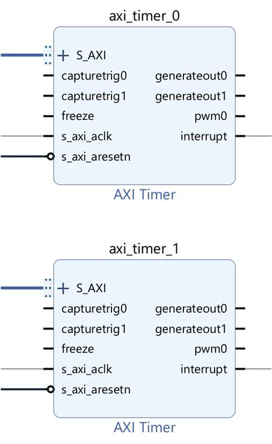

Figure 81. The AXI timer 0 and 1 in the hardware architecture.

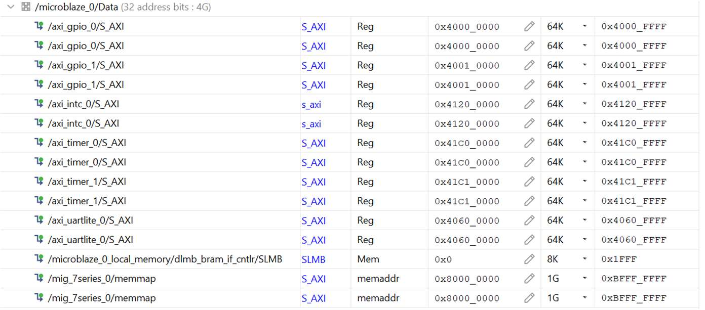

Figure 82. Memory map region for the AXI timer 0 and AXI Timer 1in the hardware architecture.

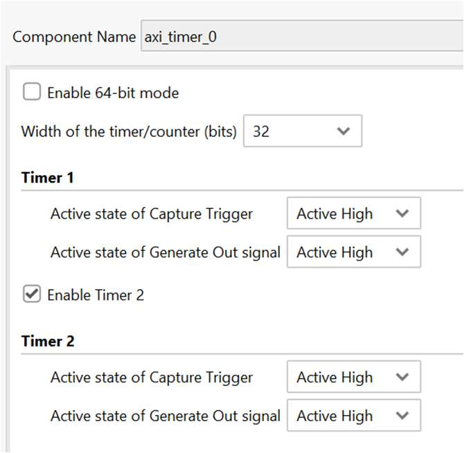

Figure 83. Parameters of timer 0. Two timers are enabled in each AXI Timer.

@Marcos Martínez Peiró, Feb 25. Pag 53

---

First thing is to study the peripheral, AMD easiest method to locate the documents
are the links in the Documentation tab in the peripheral IP Block in the Vivado IDE.
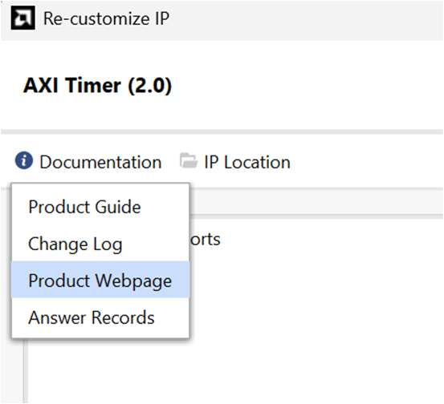

Figure 84. Searching documentation of the AXI Timer.

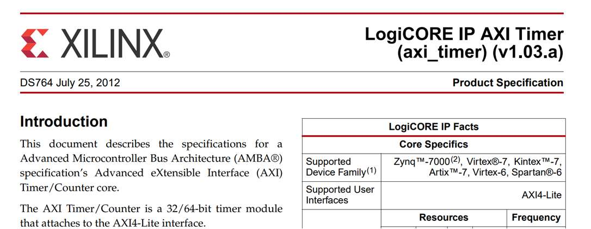

Figure 85. Data Sheet of the AXI Timer.

Step 1. Check Setting in the platform.
Check the timers selected in the platform
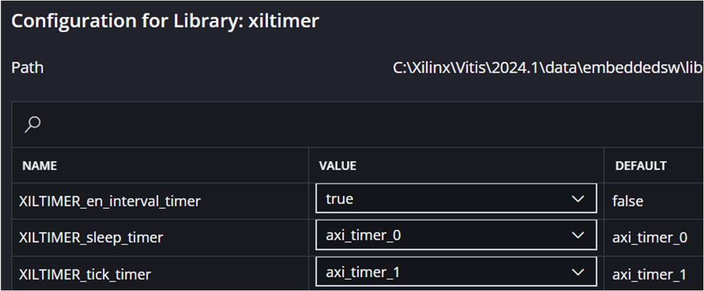

Figure 86. Configuration of timers.

Axi_timer 0 is selected as sleep_timer thus sleep() library and function will use it.
Axi_timer 1 is selected as tick timer, managing the functionality of a classical
microcontroller peripheral timer (getting the current time by polling or
interruptions).
@Marcos Martínez Peiró, Feb 25. Pag 54

---

Step 2. Libraries, constant definition and prototype functions.
#include "xil_printf.h" // xil_printf
#include "sleep.h" // usleep
#include "xgpio.h" // XGpio
#include "xil_types.h" // u16, u32
#include "xparameters.h" // XPAR_AXI_GPIO_0_BASEADDR
#include "xstatus.h" // XST_SUCCESS
#include "xil_exception.h" // Xil_ExceptionEnable
#include "xinterrupt_wrap.h" // XIntc_Initialize
#include "xtmrctr.h" // XTmrCtr
#define XTMRCTR_BASEADDRESS XPAR_XTMRCTR_1_BASEADDR // Base address of the timer 1
used as interval timer
/*
* This example only uses the 1st of the 2 timer counters contained in a
* single timer counter hardware device
*/
#define TIMER_COUNTER_0 0
#define TIMER_COUNTER_1 1
// function prototypes for exercise 4
int TmrCtrPolledExample(UINTPTR BaseAddr, u8 TmrCtrNumber, XTmrCtr TimerCounter);
int TimerInit(UINTPTR BaseAddr, u8 TmrCtrNumber, XTmrCtr TimerCounter);
/************************** Variable Definitions *****************************/
XTmrCtr TimerCounter_0; /* The instance of the Tmrctr 0 Device */
XTmrCtr TimerCounter_1; /* The instance of the Tmrctr 1 Device */
XGpio Gpio_sw_led; /* The Instance of the GPIO Driver */
#define SW_CHANNEL 1 // Switches are connected to channel 1
#define LED_CHANNEL 2 // LEDs are connected to channel 2
u32 Value1;
u32 Value2;
@Marcos Martínez Peiró, Feb 25. Pag 55

---

Step 3. Initialize in the main().
Before the while() loop include next code, representing initializations of GPIOs and
two timers from the same AXI Timer
u32 LED_write;
/* Initialize the GPIO driver */
Status = XGpio_Initialize(&Gpio_sw_led, XPAR_AXI_GPIO_0_BASEADDR);
if (Status != XST_SUCCESS) {
xil_printf("Gpio Initialization Failed\r\n");
return XST_FAILURE;
}
/* SW are inputs */
XGpio_SetDataDirection(&Gpio_sw_led,SW_CHANNEL,0x0000FFFF);
/* LED are outputs */
XGpio_SetDataDirection(&Gpio_sw_led,LED_CHANNEL,0x00);
Status = TimerInit(XTMRCTR_BASEADDRESS, TIMER_COUNTER_0,TimerCounter_0);
if (Status != XST_SUCCESS) {
xil_printf("Tmrctr 0 Initialization Failed\r\n");
return XST_FAILURE;
} else {
xil_printf("Tmrctr 0 Initialization Success\r\n");
}
Status = TimerInit(XTMRCTR_BASEADDRESS, TIMER_COUNTER_1,TimerCounter_0);
if (Status != XST_SUCCESS) {
xil_printf("Tmrctr 1 Initialization Failed\r\n");
return XST_FAILURE;
} else {
xil_printf("Tmrctr 1 Initialization Success\r\n");
}
The TimerInit() function is written in the next code:
int TimerInit(UINTPTR BaseAddr, u8 TmrCtrNumber, XTmrCtr TimerCounter)
{
int Status;
XTmrCtr *TmrCtrInstancePtr = &TimerCounter;
Status = XTmrCtr_Initialize(TmrCtrInstancePtr, BaseAddr);
if (Status != XST_SUCCESS) {
return XST_FAILURE;
}
@Marcos Martínez Peiró, Feb 25. Pag 56

---

/*
* Perform a self-test to ensure that the hardware was built
* correctly, use the 1st timer in the device (0)
*/
Status = XTmrCtr_SelfTest(TmrCtrInstancePtr, TmrCtrNumber);
if (Status != XST_SUCCESS) {
return XST_FAILURE;
}
// Set the reset value of the timer counter such that it's incrementing by default
XTmrCtr_SetResetValue(TmrCtrInstancePtr, TmrCtrNumber,0xFFFFFFFF); // 0xFFFFFFFF
start value of the timer
/*
* Enable the Autoreload mode of the timer counters.
*/
XTmrCtr_SetOptions(TmrCtrInstancePtr, TmrCtrNumber,XTC_AUTO_RELOAD_OPTION|
XTC_DOWN_COUNT_OPTION); // Enable autoreload and down count
/*
* Start the timer counter
*/
XTmrCtr_Start(TmrCtrInstancePtr, TmrCtrNumber);
xil_printf("Timer started\n\r");
Value1 = XTmrCtr_GetValue(TmrCtrInstancePtr, TmrCtrNumber);
xil_printf("Value1: %lu \n\r", (unsigned long) Value1);
usleep(100000); // 0.1s for the loop again
Value1 = XTmrCtr_GetValue(TmrCtrInstancePtr, TmrCtrNumber);
xil_printf("Value1 after 100ms: %lu \n\r", (unsigned long) Value1);
XTmrCtr_Reset(TmrCtrInstancePtr, TmrCtrNumber);
XTmrCtr_Start(TmrCtrInstancePtr, TmrCtrNumber);
Value1 = XTmrCtr_GetValue(TmrCtrInstancePtr, TmrCtrNumber);
xil_printf("Value1 after reset: %lu \n\r", (unsigned long) Value1);
return XST_SUCCESS;
}
Step 4. Switching LEDs in the while loop.
The easiest part of the exercise into the while loop code:
usleep(1000000); // 1s for the loop again
XGpio_DiscreteWrite(&Gpio_sw_led, LED_CHANNEL, 0xFF); //LEDs ON
usleep(1000000); // 1s for the loop again
XGpio_DiscreteWrite(&Gpio_sw_led, LED_CHANNEL, 0x00); //LEDs OFF
@Marcos Martínez Peiró, Feb 25. Pag 57

---

Exercise 6. Managing the AXI Timer. INTERRUPT.
This example describes the use of a AXI Timer to generate periodic interruptions.
In the file xtmrctr.h there is an overview of the functionality of a Xilinx AXI timer.
The Xilinx timer/counter supports the following features:
a) Polled mode.
b) Interrupt driven mode.
c) enabling and disabling specific timers.
d) PWM operation.
e) Cascade Operation (This is to be used for getting a 64 bit timer).
The timer counter operates in 2 primary modes, compare and capture. In either
mode, the timer counter may count up or down, with up being the default.
Compare mode is typically used for creating a single time period or multiple
repeating time periods in the auto reload mode, such as a periodic interrupt. When
started, the timer counter loads an initial value, referred to as the compare value,
into the timer counter and starts counting down or up. The timer counter expires
when it rolls over/under depending upon the mode of counting. An external compare
output signal may be configured such that a pulse is generated with this signal when
it hits the compare value.
Capture mode is typically used for measuring the time period between external
events. This mode uses an external capture input signal to cause the value of the
timer counter to be captured. When started, the timer counter loads an initial
value, referred to as the compare value.
The timer can be configured to either cause an interrupt when the count reaches the
compare value in compare mode or latch the current count value in the capture
register when an external input is asserted in capture mode. The external capture
input can be enabled/disabled using the XTmrCtr_SetOptions function. While in
compare mode, it is also possible to drive an external output when the compare
value is reached in the count register The external compare output can be
enabled/disabled using the XTmrCtr_SetOptions function.
Timer Interrupts
It is the responsibility of the application to connect the interrupt handler of the
timer/counter to the interrupt source. The interrupt handler function,
XTmrCtr_InterruptHandler, is visible such that the user can connect it to the
interrupt source. Note that this interrupt handler does not provide interrupt context
save and restore processing, the user must perform this processing.
@Marcos Martínez Peiró, Feb 25. Pag 58

---

Step 1. Libraries and definitions.
At the beginning of the file use next code:
#include "xgpio.h" // XGpio
#include "xil_types.h" // u16, u32
#include "xparameters.h" // XPAR_AXI_GPIO_0_BASEADDR
#include "xstatus.h" // XST_SUCCESS
#include "xil_exception.h" // Xil_ExceptionEnable
#include "xinterrupt_wrap.h" // XIntc_Initialize
#include "xtmrctr.h" // XTmrCtr
// Base address of the timer 1 used as interval timer
#define XTMRCTR_BASEADDRESS XPAR_XTMRCTR_1_BASEADDR
/*
* This example only uses the 1st of the 2 timer counters contained in a
* single timer counter hardware device
*/
#define TIMER_COUNTER_0 0
#define TIMER_COUNTER_1 1
XTmrCtr TimerCounter_0; /* The instance of the Tmrctr 0 Device */
XTmrCtr TimerCounter_1; /* The instance of the Tmrctr 1 Device */
/*
* The following constant is used to set the reset value of the timer counter,
* making this number larger reduces the amount of time this example consumes
* because it is the value the timer counter is loaded with when it is started
*/
#define RESET_VALUE 0xFFFF0000
/************************** Function Prototypes ******************************/
int TmrCtrIntrExample_Init(XTmrCtr *TmrCtrInstancePtr,
UINTPTR BaseAddr);
int TmrCtrIntrExample(XTmrCtr *InstancePtr,
UINTPTR BaseAddr);
static void TmrCtrDisableIntr( u16 IntrId, UINTPTR IntrParent);
static void TimerCounterHandler(void *CallBackRef, u8 TmrCtrNumber);
/************************** Variable Definitions *****************************/
/*
* The following variables are shared between non-interrupt processing and
* interrupt processing such that they must be global.
*/
static volatile int TimerExpired;
static volatile int LastTimerExpired;
@Marcos Martínez Peiró, Feb 25. Pag 59

---

Step 2. Initialization function.
Inside main() but before the while loop call an application specific function to
initialize the timer.
Status=TmrCtrIntrExample_Init(&TimerCounter_1,XTMRCTR_BASEADDRESS);
if (Status != XST_SUCCESS) {
xil_printf("Tmrctr 1 interrupt Example Initialization Failed\r\n");
return XST_FAILURE;
} else {
xil_printf("Tmrctr 1 interrupt Example Initialization Success\r\n");
}
#endif // TIMER_INTERRUPT_EXAMPLE
xil_printf("Hello World\n\r");
An define the function in a C file or at the end of the code.
int TmrCtrIntrExample_Init(XTmrCtr *TmrCtrInstancePtr,
UINTPTR BaseAddr)
{
int Status;
int LastTimerExpired = 0;
u8 TmrCtrNumber = TIMER_COUNTER_1;
/*
* Initialize the timer counter so that it's ready to use,
* specify the device ID that is generated in xparameters.h
*/
Status = XTmrCtr_Initialize(TmrCtrInstancePtr, BaseAddr);
if (Status != XST_SUCCESS) {
return XST_FAILURE;
}
/*
* Perform a self-test to ensure that the hardware was built
* correctly
*/
Status = XTmrCtr_SelfTest(TmrCtrInstancePtr, TmrCtrNumber);
if (Status != XST_SUCCESS) {
return XST_FAILURE;
}
/*
* Connect the timer counter to the interrupt subsystem such that
@Marcos Martínez Peiró, Feb 25. Pag 60

---

* interrupts can occur.
*/
Status = XSetupInterruptSystem(TmrCtrInstancePtr,
(XInterruptHandler)XTmrCtr_InterruptHandler, \
TmrCtrInstancePtr->Config.IntrId, TmrCtrInstancePtr->Config.IntrParent, \
XINTERRUPT_DEFAULT_PRIORITY);
if (Status != XST_SUCCESS) {
return XST_FAILURE;
}
/*
* Setup the handler for the timer counter that will be called from the
* interrupt context when the timer expires, specify a pointer to the
* timer counter driver instance as the callback reference so the
* handler is able to access the instance data
*/
XTmrCtr_SetHandler(TmrCtrInstancePtr, TimerCounterHandler,
TmrCtrInstancePtr);
/*
* Enable the interrupt of the timer counter so interrupts will occur
* and use auto reload mode such that the timer counter will reload
* itself automatically and continue repeatedly, without this option
* it would expire once only
*/
XTmrCtr_SetOptions(TmrCtrInstancePtr, TmrCtrNumber,
XTC_INT_MODE_OPTION | XTC_AUTO_RELOAD_OPTION);
/*
* Set a reset value for the timer counter such that it will expire
* earlier than letting it roll over from 0, the reset value is loaded
* into the timer counter when it is started
*/
XTmrCtr_SetResetValue(TmrCtrInstancePtr, TmrCtrNumber, RESET_VALUE);
/*
* Start the timer counter such that it's incrementing by default,
* then wait for it to timeout a number of times
*/
XTmrCtr_Start(TmrCtrInstancePtr, TmrCtrNumber);
TimerExpired = 0;
LastTimerExpired = 0;
return XST_SUCCESS;
}
@Marcos Martínez Peiró, Feb 25. Pag 61

---

The function does:
1. Initialize the timer.
2. A self-test of the timer.
3. Set Up the Interrupt System.
4. Set the handler function when timer expires.
5. Stablish the options: interrupt mode and auto reload.
6. Set the Reset Value.
7. Start the Timer.
Step 3. Handler function.
Every time the timer expires the handler function executes.
An example code of this function is:
void TimerCounterHandler(void *CallBackRef, u8 TmrCtrNumber)
{
XTmrCtr *InstancePtr = (XTmrCtr *)CallBackRef;
/*
* Check if the timer counter has expired, checking is not necessary
* since that's the reason this function is executed, this just shows
* how the callback reference can be used as a pointer to the instance
* of the timer counter that expired, increment a shared variable so
* the main thread of execution can see the timer expired
*/
if (XTmrCtr_IsExpired(InstancePtr, TmrCtrNumber)) {
TimerExpired++;
//xil_printf("Timer expired %d times\n\r", TimerExpired);
if (TimerExpired == 3) {
XTmrCtr_SetOptions(InstancePtr, TmrCtrNumber, 0); // Disable the timer counter
}
}
}
@Marcos Martínez Peiró, Feb 25. Pag 62

---

Step 4: Doing anything in the while loop.
Inside the while loop a new function is called.
int Status;
/*
* Run the Timer Counter - Interrupt example.
*/
Status = TmrCtrIntrExample(&TimerCounter_1,XTMRCTR_BASEADDRESS);
if (Status != XST_SUCCESS) {
xil_printf("Tmrctr 1 interrupt Example Failed\r\n");
return XST_FAILURE;
}
xil_printf("Successfully ran Tmrctr 1 interrupt Example\r\n");
And the code for the TmrCtrIntrExample() is:
int TmrCtrIntrExample(XTmrCtr *TmrCtrInstancePtr,
UINTPTR BaseAddr)
{
int Status;
u8 TmrCtrNumber = TIMER_COUNTER_1;
/*
* Wait for the first timer counter to expire as indicated
* by the shared variable which the handler will increment
*/
while (TimerExpired == LastTimerExpired) {
}
LastTimerExpired = TimerExpired;
xil_printf("Timer expired %d times\n\r", LastTimerExpired);
/*
* If it has expired a number of times, then stop the timer counter and stop this
example */
if (TimerExpired == 3) {
XTmrCtr_Stop(TmrCtrInstancePtr, TmrCtrNumber); // Stop the timer counter
}
return XST_SUCCESS;
}
Step 5. Show the result to the teacher.
@Marcos Martínez Peiró, Feb 25. Pag 63

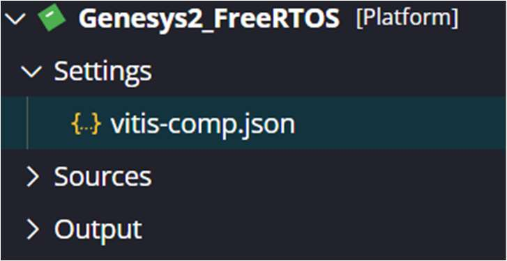

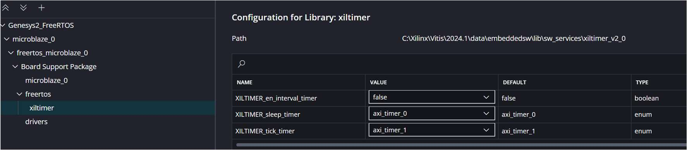

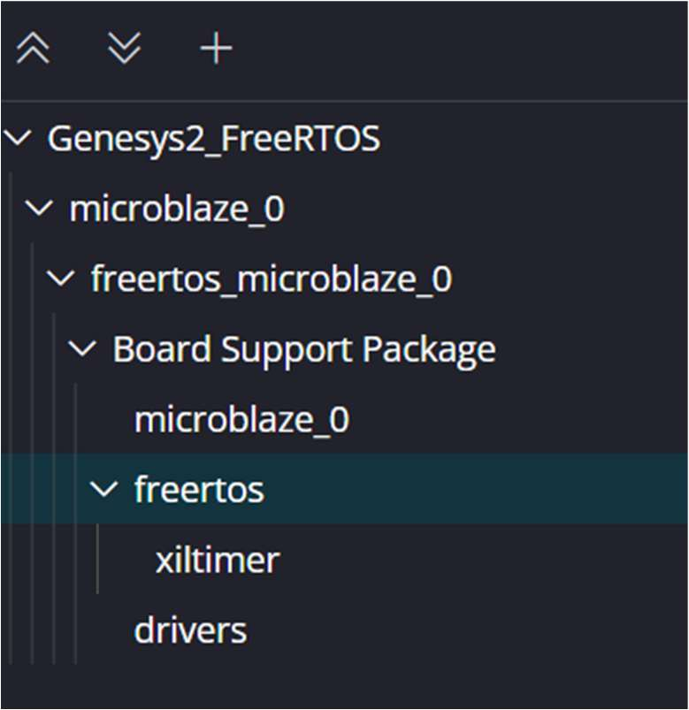

FREERTOS ON AMD KINTEX7 FPGA
Exercise 1: Creating a project with FreeRTOS.
1. Vivado: Create a timer to work like FreeRTOS SysTick.
2. Export the HW and launch a new Vitis platform with FreeRTOS OS for
Microblaze.
3. In BSP edit settings and select timers appropriately.
FreeRTOS Setup
@Marcos Martínez Peiró, Feb 25. Pag 64