[← Back to Chapter 2](chapter-2-baremetal.md)

<script src="./static/step-navigation.js"></script>

<style>
.step-container {
  max-width: 800px;
  margin: 2rem auto;
}

.step {
  display: none;
  padding: 2rem;
  border: 1px solid var(--lightgray);
  border-radius: 8px;
  background-color: var(--light);
}

.step.active {
  display: block;
  animation: fadeIn 0.3s ease-in;
}

@keyframes fadeIn {
  from { opacity: 0; }
  to { opacity: 1; }
}

.step h2 {
  margin-top: 0;
  color: var(--secondary);
}

.navigation {
  display: flex;
  justify-content: space-between;
  align-items: center;
  margin-top: 2rem;
  gap: 1rem;
  flex-wrap: wrap;
}

button {
  padding: 0.7rem 1.5rem;
  background-color: var(--secondary);
  color: white;
  border: none;
  border-radius: 5px;
  cursor: pointer;
  font-weight: bold;
  transition: background-color 0.2s;
}

button:hover:not(:disabled) {
  background-color: var(--tertiary);
}

button:disabled {
  opacity: 0.5;
  cursor: not-allowed;
}

.step-indicator {
  text-align: center;
  font-weight: bold;
  color: var(--darkgray);
}

.objectives {
  background-color: var(--highlight);
  padding: 1rem;
  border-left: 4px solid var(--secondary);
  margin-bottom: 1.5rem;
  border-radius: 4px;
}

.objectives h3 {
  margin-top: 0;
}

.objectives ul {
  margin-bottom: 0;
}
</style>

<div class="step-container">
<div class="step active" data-step="1">
<h2>Overview: Hello MicroBlaze</h2>

> ### Objectives
>
> Familiarize yourself with the Vitis environment, programming, and debugging<br>
> Understand the system startup process in `main()`<br>
> Learn about important libraries for BareMetal development<br>

This exercise guides you through creating your first BareMetal application on the MicroBlaze processor. You will:
- Create a Vitis platform based on your Vivado hardware design
- Create a Hello World application
- Optimize the code by removing unnecessary libraries
- Build and test the application

> [!warning] **Prerequisites** 
> Complete Chapter 1 to generate the hardware architecture and bitstream

> [!info] **Useful Resources**
>
> [Xilinx BareMetal Drivers and Libraries](https://xilinx-wiki.atlassian.net/wiki/spaces/A/pages/18841745/Baremetal+Drivers+and+Libraries)<br>
> [Xilinx Embedded Software Drivers](https://github.com/Xilinx/embeddedsw/tree/master/XilinxProcessorIPLib/drivers)<br>
> [Xilinx FPGA Wiki](https://xilinx-wiki.atlassian.net/wiki/spaces/A/overview)<br>


</div>
<div class="step" data-step="2">
<h2>Open Vitis and Create a Platform</h2>

Open the Vitis IDE and select `File`/`New Component`/`Platform`

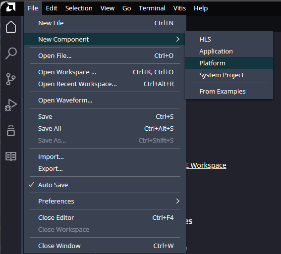

<center><em>Figure 56. Creating a new platform in Vitis IDE.</em></center><br>

</div>
<div class="step" data-step="3">
<h2>Specify the platform name</h2>

Specify the platform name `genesys2_std_microblaze`

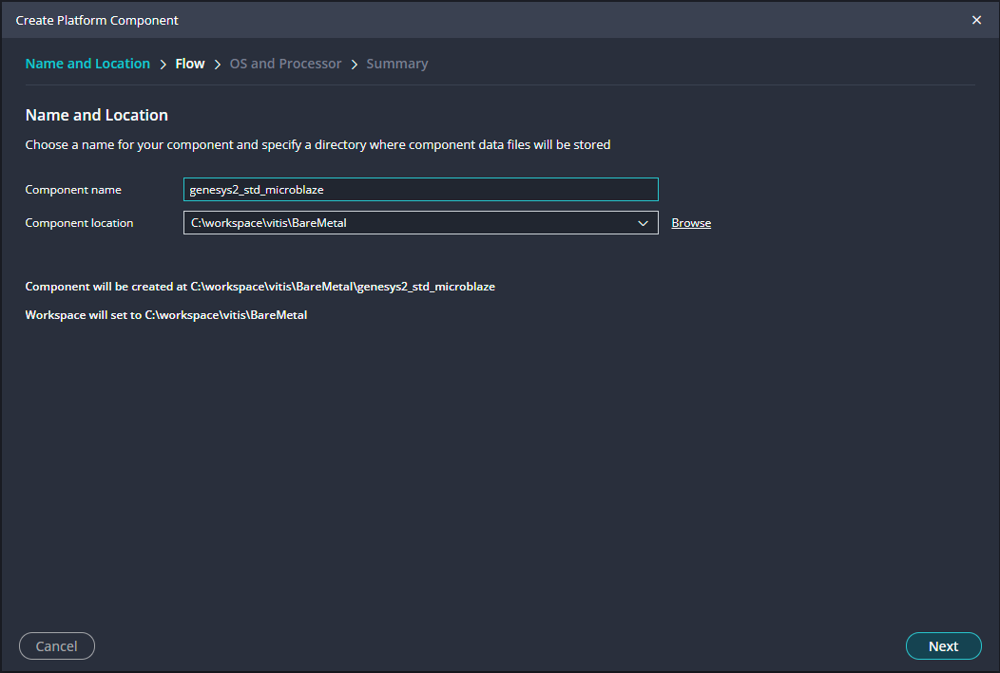

<center><em>Figure 57. Specify the platform name.</em></center><br>

</div>
<div class="step" data-step="4">
<h2>Select the XSA file</h2>

Select `Hardware Design` and browse the XSA file created from Vivado (this describes your hardware architecture)

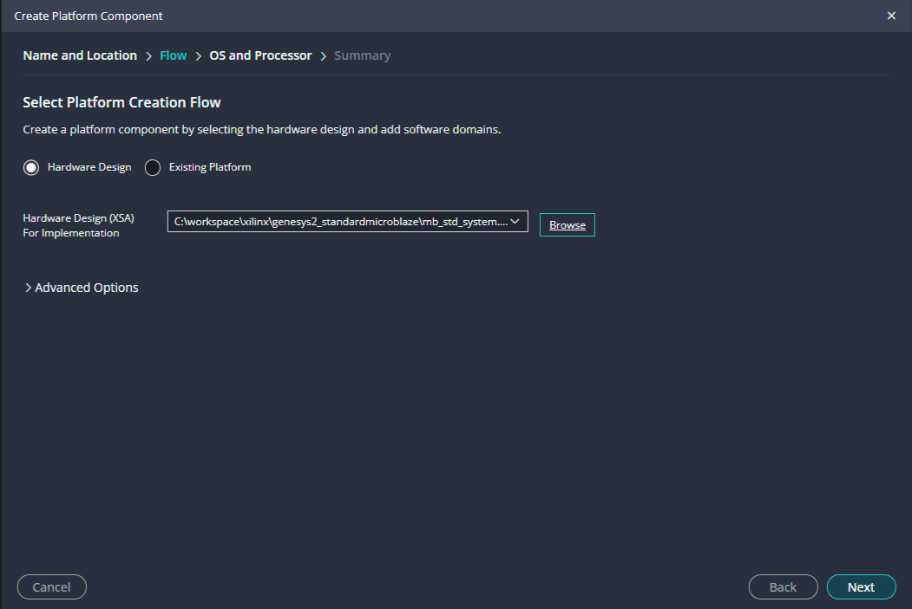

<center><em>Figure 58. Select the XSA file.</em></center><br>

If you modify the architecture in Vivado, you can update the XSA file without losing your platform configuration.

</div>
<div class="step" data-step="5">
<h2>Configure Operating System</h2>

Select `Operative System` as `Stand Alone`, select `MicroBlaze` from available processor options and finish the process

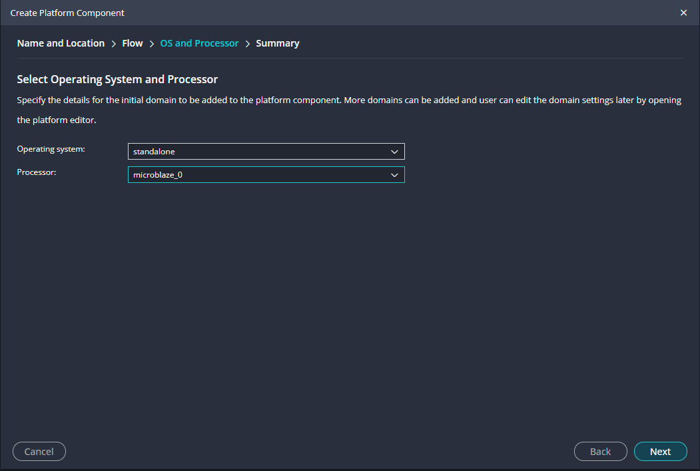

<center><em>Figure 59. Select no Operative System.</em></center><br>

</div>
<div class="step" data-step="6">
<h2>Build the Platform</h2>

Once the platform configuration is complete double click in `Build`at the `Flow` tab of the main window. The build process creates the BSP (Board Support Package) with drivers connecting peripherals to MicroBlaze

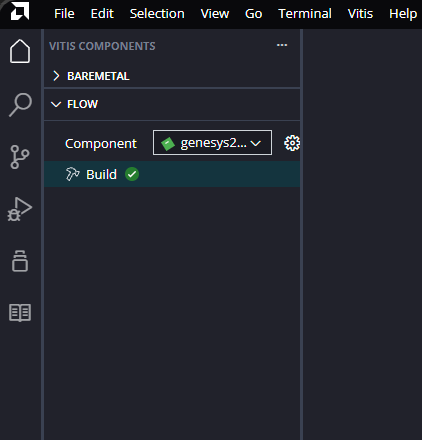

<center><em>Figure 60. Building the platform.</em></center><br>

</div>
<div class="step" data-step="7">
<h2>Configure the Platform</h2>

View settings by selecting the gear icon in the `Flow` tab or select your platform `genesys2_std_microblaze`/`Settings`/`vitis-comp.json`

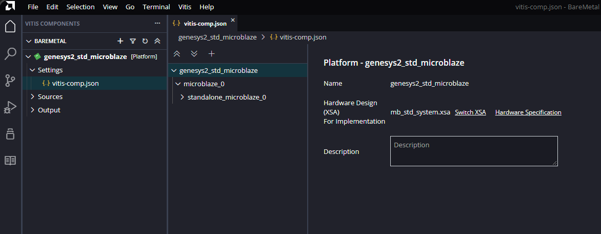

<center><em>Figure 61. Settings file for the platform.</em></center><br>

</div>
<div class="step" data-step="8">
<h2>Configure UART I/O</h2>

Configure the platform I/O settings for console communication. Select the available `axi_uartlite` as `stdin` and `stdout`. This allows you to see debug messages from your application on the console.

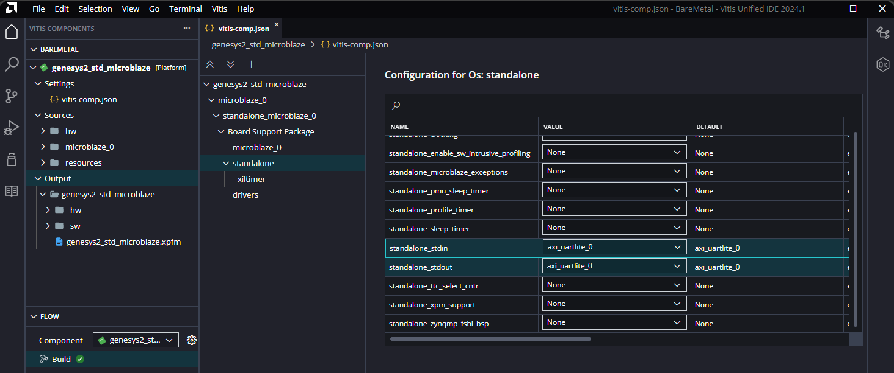

<center><em>Figure 62. UART selection as stdout and stdin for the platform.</em></center><br>

</div>
<div class="step" data-step="9">
<h2>Configure Timers</h2>

Configure timing services for the platform. Set up `sleep timer` for delay functions with `axi_timer_0`. Set up `tick timer` for system timing services with `axi_timer_1` (used by FreeRTOS later).

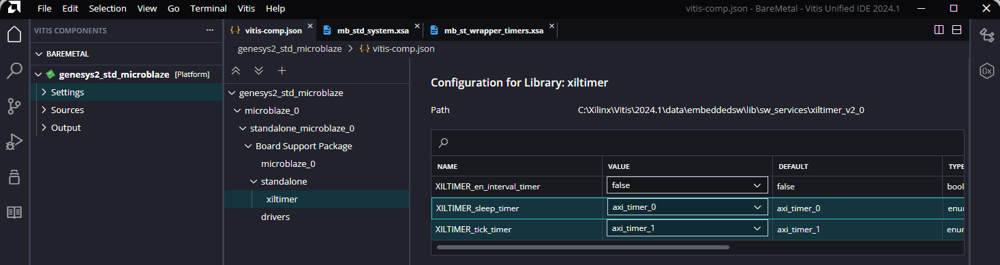

<center><em>Figure 63. Sleep timer and tick timer for the platform.</em></center><br>

</div>
<div class="step" data-step="10">
<h2>Create a New Application</h2>

Once the platform is created, you can now develop applications. Open Vitis environment (or create new project in same workspace) and select `File`/`New Component`/`From Examples`

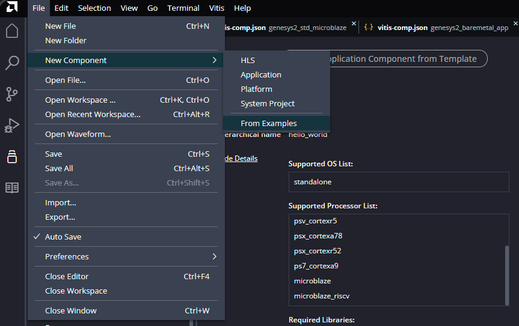

<center><em>Figure 64. Select examples.</em></center><br>

</div>
<div class="step" data-step="11">
<h2>Select Hello World Application</h2>

Select `Hello World` application and `Create Application Component from Template`

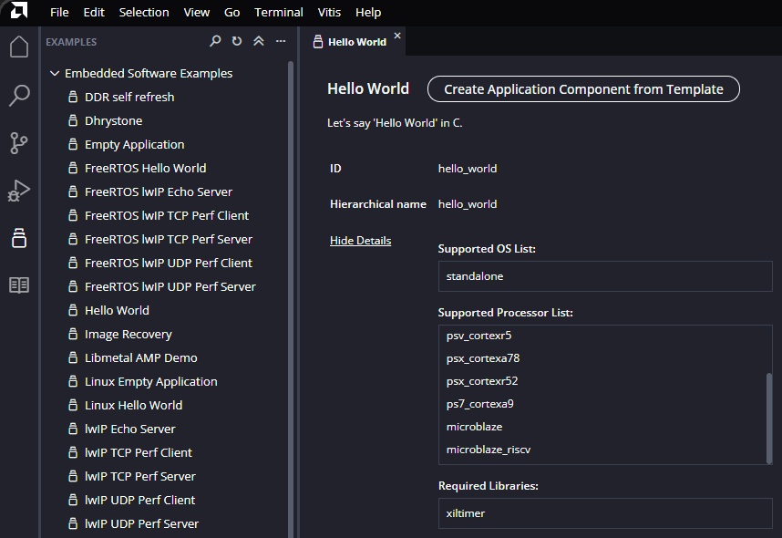

<center><em>Figure 65. Select Hello World.</em></center><br>

</div>
<div class="step" data-step="12">
<h2>Name your Application</h2>

Name your application `genesys2_baremetal_app`

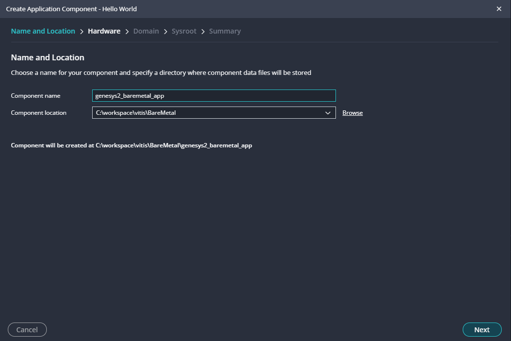

<center><em>Figure 66. Name your application.</em></center><br>

</div>
<div class="step" data-step="13">
<h2>Name your Platform</h2>

Select your platform `genesys2_std_microblaze` and finish the process. The application will build on top of this platform's BSP and drivers. 

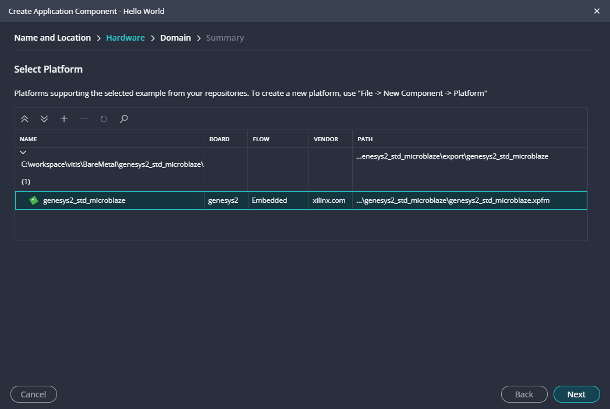

<center><em>Figure 67. Select your platform.</em></center><br>

</div>
<div class="step" data-step="14">
<h2>Configure your application</h2>

Explore the application settings folder

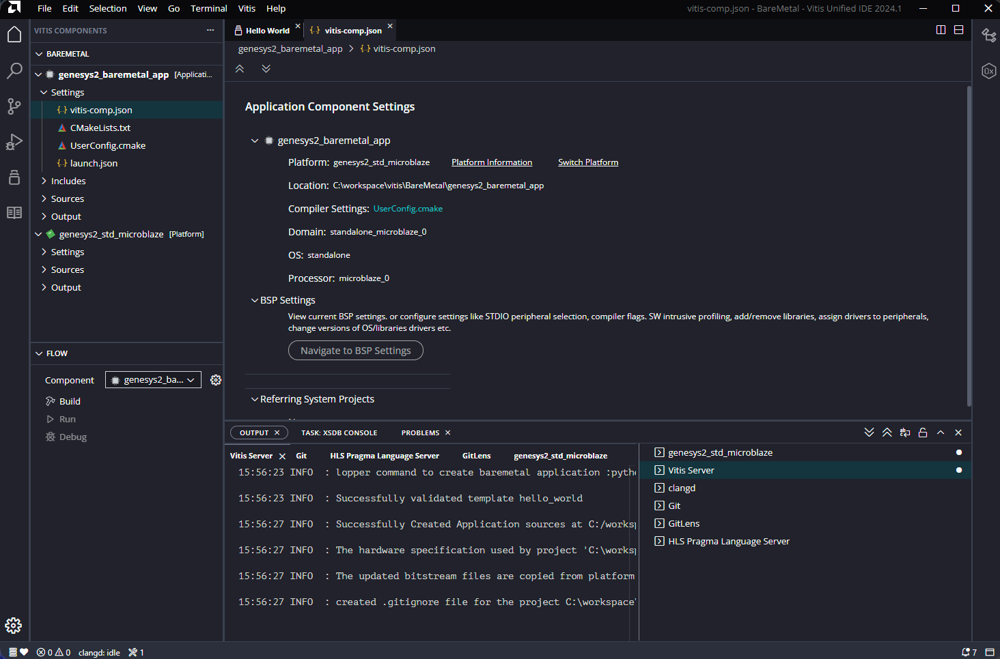

<center><em>Figure 68. Settings for the application.</em></center><br>

> [!info] Key Settings Options
>
> Switch Platform: Change XSA file if hardware modifications were made<br>
> Platform Information: Verify hardware structure<br>

</div>
<div class="step" data-step="15">
<h2>Configure Compiler Settings</h2>

Check the `Compiler Setting` where you can select diƯerent compiler optimization methods

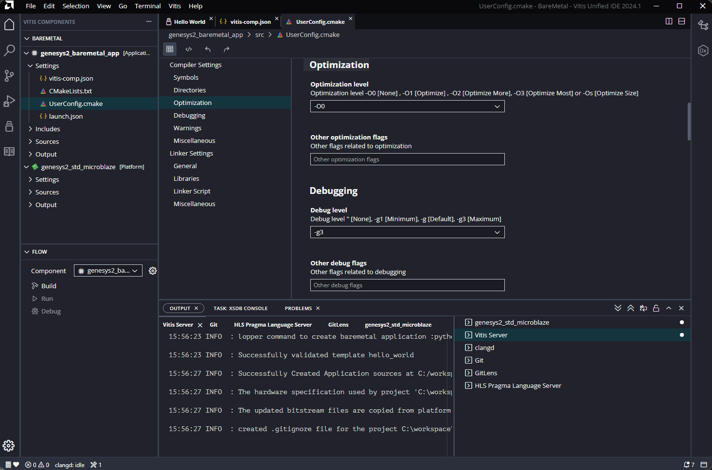

<center><em>Figure 69. Compiler Settings.</em></center><br>

</div>
<div class="step" data-step="16">
<h2>Examine Source Files</h2>

Navigate to the `Sources` folder to view the generated C files and open the `helloworld.c` file to understand the basic template structure. Note that the template includes many libraries for convenience, but you can optimize by removing unnecessary ones.

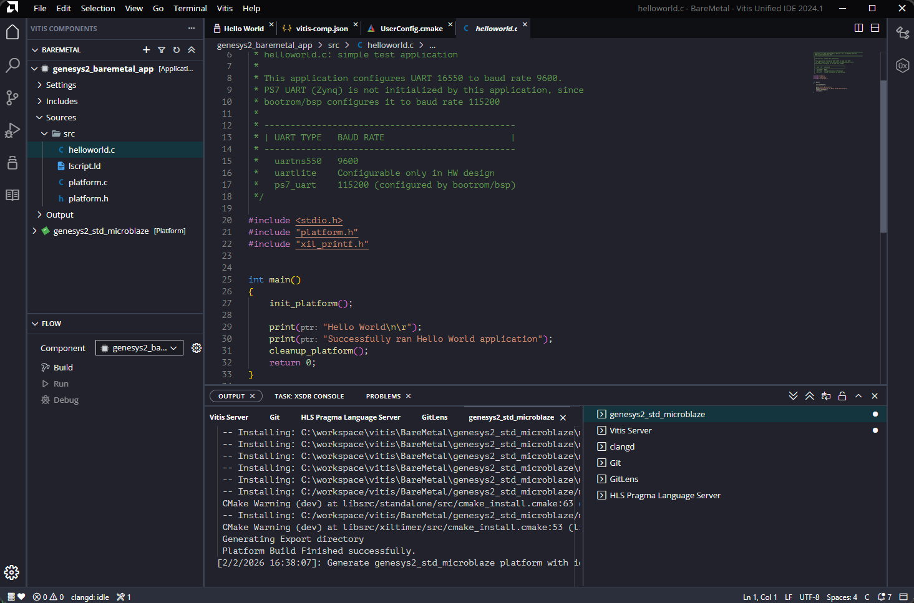

<center><em>Figure 70. Source files.</em></center><br>

</div>
<div class="step" data-step="17">
<h2>Optimize: Remove Unnecessary Includes</h2>

When using predefined examples, they often include many macros and libraries that consume unnecessary memory. Best practice is to:
- Learn from templates
- Adapt and optimize for your specific application
- Remove unnecessary includes

Modify `helloworld.c` by commenting out unused libraries:

```c
//#include <stdio.h>
//#include "platform.h"
#include "xil_printf.h"

int main()
{
    xil_printf("Hello MicroBlaze!\r\n");
    return 0;
}
```

> [!info] Benefits
>
> Removing `stdio.h` reduces code size significantly<br>
> Removing `platform.h` eliminates initialization overhead if not needed<br>
> Keeping `xil_printf.h` provides lightweight printf for debugging<br>

</div>
<div class="step" data-step="18">
<h2>Build the Application</h2>

Build your optimized application. Select the created application at the `Flow` tab and double click `Build`. Check the console for build status.

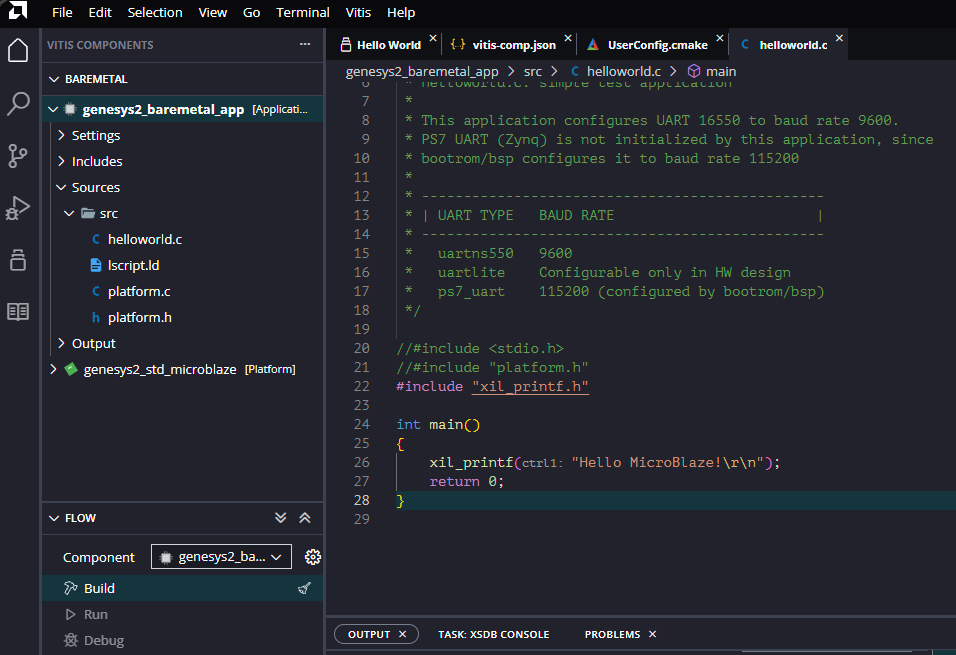

<center><em>Figure 71. Build application.</em></center><br>

Once successful, the executable is ready for programming

> [!attention] Make sure
> 
> - The platform built successfully with no errors<br>
> - The application code compiles without warnings<br>
> - You have the bitstream file from Chapter 1<br>

</div>
<div class="step" data-step="19">
<h2>Program and Test</h2>

To run your application select `Debug` from the `Flow` tab. That should download the bitstream and the application to the board. Open a terminal emulator connected to the UART (usually COM port) and run the program from the debug console. You should see "Hello MicroBlaze!" printed to the console.

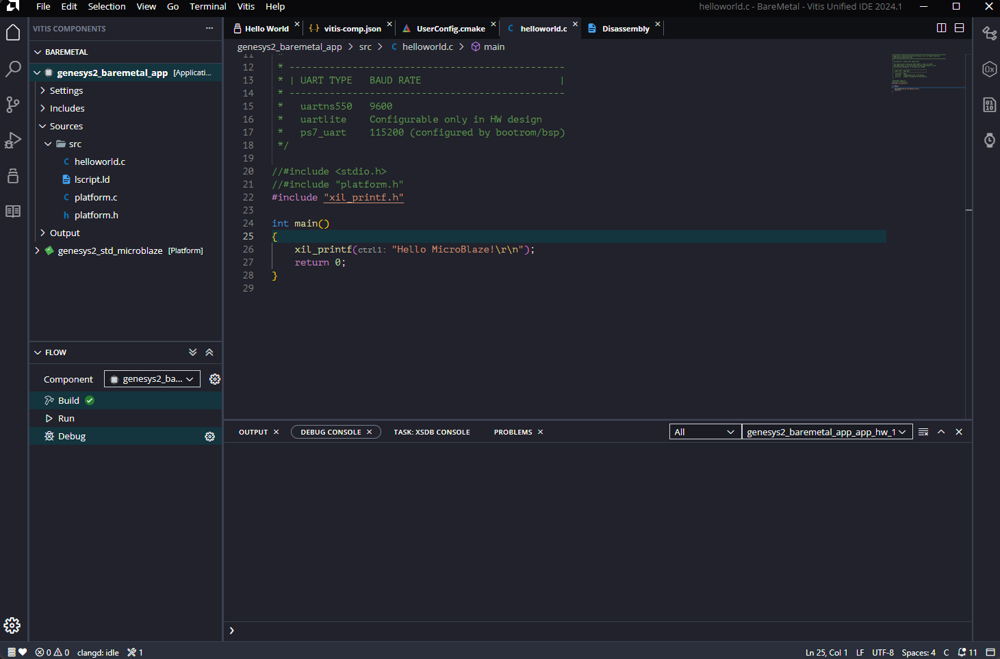

<center><em>Figure 72. Debug application.</em></center><br>

Your first BareMetal application is now running on the MicroBlaze processor!

</div>
<div class="step" data-step="20">
<h2>Configure Debug</h2>

Select the configuration wheel settings to shows the options in the debugger session. If the FPGA was already programmed, you can unselect the `Program Device` option. The `Reset Entire System` is recommended to initialize the running of MicroBlaze.


<center><em>Figure 73. Debug application options.</em></center><br>

</div>
<div class="step" data-step="21">
<h2>Application loop</h2>

```c
//#include <stdio.h>
//#include "platform.h"
#include "xil_printf.h"

int main()
{
    u32 i = 0;
    while(1)
    {
        xil_printf("Hello World, successfully ran number %d\n\r",i++);
        sleep(1); // sleep for 1 second
    } 
}
```

The output of this program on the console should look like this:

```sh
---- Opened the serial port COM4 ----
Hello World, successfully ran number 0
Hello World, successfully ran number 1
Hello World, successfully ran number 2
Hello World, successfully ran number 3
Hello World, successfully ran number 4
Hello World, successfully ran number 5
Hello World, successfully ran number 6
```

> [!info] If your hardware does not contain an `AXI Timer`, the timer used is the inner `MicroBlaze` timer. The time response of the `sleep()` function is highly dependent of the `MicroBlaze` frequency operation from your Vivado Design.

</div>
<div class="step" data-step="22">
<h2>Tips</h2>

When working with a UART on a MicroBlaze system, there are key differences between `xil_printf()` and `printf()`, mainly in terms of efficiency and implementation.

1. Dependency on Standard Library
printf(): Part of the C standard library (newlib), which supports advanced format conversions but can increase code size and execution time in embedded systems like MicroBlaze.
xil_printf(): A lightweight function provided by Xilinx, optimized for embedded systems. It does not depend on newlib, making it more eƯicient in terms of memory and performance.

2. Format Handling
printf(): Supports all standard C format specifiers, such as %f (floating point), %x (hexadecimal), %o (octal), etc.
xil_printf(): Does not support floating point (%f), making it more eƯicient for resource-constrained systems.

3. Code Size
printf(): Can significantly increase the compiled code size due to the inclusion of newlib functions, which may be problematic in memory-limited systems.
xil_printf(): Much more compact and eƯicient in terms of memory usage because it is optimized for Xilinx hardware.

4. UART Output
printf(): Requires stdout to be redirected to UART, which may need additional configuration. 
xil_printf(): Already optimized to send data directly to UART in Xilinx embedded systems.

[!info] When to Use Each?
- If you need efficiency and smaller code size, use xil_printf().
- If you need advanced formatting (such as floating point support), use printf(), but be aware of the higher resource consumption.
- In MicroBlaze-based embedded systems, xil_printf() is generally recommended unless you specifically require the advanced formatting features of printf().

[!Attention] If VIVADO JTAG is still connected to the board as Target Connected some issues could appear if VITIS try to program the board. You must select one of the two options: VITIS or VIVADO to program your FPGA. If you will program without modify your architecture better to program from VITIS so disconnect previously the Hardware Platform from Vivado.

</div>
<div class="navigation">
  <button id="prevBtn">Previous</button>
  <div class="step-indicator">
    <span><span id="currentStep">1</span> of <span id="totalSteps">22</span></span>
  </div>
  <button id="nextBtn">Next</button>
</div>

</div>

---

[Next: Exercise 2 - Managing GPIO - Part I](chapter-2-exercise-2.md)
