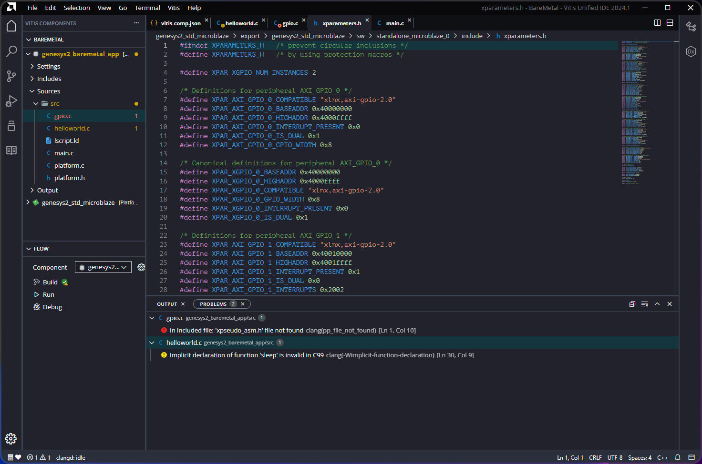
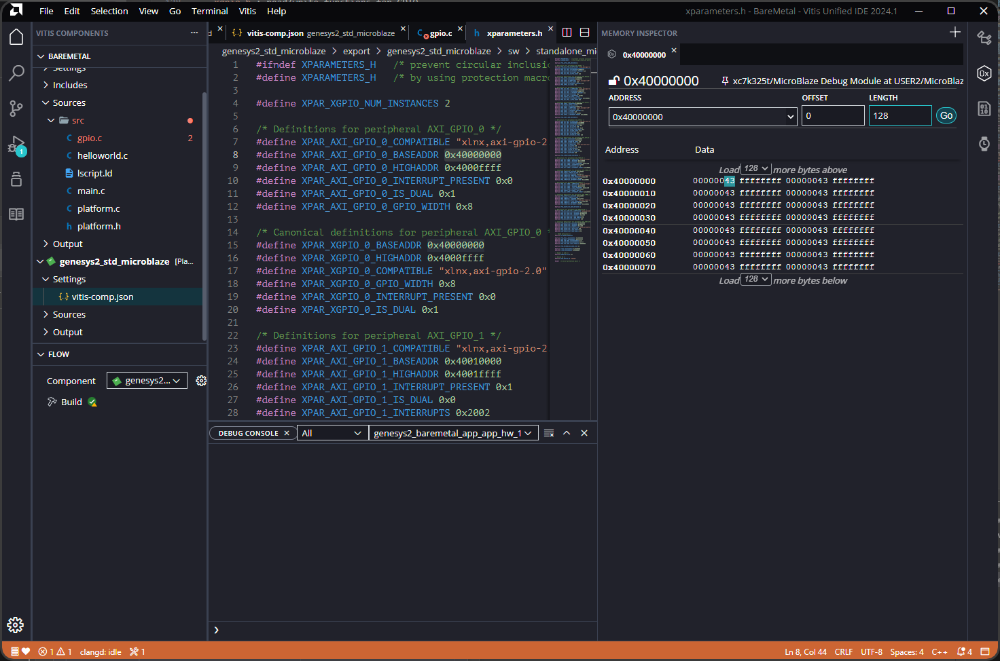

[Previous: Exercise 1](chapter-2-exercise-1.md)

<script src="./static/step-navigation.js"></script>

<style>
.step-container {
  max-width: 800px;
  margin: 2rem auto;
}

.step {
  display: none;
  padding: 2rem;
  border: 1px solid var(--lightgray);
  border-radius: 8px;
  background-color: var(--light);
}

.step.active {
  display: block;
  animation: fadeIn 0.3s ease-in;
}

@keyframes fadeIn {
  from { opacity: 0; }
  to { opacity: 1; }
}

.step h2 {
  margin-top: 0;
  color: var(--secondary);
}

.navigation {
  display: flex;
  justify-content: space-between;
  align-items: center;
  margin-top: 2rem;
  gap: 1rem;
  flex-wrap: wrap;
}

button {
  padding: 0.7rem 1.5rem;
  background-color: var(--secondary);
  color: white;
  border: none;
  border-radius: 5px;
  cursor: pointer;
  font-weight: bold;
  transition: background-color 0.2s;
}

button:hover:not(:disabled) {
  background-color: var(--tertiary);
}

button:disabled {
  opacity: 0.5;
  cursor: not-allowed;
}

.step-indicator {
  text-align: center;
  font-weight: bold;
  color: var(--darkgray);
}

.objectives {
  background-color: var(--highlight);
  padding: 1rem;
  border-left: 4px solid var(--secondary);
  margin-bottom: 1.5rem;
  border-radius: 4px;
}

.objectives h3 {
  margin-top: 0;
}

.objectives ul {
  margin-bottom: 0;
}
</style>

<div class="step-container">
<div class="step active" data-step="1">
<h2>Overview: Managing GPIO</h2>

> ### Objectives
>
> Learn how to read and write GPIO using the Xilinx drivers<br>
> Understand the role of `xgpio.h` and `xparameters.h`<br>
> Control LEDs from switches on the Genesys2 board<br>

This exercise works on the `GPIO` modules of our architecture: LEDs and switches. The objective is to read and write the GPIOs and understand the libraries and drivers used by `MicroBlaze`.

> [!info] Encapsulate examples
>
> Use conditional compilation to keep multiple examples in the same file:
>
> ```c
> #define GPIO_EXAMPLE
> ...
> #ifdef GPIO_EXAMPLE
> // GPIO example code
> #endif // GPIO_EXAMPLE
> ```

</div>
<div class="step" data-step="2">
<h2>Include Libraries</h2>

Include the following libraries in your application:

```c
#include "xgpio.h"        // XGpio
#include "xil_types.h"    // u16, u32
#include "xparameters.h"  // XPAR_AXI_GPIO_0_BASEADDR
#include "xstatus.h"      // XST_SUCCESS
```

These libraries are needed for:
- `xgpio.h`: read/write functions for GPIO
- `xparameters.h`: hardware architecture definitions



<center><em>Figure 74. xparameters file.</em></center><br>

</div>
<div class="step" data-step="3">
<h2>Constants and Prototypes</h2>

Define the constants and driver instance used for GPIO control:

```c
XGpio Gpio_sw_led; /* The Instance of the GPIO Driver */

#define SW_CHANNEL 1      // Switches are connected to channel 1
#define LED_CHANNEL 2     // LEDs are connected to channel 2
#define LED_DELAY 1000000 // Delay in microseconds
#define NUMBER_OF_SW 8    // Number of switches
```

> [!question] Why are switches on channel 1 and LEDs on channel 2? 

</div>
<div class="step" data-step="4">
<h2>Initialize GPIO in main()</h2>

Before the `while()` loop, add the initialization code:

```c
int i;
int Status;
u32 SW_read;
u32 LED_write;

/* Initialize the GPIO driver */
Status = XGpio_Initialize(&Gpio_sw_led, XPAR_AXI_GPIO_0_BASEADDR);
if (Status != XST_SUCCESS) {
    xil_printf("Gpio Initialization Failed\r\n");
    return XST_FAILURE;
}

/* SW are inputs */
XGpio_SetDataDirection(&Gpio_sw_led, SW_CHANNEL, 0x0000FFFF);

/* LED are outputs */
XGpio_SetDataDirection(&Gpio_sw_led, LED_CHANNEL, 0x00);
```

Look into the functions’ code to understand the GPIO driver functionality.

</div>
<div class="step" data-step="5">
<h2>Read and Write GPIO in the Loop</h2>

Modify the `while()` loop to read switches and update LEDs:

```c
xil_printf("Successfully ran GPIO example number %d\n\r", i++);

/* Read Switches */
SW_read = XGpio_DiscreteRead(&Gpio_sw_led, SW_CHANNEL);
xil_printf("\n\r Valor de SW: %lu \n\r", (unsigned long) SW_read);

/* Set the LED to the value of the switches */
LED_write = SW_read;
XGpio_DiscreteWrite(&Gpio_sw_led, LED_CHANNEL, LED_write);

usleep(LED_DELAY);
```

</div>
<div class="step" data-step="6">
<h2>Compile and Debug</h2>

Use the `DEBUG` session to watch the memory region of the GPIO switches. Step through the code and toggle the switches to see the LEDs update.



<center><em>Figure 75. Debugging memory region.</em></center><br>

By debugging step-by-step, try to modify the switches in each iteration to read the peripheral memory region. Change switches and look at the LEDs on the Genesys2 board.

</div>

<div class="navigation">
  <button id="prevBtn">Previous</button>
  <div class="step-indicator">
    <span><span id="currentStep">1</span> of <span id="totalSteps">6</span></span>
  </div>
  <button id="nextBtn">Next</button>
</div>

</div>

---

[Next: Exercise 3](chapter-2-exercise-3.md)
