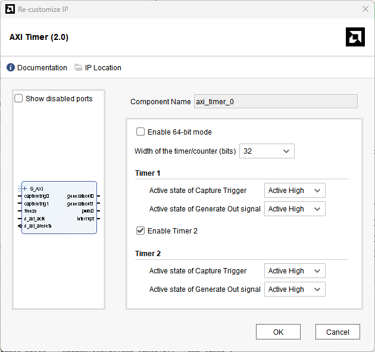
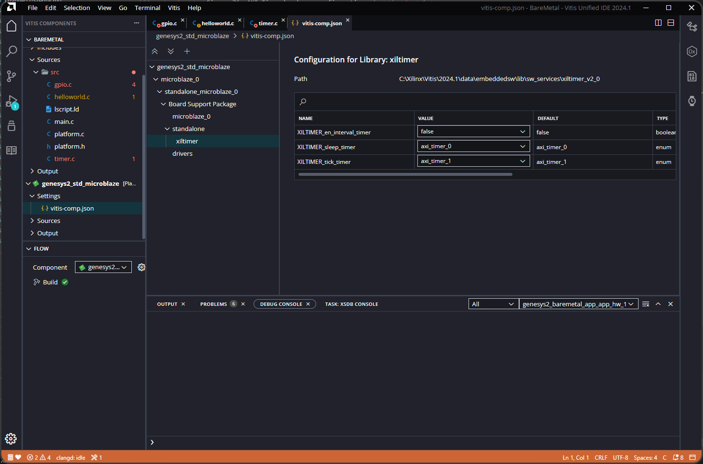

[Previous: Exercise 4](chapter-2-exercise-4.md)

<script src="./static/step-navigation.js"></script>
<link rel="stylesheet" href="./static/step-navigation.css" />

<div class="step-container">
<div class="step active" data-step="1">
<h2>AXI Timer Polling</h2>

> [!note] Objectives
>
> Understand the `AXI Timer` peripheral architecture<br>
> Initialize and configure timers using polling mode<br>
> Use timers for precise timing control in `BareMetal` applications<br>

One of the basic peripherals in every microcontroller architecture is the timer. The Vivado architecture created includes two `AXI Timers` that will be managed in this section. `AXI Timer 0` and `AXI Timer 1` will be used as sleep and tick timer respectively. The inner characteristics of each `AXI Timer` allow you to create up to 2 timers (counters) in the same `AXI Timer` architectural block by using counters of 32 bits instead of one of 64 bits. That was configured in Chapter 1.



<center><em>Figure 76. AXI Timer hardware configuration.</em></center><br>

>[!warning] Clicking the `Documentation` option in hardware properties in the Vivado IDE is an easy method to locate information and datasheets of the peripheral

</div>
<div class="step" data-step="2">
<h2>Check Timer Settings</h2>

Go to the `Platform` configuration, select `xiltimer` configuration and confirm that `AXI Timer 0` is selected as sleep_timer so the sleep() library and function will use it. `AXI Timer 1` should be selected as tick timer, managing the functionality of a classical microcontroller peripheral timer (getting the current time by polling or interrupts).



<center><em>Figure 77. Timer configuration in platform.</em></center><br>

</div>
<div class="step" data-step="3">
<h2>Include Libraries</h2>

Include the following timer-related libraries to control timers.

```c
#include "xgpio.h"           // XGpio (for LED output)
#include "xil_types.h"       // u16, u32
#include "xparameters.h"     // XPAR_XTMRCTR_1_BASEADDR
#include "xstatus.h"         // XST_SUCCESS
#include "xtmrctr.h"         // XTmrCtr (Timer Counter)
```

These libraries provide:
- `xtmrctr.h`: All timer functions and structures
- `xparameters.h`: Hardware configuration constants

</div>
<div class="step" data-step="4">
<h2>Define Constants and Variables</h2>

Define the timer constants and global variables.

```c
#define XTMRCTR_BASEADDRESS XPAR_XTMRCTR_0_BASEADDR
#define TIMER_COUNTER_0 0      // First timer counter
#define TIMER_COUNTER_1 1      // Second timer counter

#define LED_DELAY 1000000      // 1 second delay
#define TEST_DELAY 100000      // 0.1 second delay
#define SW_CHANNEL 1           // Switches are connected to channel 1
#define LED_CHANNEL 2          // LEDs are connected to channel 2

XTmrCtr TimerCounter_0;        // Timer instance
XTmrCtr TimerCounter_1;        // Timer instance
XGpio Gpio_sw_led_timers;      // GPIO instance for LEDs

u32 Value1;                    // Timer value storage
u32 Value2;                    // Timer value storage
```

> [!info] Timer Counter Numbers
>
> - Each AXI Timer can contain up to 2 independent counters
> - Counter 0 and Counter 1 share the same hardware but operate independently
> - Both use 32-bit down-counting by default

Define the function prototypes for the exercise.

```c
int TimerInit(UINTPTR BaseAddr, u8 TmrCtrNumber, XTmrCtr *TimerCounter); 
```

</div>
<div class="step" data-step="5">
<h2>Initialize GPIO and Timers</h2>

In `main()` before the `while()` loop, initialize GPIO and both timers:

```c
int Status;

/* Initialize GPIO driver */
Status = XGpio_Initialize(&Gpio_sw_led_timers, XPAR_AXI_GPIO_0_BASEADDR);
if (Status != XST_SUCCESS) {
    xil_printf("GPIO Initialization Failed\r\n");
    return XST_FAILURE;
}

/* Configure GPIO */
XGpio_SetDataDirection(&Gpio_sw_led_timers, 1, 0x0000FFFF);  // Switches as inputs
XGpio_SetDataDirection(&Gpio_sw_led_timers, 2, 0x00);         // LEDs as outputs

Status = TimerInit(XTMRCTR_BASEADDRESS, TIMER_COUNTER_0, &TimerCounter_0);
if (Status != XST_SUCCESS) {
    xil_printf("Tmrctr 0 Initialization Failed\r\n");
    return XST_FAILURE;
} else {
    xil_printf("Tmrctr 0 Initialization Success\r\n");
}

Status = TimerInit(XTMRCTR_BASEADDRESS, TIMER_COUNTER_1, &TimerCounter_0);
if (Status != XST_SUCCESS) {
    xil_printf("Tmrctr 1 Initialization Failed\r\n");
    return XST_FAILURE;
} else {
    xil_printf("Tmrctr 1 Initialization Success\r\n");
} 
```

</div>
<div class="step" data-step="6">
<h2>Configure timers function</h2>

Configure the timer with autoreload and down-counting, self test it and then start it:

```c
int TimerInit(UINTPTR BaseAddr, u8 TmrCtrNumber, XTmrCtr *TimerCounter)
{
    int Status;
    XTmrCtr *TmrCtrInstancePtr = TimerCounter;
    Status = XTmrCtr_Initialize(TmrCtrInstancePtr, BaseAddr);
    if (Status != XST_SUCCESS) {
        return XST_FAILURE;
    }

    /*
    * Perform a self-test to ensure that the hardware was built
    * correctly, use the 1st timer in the device (0)
    */
    Status = XTmrCtr_SelfTest(TmrCtrInstancePtr, TmrCtrNumber);
    if (Status != XST_SUCCESS) {
        return XST_FAILURE;
    }

    // Set the reset value of the timer counter such that it's incrementing by default
    XTmrCtr_SetResetValue(TmrCtrInstancePtr, TmrCtrNumber,0xFFFFFFFF); // 0xFFFFFFFF start value of the timer
    // Enable the Autoreload mode of the timer counters
    XTmrCtr_SetOptions(TmrCtrInstancePtr, TmrCtrNumber,XTC_AUTO_RELOAD_OPTION|XTC_DOWN_COUNT_OPTION); // Enable autoreload and down count
    
    // Start the timer counter
    XTmrCtr_Start(TmrCtrInstancePtr, TmrCtrNumber);
    xil_printf("Timer started\n\r");
    Value1 = XTmrCtr_GetValue(TmrCtrInstancePtr, TmrCtrNumber);
    xil_printf("Value1: %lu \n\r", (unsigned long) Value1);
    usleep(TEST_DELAY); // 0.1s for the loop again
    Value2 = XTmrCtr_GetValue(TmrCtrInstancePtr, TmrCtrNumber);
    xil_printf("Value2 after TEST_DELAY: %lu, Diff: %lu \n\r", (unsigned long) Value2, (unsigned long) Value2-Value1);
    
    XTmrCtr_Reset(TmrCtrInstancePtr, TmrCtrNumber);
    Value1 = XTmrCtr_GetValue(TmrCtrInstancePtr, TmrCtrNumber);
    xil_printf("Value after reset: %lu \n\r", (unsigned long) Value1);
    XTmrCtr_Start(TmrCtrInstancePtr, TmrCtrNumber);
    return XST_SUCCESS;
} 
```

> [!warning] Timer Behavior
>
> - Timer counts DOWN from the reset value by default
> - The difference between readings shows elapsed time
> - Higher frequency = greater counter decrement per cycle

</div>
<div class="step" data-step="7">
<h2>Use Timer in Main Loop</h2>

Toggle LEDs using the timer for precise timing:

```c
while(1) {
    /* Turn LEDs ON */
    XGpio_DiscreteWrite(&Gpio_sw_led_timers, 2, 0xFF);
    xil_printf("LEDs ON\r\n");
    
    /* Wait 1 second */
    usleep(LED_DELAY);
    
    /* Turn LEDs OFF */
    XGpio_DiscreteWrite(&Gpio_sw_led_timers, 2, 0x00);
    xil_printf("LEDs OFF\r\n");
    
    Value1 = XTmrCtr_GetValue(&TimerCounter_0, TIMER_COUNTER_0);
    /* Wait 1 second */
    usleep(LED_DELAY);
    Value2 = XTmrCtr_GetValue(&TimerCounter_1, TIMER_COUNTER_1);
    xil_printf("Value2 after LED_DELAY: %lu, Diff: %lu \n\r", (unsigned long) Value2, (unsigned long) Value1-Value2);

}
```

> [!info] Polling vs Interrupt Mode
>
> - **Polling**: Check timer value manually in code (this exercise)
> - **Interrupt**: Timer triggers ISR automatically when threshold reached (next exercise)
> - Polling is simpler but less efficient for time-critical applications

</div>
<div class="step" data-step="8">
<h2>Compile and Debug</h2>

Build and debug the application.

Monitor the console output:
- Initial timer values
- LED toggle messages
- Timer readings after delays

</div>
<div class="navigation">
  <button id="prevBtn">Previous</button>
  <div class="step-indicator">
    <span><span id="currentStep">1</span> of <span id="totalSteps">8</span></span>
  </div>
  <button id="nextBtn">Next</button>
</div>

</div>

---

[Next: Exercise 6](chapter-2-exercise-6.md)
