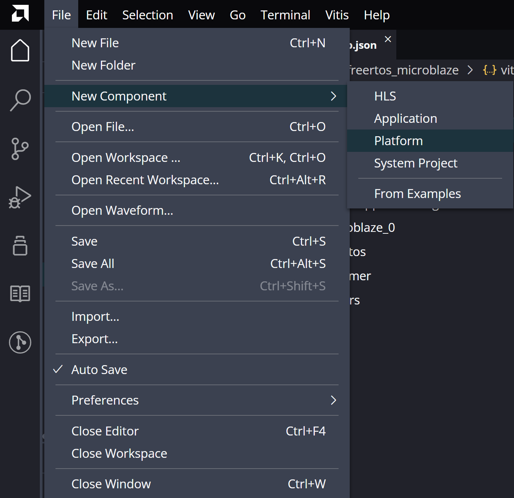
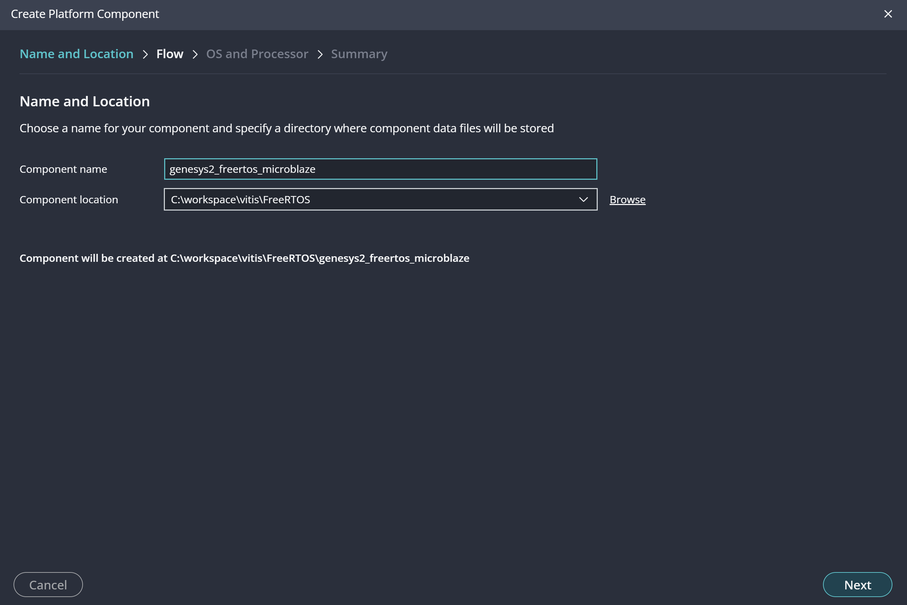
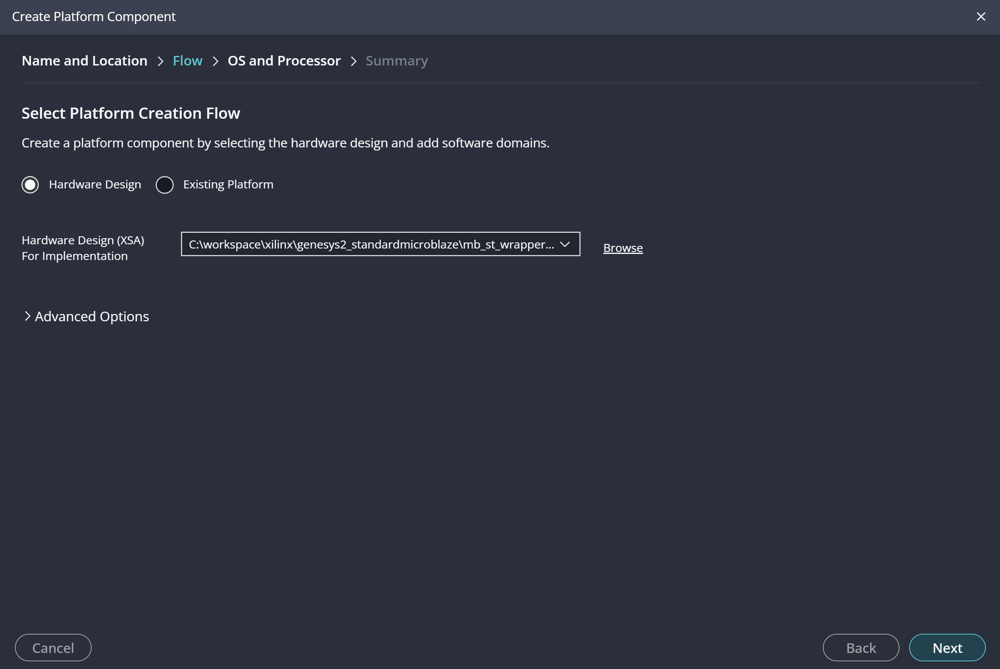
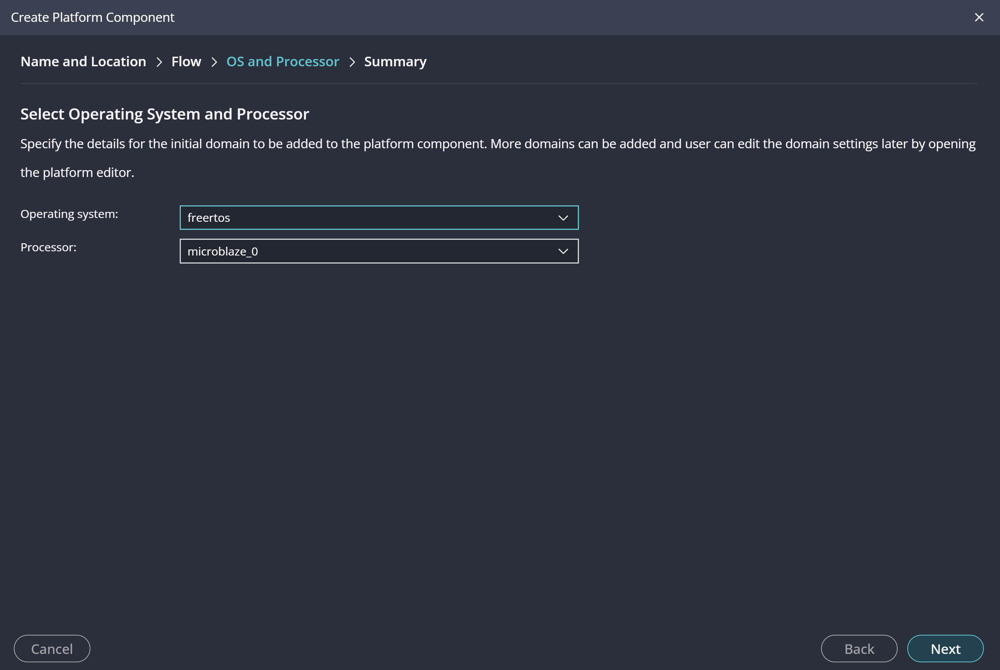
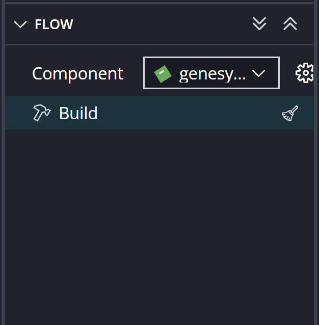
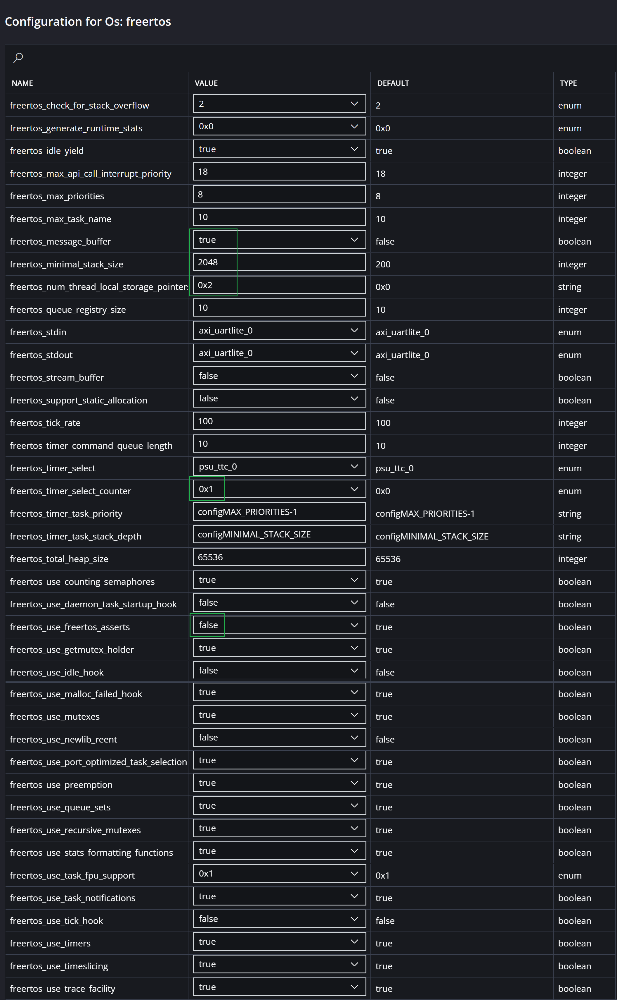
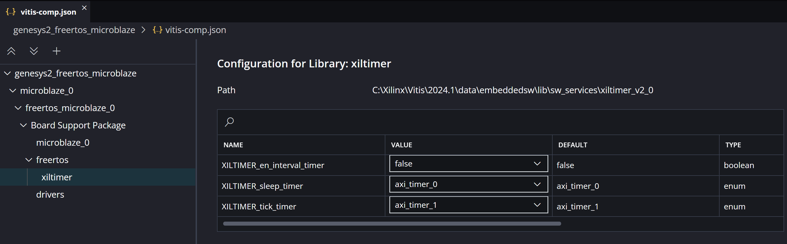

[Back to Chapter 3](chapter-3-freertos.md)

<link rel="stylesheet" href="./static/step-navigation.css" />

<h2>Creating a project with Free RTOS</h2>

> [!note] Objectives
>
> Create a base project like in [2.1](chapter-2-exercise-2.md) using `Free RTOS` as software platform 
> Adjust the BSP configuration and select the appropriate timers 

This exercise guides you through creating your first `Free RTOS` application on the `MicroBlaze` processor. You will create a Vitis platform based on your Vivado hardware design.

> [!warning] Prerequisites 
> Complete [Chapter 1](chapter-1-architecture.md) to generate the hardware architecture and bitstream

<h2>Open Vitis and Create a Platform</h2>

Open the Vitis IDE and select `File`/`New Component`/`Platform`

<em>Figure 78. Creating a new platform in Vitis IDE.</em>
 

<h2>Specify the platform name</h2>

Specify the platform name `genesys2_freertos_microblaze`

<em>Figure 79. Specify the platform name.</em>
 

<h2>Select the XSA file</h2>

Select `Hardware Design` and browse the XSA file created from Vivado

<em>Figure 80. Select the XSA file.</em>
 

> [!warning] Select the complete hardware architecture that include `AXI Timers`

<h2>Configure Operating System</h2>

Select `Operative System` as `freertos`, select `MicroBlaze` from available processor options and finish the process

<em>Figure 81. Select Free RTOS.</em>
 

<h2>Build the Platform</h2>

Once the platform configuration is complete, click in `Build` at the `Flow` tab of the main window

<em>Figure 82. Building the platform.</em>
 

<h2>Check Free RTOS options</h2>

View settings by selecting the gear icon in the `Flow` tab or select your platform `genesys2_freertos_microblaze`/`Settings`/`vitis-comp.json`. Select `freertos microblaze`/`Board Support Package`/`freertos` and check different parameters. 

<em>Figure 83. Free RTOS parameters.</em>
 

>[!error] Some parameters have a real interest
> - Maximum size of stack for the tasks (2048 recommended to start)
> - Maximum number of priority (select almost 16)
> - Pre-emption (True in the habitual way to work on RTOS)
> - Time-slicing (False in the habitual way)
> - If you have troubles with some inner assertions on the portability of `Free RTOS` on AMD try to select False (only you have experienced issues) in freertos_asserts parameter

<h2>Configure Timers</h2>

Select `xiltimer` and configure timing services for the platform. Set up `sleep timer` for delay functions with `axi_timer_0`. Set up `tick timer` for system timing services with `axi_timer_1`.

<em>Figure 84. Sleep timer and tick timer for the platform.</em>
 

	<button id="prevBtn">Previous</button>
	

		1 of 8
	

	<button id="nextBtn">Next</button>

---

[Next: Exercise 2](chapter-3-exercise-2.md)
