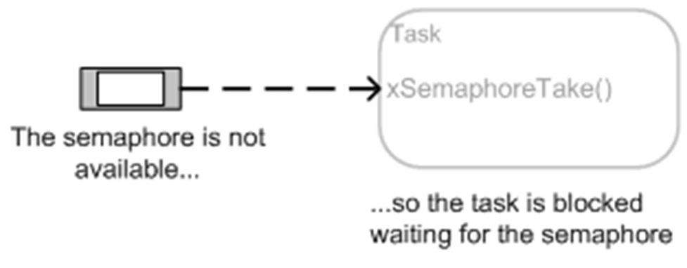

[Previous: Exercise 9](chapter-3-exercise-9.md)

<script src="./static/step-navigation.js"></script>
<link rel="stylesheet" href="./static/step-navigation.css" />

<div class="step-container">

<div class="step active" data-step="1">
<h2>Semaphores from ISR: Introduction</h2>

> [!note] Objectives
>
> Use a binary semaphore shared between an ISR and a task<br>
> Configure GPIO interrupts for button handling on `MicroBlaze`<br>
> Implement pushbutton debouncing in the ISR<br>

In this exercise, we are going to use a semaphore shared between an ISR and a task:
- The task reads the value of the button (BTN)
- The ISR runs when a BTN is pressed
- The task tries to take a binary semaphore. If it does not get the semaphore, it is blocked without being able to read the BTN value
- The ISR returns the semaphore, enabling the task to display the pressed BTN code



No example of a mutex is made, although they are simple to implement seeing the
use of binary semaphores.

> [!error] Give an example of using `MUTEX`

</div>
<div class="step" data-step="2">
<h2>Includes and libraries</h2>

> [!warning] Comment out the previously created tasks or exercises. As an alternative, you can create a new application on the same platform.

Include libraries for interrupt management and semaphores in `FreeRTOS`:

```c
#include "xil_exception.h"
#include "xinterrupt_wrap.h"
#include "semphr.h"
#include "portmacro.h"
```

> [!info] Don't forget to include the previously used libraries

```c
#include <FreeRTOS.h>
#include <task.h>
#include <xil_printf.h>
#include <xparameters.h>
#include "platform.h"
#include "queue.h"
```

</div>
<div class="step" data-step="3">
<h2>Definitions and Prototypes</h2>

Definitions, types and prototype functions for the ISR and semaphore example:

```c
#define SEMAPHORE_COUNT 1
SemaphoreHandle_t xCountingSemaphore;

#define BUTTON_INTERRUPT XGPIO_IR_CH1_MASK /* Channel 1 Interrupt Mask for BTN and SW */
/* The following constant determines which buttons must be pressed at the same time
	to cause interrupt processing to stop and start */
#define XGPIO_AXI_BASEADDRESS XPAR_XGPIO_1_BASEADDR
#define BTN_CHANNEL 1

/* Preventing pushbutton bouncing */
TickType_t xLastISRTime, xISRTime;

/*********** Function Prototypes ******************************/
void GpioHandler(void *CallBackRef);
int GpioIntrExample(XGpio *InstancePtr, UINTPTR BaseAddress, u16 IntrMask, u32 *DataRead);

XGpio_Config *ConfigPtr;
XGpio Gpio_btn; /* The instance of the GPIO Driver for key buttons */
```

> [!info] `XGPIO_IR_CH1_MASK` is the macro with value `#define XPAR_XGPIO_1_BASEADDR 0x40010000` located in the file `xparameters.h` that represents the memory map of our hardware architecture.

</div>
<div class="step" data-step="4">
<h2>Task Parameters, GPIO Init and Interrupt Setup</h2>

> [!info] `BTN_CHANNEL` is the channel associated with the GPIO AXI module.

Task parameters and prototype function for the task that will wait for the semaphore:

```c
void vTaskSemaphore(void *pvParameters);
TaskParameters_t taskSemParams = {"Task Sem", pdMS_TO_TICKS(1000), "Task Sem is running"};
TaskHandle_t xTaskSemHandle = NULL;
```

- In the `vTaskStartUp` task, include the GPIO button initialization:

```c
/* gpio btn initialization */
Status = XGpio_Initialize(&Gpio_btn, XPAR_AXI_GPIO_1_BASEADDR);

if (Status != XST_SUCCESS) {
    xil_printf("Gpio Initialization Failed\r\n");
    return XST_FAILURE;
}

/* BTN are inputs, there are 5 buttons */
XGpio_SetDataDirection(&Gpio_btn, BTN_CHANNEL, 0x1F);
/* Register the interrupt handler */
XGpio_InterruptEnable(&Gpio_btn, BUTTON_INTERRUPT);
XGpio_InterruptGlobalEnable(&Gpio_btn);
/* Initialize interrupts from BTN */
ConfigPtr = XGpio_LookupConfig(XGPIO_AXI_BASEADDRESS);
if (ConfigPtr == NULL) {
    return XST_FAILURE;
}
Status = XSetupInterruptSystem(&Gpio_btn, &GpioHandler, ConfigPtr->IntrId, ConfigPtr->IntrParent, XINTERRUPT_DEFAULT_PRIORITY);
if (Status != XST_SUCCESS) {
    return XST_FAILURE;
}

u32 Register;
Register = XGpio_ReadReg(Gpio_btn.BaseAddress, XGPIO_IER_OFFSET);
XGpio_WriteReg(Gpio_btn.BaseAddress, XGPIO_IER_OFFSET, Register | BTN_CHANNEL);
XGpio_WriteReg(Gpio_btn.BaseAddress, XGPIO_GIE_OFFSET, XGPIO_GIE_GINTR_ENABLE_MASK);
if (Status != XST_SUCCESS) {
    return XST_FAILURE;
}

/* Enable MicroBlaze global interrupts */
Xil_ExceptionEnable();

xLastISRTime = 0;
xISRTime = 0;
```

> [!info] The previous code represents:
> - Initialization of BTN (`XGpio_Initialize`) connecting `Gpio_btn` with the memory address of the AXI GPIO
> - The direction of the 5 BTN (`0x1F`) as inputs using `XGpio_SetDataDirection()`
> - Enable the BTN GPIO as hardware interrupts: `XGpio_InterruptEnable()` and `XGpio_InterruptGlobalEnable()`
> - Initialization of interrupts from BTN: `XGpio_LookupConfig()` and `XSetupInterruptSystem()`
> - Enabling the interrupts of BTN by writing corresponding bits on the GPIO Interrupt Enable Register (IER) and the GPIO Global Interrupt Enable Register (GIE)
> - Enabling MicroBlaze Global Interrupts. `Xil_ExceptionEnable()` must be called after all the interrupts have been enabled

</div>
<div class="step" data-step="5">
<h2>Semaphore Creation</h2>

Continue the `vTaskStartUp` code with interrupt configuration and semaphore creation:

```c
/* Initialize semaphore */
xCountingSemaphore = xSemaphoreCreateCounting(SEMAPHORE_COUNT, 0);
if (xCountingSemaphore != NULL)
{
    xTaskCreate(vTaskSemaphore, "Task 1", 1024, &taskSemParams, 1, &xTaskSemHandle);
}
else
{
    xil_printf("Could not create semaphore\n");
}
```

> [!info] The previous code represents:
> - Creation of Semaphore `xCountingSemaphore` with value 1. When a task or ISR takes it, the value goes to 0
> - When released, the value returns to 1

</div>
<div class="step" data-step="6">
<h2>GPIO interrupt handler</h2>

Create the GPIO handler routine for the interrupt at the end of the entire project. It represents the ISR routine for the GPIO:

```c
/******************************************************************************/
/**
*
* This is the interrupt handler routine for the GPIO for this example.
*
* @param CallbackRef is the Callback reference for the handler.
*
* @return None.
*
* @note None.
*
******************************************************************************/
void GpioHandler(void *CallbackRef)
{
    XGpio *GpioPtr = (XGpio *)CallbackRef;
    BaseType_t xHigherPriorityTaskWoken = pdFALSE;

    /* Disable the interrupt */
    XGpio_InterruptDisable(&Gpio_btn, BUTTON_INTERRUPT);

    /* Pushbutton debouncing */
	// Initialise the xLastWakeTime variable with the current time.
	xISRTime = xTaskGetTickCountFromISR();
	//xil_printf("Current tick in ISR: %d\n", xISRTime);
	//xil_printf("Previous tick in ISR: %d\n", xLastISRTime);

	/* Clear the Interrupt */
	u32 Register;

	Register = XGpio_ReadReg(Gpio_btn.BaseAddress, XGPIO_ISR_OFFSET);
	XGpio_WriteReg(Gpio_btn.BaseAddress, XGPIO_ISR_OFFSET,Register & BUTTON_INTERRUPT);
	Register = XGpio_ReadReg(Gpio_btn.BaseAddress, XGPIO_ISR_OFFSET);

	/* Clear the interrupt*/
	XGpio_InterruptClear(&Gpio_btn, BUTTON_INTERRUPT);
	/* Enable the interrupt */
	XGpio_InterruptEnable(&Gpio_btn, BUTTON_INTERRUPT);

	if (xISRTime - xLastISRTime > 20){/* Pushbutton debouncing*/
		/* return the semaphore
			Performs a context switch by setting the xHigherPriorityTaskWoken
			variable to TRUE and passes the CPU to the highest priority task on standby */
		xSemaphoreGiveFromISR(xCountingSemaphore, &xHigherPriorityTaskWoken);
	}

	/* If a higher-priority task was waiting, make a context switch */
	if (xHigherPriorityTaskWoken == pdTRUE)
	{
		portYIELD_FROM_ISR(xHigherPriorityTaskWoken);
	}
	xLastISRTime = xTaskGetTickCountFromISR();
	return;
}
```

> [!info] The previous code represents:
> An ISR first disables the interrupt, then clears the interrupt, processes the interrupt, and finally enables the interrupt again. <br>
> The interrupt handler gives the semaphore and activates the variable xHigherPriorityTaskWoken (pdTRUE). It also contains debouncing protection for the BTNs of the Genesys2 board. Through testing, the value has been selected as 20 ticks.<br>
> Switch Context. Activation of the blocked task with higher priority.

</div>
<div class="step" data-step="7">
<h2>Creation of the Task</h2>

Creation of the task that waits for the semaphore.

```c
/* Task waiting for the semaphore and printing the button pressed */
void vTaskSemaphore(void *pvParameters)
{
	u32 btn_value;
	TaskParameters *params = (TaskParameters *)pvParameters;

	while (1)
	{
		xil_printf("%s: %s\n", params->taskName, params->message);
		/* Wait until the semaphore is released by the ISR */
		if (xSemaphoreTake(xCountingSemaphore, portMAX_DELAY) == pdTRUE)
		{
			/* Read the GPIO value */
			btn_value = XGpio_DiscreteRead(&Gpio_btn, BTN_CHANNEL);
			/* Print the pressed button */
			xil_printf("Botón presionado desde task: %d\n", btn_value);
		}
	}
}
```

When the task takes the semaphore, it then prints out the value of the BTN pressed. As the interrupt is faster than our finger press and release, the BTN could be read in the task better than the ISR.

</div>

<div class="navigation">
	<button id="prevBtn">Previous</button>
	<div class="step-indicator">
		<span><span id="currentStep">1</span> of <span id="totalSteps">7</span></span>
	</div>
	<button id="nextBtn">Next</button>
</div>

</div>

---

[Next: Exercise 11](chapter-3-exercise-11.md)
