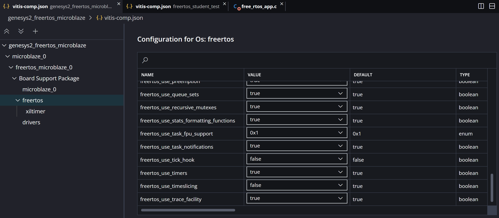

[Previous: Exercise 1](chapter-3-exercise-1.md)

<script src="./static/step-navigation.js"></script>
<link rel="stylesheet" href="./static/step-navigation.css" />
their operation. Assign priorities 3, 4, 5, and 6 to tasks 1, 2, 3, and 4

<div class="step-container">

<div class="step active" data-step="1">
<h2>Creating Threads</h2>

> [!note] Objectives
>
> Create a basic Application without template<br>
> Start working with `Free RTOS`<br>

Select `File`/`New Component`/`Application` and name your application as
`freertos_student_test`. Select the platform created on previous exercised as
platform for the application.

Use the following example and verify its functionality, call the file
`free_rtos_app.c` at `Source`/`src` folder inside the application component.

> [!error] Take a while to understand how it works

```c
// Free RTOS Application for Xilinx FPGA
#include <FreeRTOS.h>
#include <task.h>
#include <xil_printf.h>
#include <xparameters.h>
// Task function prototypes
void vTask1(void *pvParameters);
void vTask2(void *pvParameters);

int main(void)
{
    // Create tasks
    xTaskCreate(vTask1, "Task 1", 1000, NULL, 1, NULL);
    xTaskCreate(vTask2, "Task 2", 1000, NULL, 2, NULL);
    // Start the scheduler
    vTaskStartScheduler();
    // Should never reach here
    for (;;);

    return 0;
}

void vTask1(void *pvParameters)
{
    for (;;)
    {
        xil_printf("Task 1 is running\n");
        vTaskDelay(pdMS_TO_TICKS(1000)); // Delay for 1000 ms
    }
}

void vTask2(void *pvParameters)
{
    for (;;)
    {
        xil_printf("Task 2 is running\n");
        vTaskDelay(pdMS_TO_TICKS(1500)); // Delay for 1500 ms
    }
}
```

>[!warning] Build and test your application

</div>
<div class="step" data-step="2">
<h2>Adding tasks</h2>

- Create two more tasks (`Task3` and `Task4`) with the same functionality, check
their operation
- Reassign priorities 3, 4, 5, and 6 to tasks 1, 2, 3, and 4 respectively
- Modify the period of `Task3` and `Task4` and shows their messages
- Assign a period of 1.5 seconds to `Task3` and 3 secconds to `Task4`

>[!warning] Build and check your application

</div>
<div class="step" data-step="3">
<h2>Modifying Free RTOS parameters</h2>

- Modify the `Task3` and `Task4` to create continuous tasks (they should never suspend)
- Set all tasks at the same priority and check the `configUSE_TIME_SLICING` parameter at `FreeRTOSConfig.h` file in the platform files `Sources`/`microblaze`/`freertos_microblaze`/`bsp`/`include`

>[!warning] Build and check your application

</div>
<div class="step" data-step="4">
<h2>Modifying Free RTOS parameters</h2>

- Go to `Free RTOS` parameters and modify `Time Slicing` parameter to `false`. Check the `FreeRTOSConfig.h` file to see if configuration has been applied.



<center><em>Figure 83. Free RTOS parameters.</em></center><br>

>[!warning] Build and check your application

>[!error] Take a while to understand what is happening

- Restore the tasks priorities and set `Time Slicing` to `true`

</div>
<div class="navigation">
	<button id="prevBtn">Previous</button>
	<div class="step-indicator">
		<span><span id="currentStep">1</span> of <span id="totalSteps">3</span></span>
	</div>
	<button id="nextBtn">Next</button>
</div>

</div>

---

[Next: Exercise 3](chapter-3-exercise-3.md)
