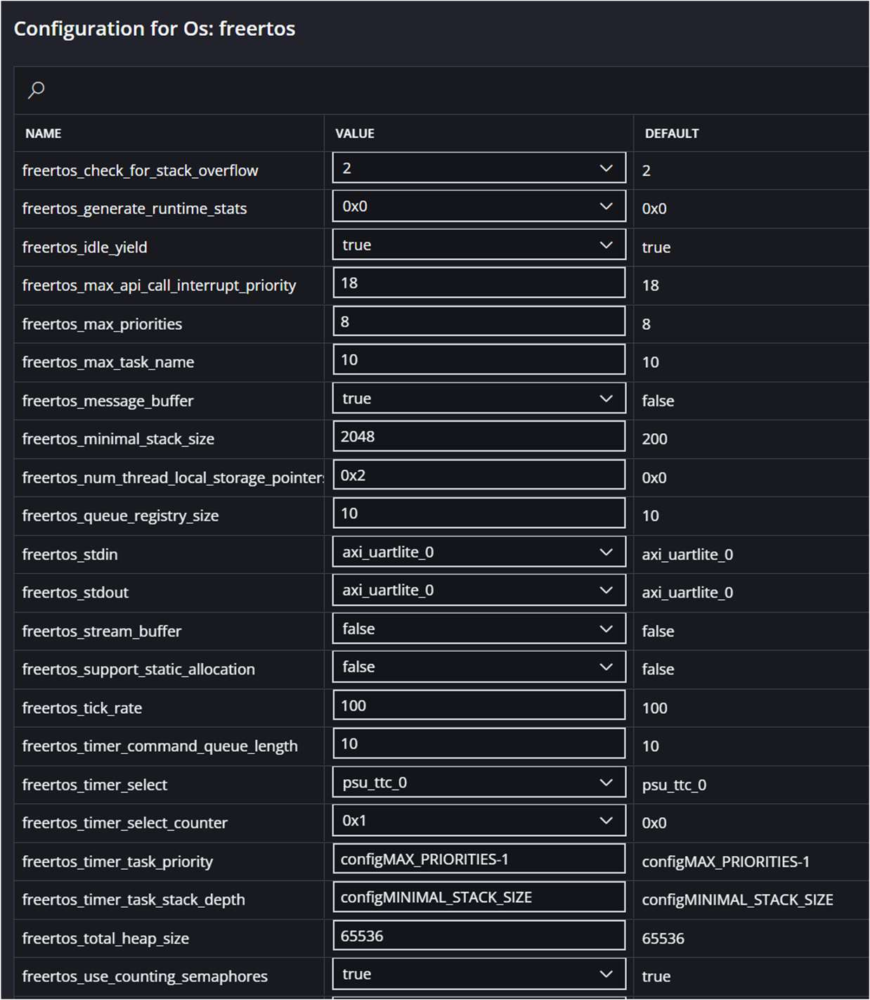
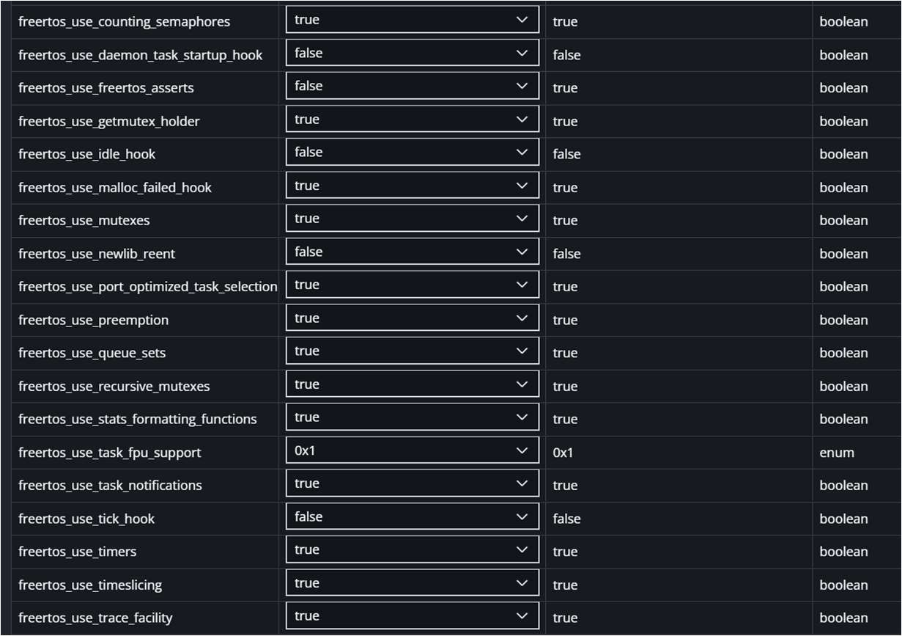
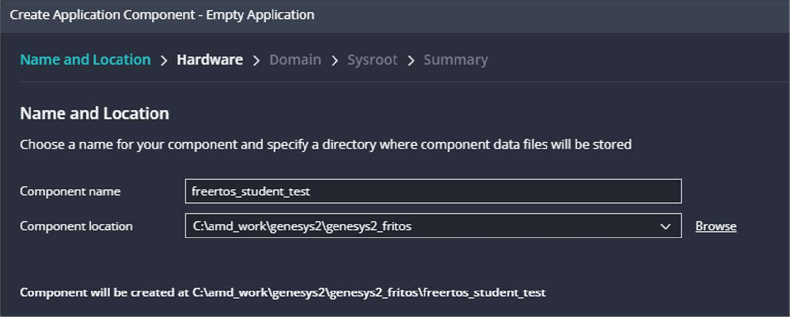
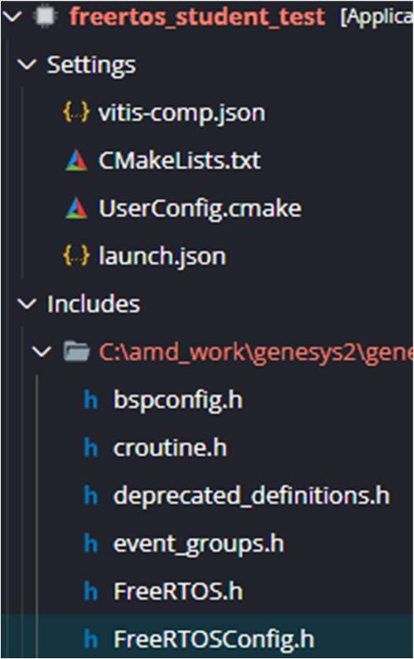
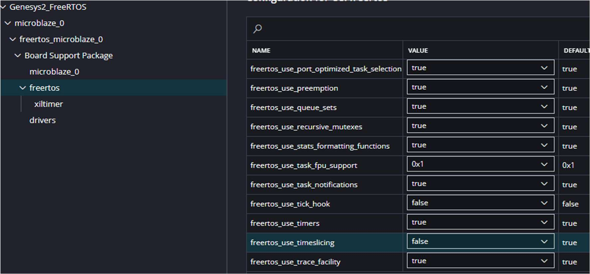
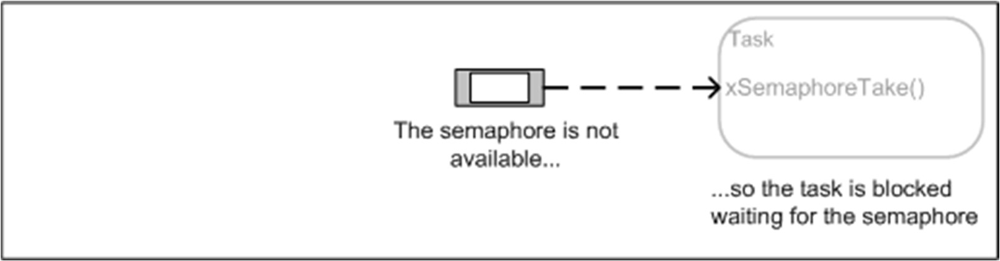
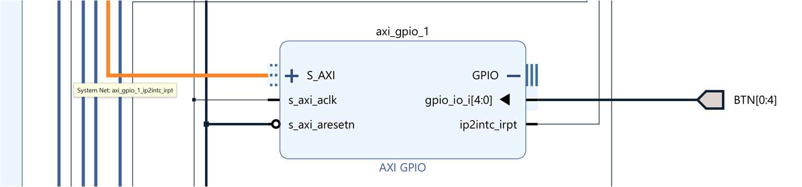
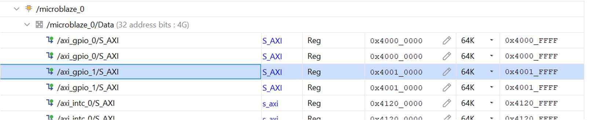
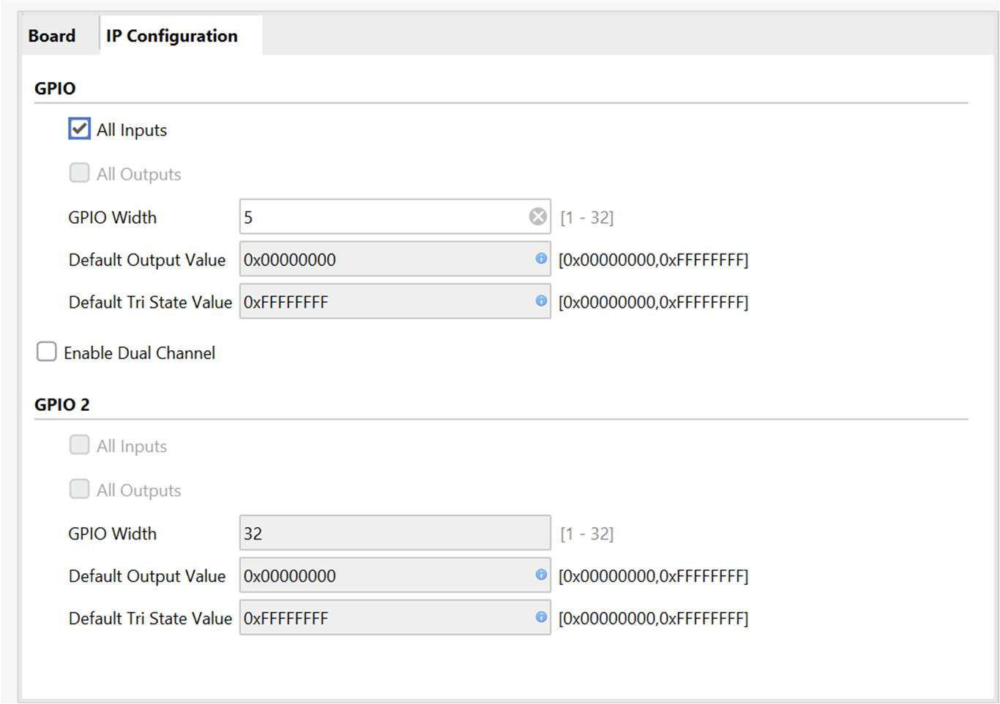

[← Back to Index](index.md)

FREERTOS ON AMD KINTEX7 FPGA
Exercise 1: Creating a project with FreeRTOS.
1. Vivado: Create a timer to work like FreeRTOS SysTick.
2. Export the HW and launch a new Vitis platform with FreeRTOS OS for
Microblaze.
3. In BSP edit settings and select timers appropriately.
FreeRTOS Setup
@Marcos Martínez Peiró, Feb 25. Pag 64

---

ATTENTION: Some parameters have a real interest: maximum size of stack for
the tasks (2048 recommended to start), maximum number of priority (select
almost 16), pre-emption (True in the habitual way to work on RTOS), time-slicing
(False in the habitual way), even if you have troubles with some inner assertions
on the portability of FreeRTOS on AMD try to select False (only you have
experienced issues) in freertos_asserts parameter.
@Marcos Martínez Peiró, Feb 25. Pag 65

---

Exercise 2: Creating Threads (Tasks)
The objectives are:
1. Create a basic Application without template.
2. Start Working with FreeRTOS.
Select File->New_Component->Application and name your application as
“freertos_student_test”. Select the platform created on previous exercised as
platform for the application.

Figure 87. Example of application for FreeRTOS exercises.

Use the following example and verify its functionality, call the file
“free_rtos_app.c”. Understand how it works.
// FreeRTOS Application for Xilinx FPGA
#include <FreeRTOS.h>
#include <task.h>
#include <xil_printf.h>
#include <xparameters.h>
// Task function prototypes
void vTask1(void *pvParameters);
void vTask2(void *pvParameters);
int main(void)
{
// Create tasks
xTaskCreate(vTask1, "Task 1", 1000, NULL, 1, NULL);
xTaskCreate(vTask2, "Task 2", 1000, NULL, 2, NULL);
// Start the scheduler
vTaskStartScheduler();
// Should never reach here
for (;;);
@Marcos Martínez Peiró, Feb 25. Pag 66

---

return 0;
}
void vTask1(void *pvParameters)
{
for (;;)
{
xil_printf("Task 1 is running\n");
vTaskDelay(pdMS_TO_TICKS(1000)); // Delay for 1000 ms
}
}
void vTask2(void *pvParameters)
{
for (;;)
{
xil_printf("Task 2 is running\n");
vTaskDelay(pdMS_TO_TICKS(1500)); // Delay for 1500 ms
}
}
1. Create two more tasks task3 and Task4 with the same functionality, check
their operation. Assign priorities 3, 4, 5, and 6 to tasks 1, 2, 3, and 4
respectively. Task3 and Task4 are 1.5sec and 3sec of period respectively.
2. Check their functionality.
3. Modify the period of Task3 and Task4 allowing to shows their message.
4. (*) Modify the Tasks 3 and 4 to create continuous tasks. (they never
suspend).
5. (*) Put all tasks at the same priority. Understand how Time Slicing works in
FreeRTOS. Previously verify that the TimeSlicing option is active in the
FreeRTOSConfig.h file. Modify it in the BSP Settings for FreeRTOS.
@Marcos Martínez Peiró, Feb 25. Pag 67

---

Figure 88. FreeRTOSConfig.h file in the app project, also can be located in the includes folder on BSP folder.

Figure 89. FreeRTOS config in the json file.

6. Turn o(cid:431) TimeSlicing and check that it doesn't work.
7. Reprioritize each task.
@Marcos Martínez Peiró, Feb 25. Pag 68

---

Exercise 3: Parameters and TaskControl: Delete Tasks.
Create parameters in previous tasks using parameter passing.
Use a struct and create next parameters:
typedef struct {
const char *taskName;
TickType_t delay;
const char *message;
} TaskParameters;
TaskParameters task1_parameters={"Task 1", 1000, "Task 1 is running\n"};
TaskParameters task2_parameters={"Task 2", 1500, "Task 2 is running\n"};
TaskParameters task3_parameters={"Task 3", 2000, "Task 3 is running\n"};
TaskParameters task4_parameters={"Task 4", 2500, "Task 4 is running\n"};
Add handlers for each task so that they can be used to identify them.
TaskHandle_t xTask1Handle = NULL;
TaskHandle_t xTask2Handle = NULL;
TaskHandle_t xTask3Handle = NULL;
TaskHandle_t xTask4Handle = NULL;
In this way we can pass several parameters
xTaskCreate(vTask1, "Task 1", STACK_SIZE, &task1_parameters, 4, &xTask1Handle);
xTaskCreate(vTask2, "Task 2", STACK_SIZE, &task2_parameters, 5, &xTask2Handle);
xTaskCreate(vTask3, "Task 3", STACK_SIZE, &task3_parameters, 6, &xTask3Handle);
xTaskCreate(vTask4, "Task 4", STACK_SIZE, &task4_parameters, 7, &xTask4Handle);
And use them in every task.
void vTask1(void *pvParameters)
{
TaskParameters *params = (TaskParameters *)pvParameters;
for (;;)
{
xil_printf("%s: %s\n", params->taskName, params->message);
vTaskDelay(params->delay);
}
}
Use it to delete Task 4 from Task 1, when Task1 is run 3 times.
if (xTask4Handle != NULL)
{
vTaskDelete(xTask4Handle);
xil_printf("Task 4 deleted by Task 1\n");
xTask4Handle = NULL;
}
Check your usage on the serial terminal.
Have you been able to delete high-priority tasks from a lower-priority one?
@Marcos Martínez Peiró, Feb 25. Pag 69

---

Exercise 4: Use of LEDS. Duration of Tasks.
Light ON a LED when task i starts, turn o(cid:431) LED i when task finishes execution
(before vTaskDelay()).
For example, in Task2:
void vTask2(void *pvParameters)
{
TaskParameters *params = (TaskParameters *)pvParameters;
for (;;)
{
XGpio_DiscreteWrite(&Gpio_sw_led, LED_CHANNEL, 0x00000002);
xil_printf("%s: %s\n", params->taskName, params->message);
XGpio_DiscreteWrite(&Gpio_sw_led, LED_CHANNEL, 0x00000000);
vTaskDelay(params->delay);
}
}
What does the flashing of the LEDs indicate?
NOTE:
In FreeRTOS, certain Xilinx features, especially those related to hardware and peripheral
drivers (such as XUartPs_Send, XGpio_DiscreteWrite, XScuGic_Connect, etc.), may not
work properly within main() due to several reasons:
1. There is not a scheduler.
In FreeRTOS, main() runs before the scheduler (vTaskStartScheduler()) starts.
Some Xilinx functions may depend on interrupts or the state of the operating
system to run properly.
When you call these functions within main(), there is still no proper task context,
which can cause them to fail.
2. No task context
In FreeRTOS, each task has its own stack and execution context. Some Xilinx
functions may need access to context variables that are not available if called
from main(), before the scheduler starts.
3. Interrupts may not be enabled
Some features of Xilinx controllers require interrupts to be turned on. If you call
them on main() before FreeRTOS enables interrupts, they may not run correctly.
4. System Initializer Conflicts
main() can run in a state where certain peripherals are not yet fully initialized.
Instead, when used within a task, the hardware is already configured correctly.
@Marcos Martínez Peiró, Feb 25. Pag 70

---

How to fix the problem?
If you need to call these functions, do so within a task. For example:
void myTask(void *pvParameters) {
//Initialize hardware if necessary
XGpio gpio;
XGpio_Initialize(&gpio, XPAR_AXI_GPIO_0_DEVICE_ID);
while (1) {
XGpio_DiscreteWrite(&gpio, 1, 0x01);
vTaskDelay(pdMS_TO_TICKS(1000)); // Wait 1 second
}
}
In our case, create a vTaskStartUp task, with priority configMAX_PRIORITIES, , that
initializes the GPIO peripherals and then commits suicide with vTaskDelete(NULL),
it will not have a loop but only executes the initialization of the peripherals. Create it
before any other.
To know the duration of the tasks we can estimate it by using the
xTaskGetTickCount() function. Use it to measure the duration of task 2, for example,
by subtracting the tick values before and after the call to printf().
What value in ticks lasted printf()?
Example of TaskStart code:
void vTaskStartUp(void *pvParameters)
{
TaskParameters *params = (TaskParameters *)pvParameters;
xil_printf("%s: %s\n", params->taskName, params->message);
int Status;
Status = XGpio_Initialize(&Gpio_sw_led, XPAR_AXI_GPIO_0_BASEADDR);
if (Status != XST_SUCCESS) {
xil_printf("Gpio Initialization Failed\r\n");
return XST_FAILURE;
}
XGpio_SetDataDirection(&Gpio_sw_led,SW_CHANNEL,0x0000FFFF);
XGpio_SetDataDirection(&Gpio_sw_led,LED_CHANNEL,0x00000000);
vTaskDelete(NULL); // Delete the task StartUp
}
Remember to use
#include "xgpio.h"
XGpio Gpio_sw_led; /* The Instance of the GPIO Driver */
#define SW_CHANNEL 1
#define LED_CHANNEL 2
@Marcos Martínez Peiró, Feb 25. Pag 71

---

Exercise 5. TaskControl I: Using xTaskDelayUntil().
xTaskDelayUntil()
Delay a task until a specified time. This function can be used by periodic tasks to
ensure a constant execution frequency.
This function di(cid:431)ers from vTaskDelay() in one important aspect: vTaskDelay()
specifies a time at which the task wishes to unblock relative to the time at which
vTaskDelay() is called, whereas vTaskDelayUntil() specifies an absolute time at
which the task wishes to unblock.
Example
// Perform an action every 10 ticks.
void vTaskFunction( void * pvParameters )
{
TickType_t xLastWakeTime;
const TickType_t xFrequency = 10;
// Initialise the xLastWakeTime variable with the current time.
xLastWakeTime = xTaskGetTickCount();
for( ;; )
{
// Wait for the next cycle.
vTaskDelayUntil( &xLastWakeTime, xFrequency );
// Perform action here.
}
}
Modify the delay of Task 3 to make it accurate by using TaskDelayUntil().
@Marcos Martínez Peiró, Feb 25. Pag 72

---

Exercise 6. TaskControl II: Use of TaskSuspend(), TaskResume().
Modify Task 1 so that it stops deleting Task 4.
From Task 4 read the SWs so that:
1. SW8 and SW7 to Suspend task 0, 1, 2, or 3 depending on what is indicated
by the switch pair.
2. SW2 and SW1 to Resume the task indicated by those switches.
An example of those requested would be:
if (xTask1Handle != NULL)
{
vTaskResume(xTask1Handle);
xil_printf("The state of Task 1 is %d\n", eTaskGetState(xTask1Handle));
}
else
{
xil_printf("Task 1 is already running\n");
}
Notice the use of eTaskGetState that returns a number indicating the status of the
checked task.
0 Ready eReady
1 Running eRunning (the calling task is querying its own priority)
2 Blocked eBlocked
3 Suspended eSuspended
4 Deleted eDeleted (the tasks TCB is waiting to be cleaned up)
@Marcos Martínez Peiró, Feb 25. Pag 73

---

Exercise 7. Queues.
First don’t create the previous Tasks to “clean” the serial terminal: comment
creation tasks.
This example demonstrates creating a queue, sending data to the queue from
multiple tasks, and receiving data from the queue. The queue is created to hold data
items of type int32_t. The tasks that send to the queue do not specify a block time,
whereas the task that receives from the queue does.
Step1. Libraries
#include "queue.h"
Step 2: function prototypes
void vSenderTask( void *pvParameters );
void vReceiverTask( void *pvParameters );
Step 3: (optional) Struct with values needed by the sender and receive tasks
// Structure for the sender and receiver example
typedef struct {
const char *taskName;
TickType_t delay;
const char *message;
int32_t lValue;
} TaskQueueParameters;
Step 4. Task Parameters
Two Senders (producers) and one receiver (consumer). One Sender sends number
100 at the beginning and then increments this value in each iteration. Second
sender start sending the value 200.
All tasks have the same period of 1sec.
TaskQueueParameters sender1Params = {"Sender 1",pdMS_TO_TICKS(1000), "Sender 1 is
running", 100};
TaskQueueParameters sender2Params = {"Sender 2",pdMS_TO_TICKS(1000), "Sender 2 is
running", 200};
TaskQueueParameters receiverParams = {"Receiver",pdMS_TO_TICKS(1000), "Receiver is
running", 0};
Step 5. Types for the Queue
//types for queue example
@Marcos Martínez Peiró, Feb 25. Pag 74

---

QueueHandle_t xQueue = NULL;
Step 6. Task Handlers (optional).
TaskHandle_t xSender1TaskHandle = NULL;
TaskHandle_t xSender2TaskHandle = NULL;
TaskHandle_t xReceiverTaskHandle = NULL;
Step 7. Modify the body of TaskStartUp to create the queue.
Queue size is 10 items of 32 bits
xQueue = xQueueCreate( 10, sizeof( int32_t ) );
Next, into the Startup task creation of the three tasks of the exercise. The sender
tasks share the same function body but di(cid:431)erent parameters. Priorities for tasks are
1 and for the receiver 2. Size of stack could be 1024 words.
if( xQueue != NULL )
{
xTaskCreate( vSenderTask, "Sender1", 1024, &sender1Params, 1, &xSender1TaskHandle
);
xTaskCreate( vSenderTask, "Sender2", 1024, &sender2Params, 1, &xSender2TaskHandle
);
xTaskCreate( vReceiverTask, "Receiver", 1024, &receiverParams, 2,
&xReceiverTaskHandle );
}
else
{
/* The queue could not be created. */
xil_printf( "Could not create queue\n" );
}
@Marcos Martínez Peiró, Feb 25. Pag 75

---

Step 8. Body of senders’ tasks.
void vSenderTask( void *pvParameters )
{
TaskQueueParameters *params = (TaskQueueParameters *)pvParameters;
int32_t lValueToSend;
BaseType_t xStatus;
/* The queue was created to hold values of type int32_t, so cast the parameter to the
required type. */
lValueToSend = ( int32_t ) params->lValue;
for( ;; )
{
xil_printf("%s: %s\n", params->taskName, params->message);
xil_printf("The value to send is %d\n", lValueToSend);
/* Send the value to the queue.
The first parameter is the queue to which data is being sent. The queue was
created before the scheduler was started, so before this task started to execute.
The second parameter is the address of the data to be sent, in this case the
address of lValueToSend.
The third parameter is the Block time – the time the task should be kept in the
Blocked state to wait for space to become available on the queue*/
xStatus = xQueueSendToBack( xQueue, &lValueToSend, 0 );
if( xStatus != pdPASS )
{
/* The send operation could not complete because the queue was full.*/
xil_printf( "Could not send to the queue.\r\n" );
}
lValueToSend++;
vTaskDelay(params->delay);
}
}
@Marcos Martínez Peiró, Feb 25. Pag 76

---

Step 9. Body of the receiver task.
void vReceiverTask( void *pvParameters )
{
/* Declare the variable that will hold the values received from the
queue. */
TaskQueueParameters *params = (TaskQueueParameters *)pvParameters;
int32_t lReceivedValue;
BaseType_t xStatus;
const TickType_t xTicksToWait = pdMS_TO_TICKS( 100 );
for( ;; )
{
xil_printf("%s: %s\n", params->taskName, params->message);
/* This call should always find the queue empty because this task will
immediately remove any data that is written to the queue. */
if( uxQueueMessagesWaiting( xQueue ) != 0 )
{
xil_printf( "Queue have %d messages!\r\n",uxQueueMessagesWaiting( xQueue ) );
}
/* Receive data from the queue.
The first parameter is the queue from which data is to be received.
The queue is created before the scheduler is started, and therefore
before this task runs for the first time.
The second parameter is the buffer into which the received data will
be placed. In this case the buffer is simply the address of a
variable that has the required size to hold the received data.
The last parameter is the block time – the maximum amount of time
that the task will remain in the Blocked state to wait for data to
be available should the queue already be empty. */
xStatus = xQueueReceive( xQueue, &lReceivedValue, xTicksToWait );
if( xStatus == pdPASS )
{
/* Data was successfully received from the queue, print out the
received value. */
xil_printf( "Received = %d\n", lReceivedValue );
}
else
{
/* Data was not received from the queue even after waiting for
xTicksToWait ms.*/
xil_printf("Could not receive from the queue.\r\n" );
}
vTaskDelay(params->delay);
}
}
@Marcos Martínez Peiró, Feb 25. Pag 77

---

Exercise 8. Queues with struct message sending.
Now we're going to create two queues, one with a struct message and a size
appropriate to the struct. A second one with struct pointer message and pointer
size.
The sender3 task sends messages to both queues, initializing the struct.
The receive2 task receives messages from both queues and displays them by
UART.
To do this, we carry out the following steps:
Step 1: We comment on the previous queue exercise.
Step 2: Create the Necessary Types
//types for queue example
QueueHandle_t xQueue = NULL;
struct AMessage
{
char ucMessageID;
char ucData[ 20 ];
} xMessage;
/* Queue used to send and receive complete struct AMessage structures. */
QueueHandle_t xStructQueue = NULL;
/* Queue used to send and receive pointers to struct AMessage structures. */
QueueHandle_t xPointerQueue = NULL;
TaskQueueParameters sender3Params = {"Sender 3",pdMS_TO_TICKS(1000), "Sender 3 is
running", 1};
TaskQueueParameters receiver2Params = {"Receiver 2",pdMS_TO_TICKS(1500), "Receiver 2
is running", 0};
TaskHandle_t xSender3TaskHandle = NULL;
TaskHandle_t xReceiver2TaskHandle = NULL;
Step 3: In the StartUp task we initialize the struct and create two queues.
xMessage.ucMessageID = 0xab;
memset( &( xMessage.ucData ), 0x12, 20 );
/* Create the queue used to send complete struct AMessage structures. This can
also be created after the schedule starts, but care must be task to ensure
nothing uses the queue until after it has been created. */
xStructQueue = xQueueCreate(
/* The number of items the queue can hold. */
10,
@Marcos Martínez Peiró, Feb 25. Pag 78

---

/* Size of each item is big enough to hold the  whole structure. */
sizeof( xMessage ) );
configASSERT( xStructQueue );
/* Create the queue used to send pointers to struct AMessage structures. */
xPointerQueue = xQueueCreate(
/* The number of items the queue can hold. */
10,
/* Size of each item is big enough to hold only a pointer. */
sizeof( &xMessage ) );
configASSERT( xPointerQueue );
if( ( xStructQueue == NULL ) || ( xPointerQueue == NULL ) )
{
/* One or more queues were not created successfully as there was not enough
heap memory available. Handle the error here. Queues can also be created
statically. */
xil_printf( "Could not create queues\n" );
}
xTaskCreate( vSender3Task, "Sender3", 1024, &sender3Params, 8,
&xSender3TaskHandle);
xTaskCreate( vReceiver2Task, "Receiver2", 1024, &receiver2Params, 8,
&xReceiver2TaskHandle);
Step 4: Task sender3
void vSender3Task( void *pvParameters )
{
TaskQueueParameters *params = (TaskQueueParameters *)pvParameters;
BaseType_t xStatus;
// Inicialización de valores tipo caracter y string
// Inicializamos la estructura
//struct AMessage xMessage = {'A', "Hola, mundo!"};
// Imprimimos los valores
//xil_printf("Message ID: %c\n", xMessage.ucMessageID);
//xil_printf("Data: %s\n", xMessage.ucData);
/* As per most tasks, this task is implemented within an infinite loop. */
for( ;; )
{
xil_printf("%s: %s\n", params->taskName, params->message);
/* Declare the structure that will hold the values sent on the queue. */
struct AMessage *pxPointerToxMessage;
@Marcos Martínez Peiró, Feb 25. Pag 79

---

/* Send the entire structure to the queue created to hold 10 structures. */
xStatus=xQueueSend( /* The handle of the queue. */
xStructQueue,
/* The address of the xMessage variable. sizeof( struct AMessage )
bytes are copied from here into the queue. */
( void * ) &xMessage,
/* Block time of 0 says don't block if the queue is already full.
Check the value returned by xQueueSend() to know if the message
was sent to the queue successfully. */
( TickType_t ) 0 );
if( xStatus != pdPASS )
{
/* The send operation could not complete because the queue was full*/
xil_printf( "Could not send to the struct queue.\r\n" );
}
/* Store the address of the xMessage variable in a pointer variable. */
pxPointerToxMessage = &xMessage;
/* Send the address of xMessage to the queue created to hold 10 pointers. */
xStatus=xQueueSend( /* The handle of the queue. */
xPointerQueue,
/* The address of the variable that holds the address of xMessage.
sizeof( &xMessage ) bytes are copied from here into the queue. As
the
variable holds the address of xMessage it is the address of
xMessage
that is copied into the queue. */
( void * ) &pxPointerToxMessage,
( TickType_t ) 0 );
if( xStatus != pdPASS )
{
/* The send operation could not complete because the queue was full*/
xil_printf( "Could not send to the pointer queue.\r\n" );
}
vTaskDelay(params->delay);
}
}
@Marcos Martínez Peiró, Feb 25. Pag 80

---

Step 5: Task Receiver2.
void vReceiver2Task( void *pvParameters )
{
TaskQueueParameters *params = (TaskQueueParameters *)pvParameters;
BaseType_t xStatus;
struct AMessage xRxedStructure, *pxRxedPointer;
for( ;; )
{
xil_printf("%s: %s\n", params->taskName, params->message);
/* This call should always find the queue empty because this task will
immediately remove any data that is written to the queue. */
if( uxQueueMessagesWaiting( xStructQueue ) != 0 )
{
xil_printf( "xStructQueue have %d messages!\r\n",uxQueueMessagesWaiting(
xStructQueue ) );
}
if( xStructQueue != NULL )
{
/* Receive a message from the created queue to hold complex struct AMessage
structure. Block for 10 ticks if a message is not immediately available.
The value is read into a struct AMessage variable, so after calling
xQueueReceive() xRxedStructure will hold a copy of xMessage. */
if( xQueueReceive( xStructQueue,
&( xRxedStructure ),
( TickType_t ) 10 ) == pdPASS )
{
/* xRxedStructure now contains a copy of xMessage. */
// Imprimir Message ID en hexadecimal
xil_printf("Message ID received from struct: 0x%02X\n", (unsigned
char)xRxedStructure.ucMessageID);
// Imprimir los 20 bytes de ucData en hexadecimal
xil_printf("Data received from struct: ");
for (int i = 0; i < 20; i++)
{
xil_printf("0x%02X ", (unsigned char)xRxedStructure.ucData[i]);
}
xil_printf("\n");
}
}
if( xPointerQueue != NULL )
{
/* Receive a message from the created queue to hold pointers. Block for
10
ticks if a message is not immediately available. The value is read into a
@Marcos Martínez Peiró, Feb 25. Pag 81

---

pointer variable, and as the value received is the address of the
xMessage
variable, after this call pxRxedPointer will point to xMessage. */
if( xQueueReceive( xPointerQueue,
&( pxRxedPointer ),
( TickType_t ) 10 ) == pdPASS )
{
/* *pxRxedPointer now points to xMessage. */
// Imprimir valores
xil_printf("Message ID received from pointer: 0x%02X\n", (unsigned
char)pxRxedPointer->ucMessageID);
xil_printf("Data received from pointer: ");
for (int i = 0; i < 20; i++)
{
xil_printf("0x%02X ", (unsigned char)pxRxedPointer->ucData[i]);
}
xil_printf("\n");
}
}
vTaskDelay(params->delay);
}
}
Exercise 9. Use of xQueueReset().
Add the condition on the receiving task from the previous example, if the queue is
full it should be emptied by using xQueueReset().
@Marcos Martínez Peiró, Feb 25. Pag 82

---

Exercise 10. Semaphores from ISR and Mutexes.
In this exercise we are going to use a Semaphore shared between an ISR and a task.
 The task reads the value of the button (BTN).
 The ISR runs when a BTN is pressed.
 The Task tries to take a binary semaphore. If it does not get the semaphore,
it is blocked without being able to read the BTN value.
 The ISR returns the semaphore, enabling the Task to display the pressed
BTN code.
No example of mutex is made, although they are simple to implement seeing the
use of binary semaphores.
Give an example of using MUTEX.
Step 1. Comment the previous created tasks or exercises.
As alternative you can create a new application on the same Platform.
Step 2. Include libraries.
To manage the interruptions from interrupt controller and Microblaze processor you
must add new libraries. Also, the semaphore needs their own libraries in FreeRTOS.
#include "xil_exception.h"
#include "xinterrupt_wrap.h"
#include "semphr.h"
#include "portmacro.h"
Don’t forget maintaining previous created libraries:
#include <FreeRTOS.h>
#include <task.h>
#include <xil_printf.h>
#include <xparameters.h>
#include "platform.h"
#include "queue.h"
@Marcos Martínez Peiró, Feb 25. Pag 83

---

Step 3. Definitions, types and prototype functions.
To create the ISR and semaphore example you create next code.
#define SEMAPHORE_COUNT 1
SemaphoreHandle_t xCountingSemaphore;
#define BUTTON_INTERRUPT XGPIO_IR_CH1_MASK /* Channel 1 Interrupt Mask is for BTN and
SW */
/* The following constant determines which buttons must be pressed at the same time
to cause interrupt processing to stop and start */
#define XGPIO_AXI_BASEADDRESS XPAR_XGPIO_1_BASEADDR
#define BTN_CHANNEL 1
/* Preventing pushbutton bouncing*/
TickType_t xLastISRTime, xISRTime;
/*********** Function Prototypes ******************************/
void GpioHandler(void *CallBackRef);
int GpioIntrExample(XGpio *InstancePtr,
UINTPTR BaseAddress,
u16 IntrMask, u32 *DataRead);
XGpio_Config *ConfigPtr;
XGpio Gpio_btn; /*The instance of the GPIO Driver for key buttons */
XGPIO_IR_CH1_MASK is the macro with value
#define XPAR_XGPIO_1_BASEADDR 0x40010000
Located in the file xparameters.h that represents the memory map of our hardware
architecture.
@Marcos Martínez Peiró, Feb 25. Pag 84

---

BTN_CHANNEL is the channel associated with GPIO AXI module.
Step 4. Task parameters and prototype function.
Then the parameters and prototype function for the task that will wait for the
semaphore.
void vTaskSemaphore(void *pvParameters);
TaskParameters_t taskSemParams = {"Task Sem", pdMS_TO_TICKS(1000), "Task Sem is
running"};
TaskHandle_t xTaskSemHandle = NULL;
Step 5. StartUp task.
On the StartUp task we include next code.
/* gpio btn initialization*/
Status = XGpio_Initialize(&Gpio_btn, XPAR_AXI_GPIO_1_BASEADDR);
if (Status != XST_SUCCESS) {
xil_printf("Gpio Initialization Failed\r\n");
return XST_FAILURE;
}
/* BTN are inputs, there are 5 buttons */
XGpio_SetDataDirection(&Gpio_btn,BTN_CHANNEL,0x1F);
/* Register the interrupt handler */
XGpio_InterruptEnable(&Gpio_btn, BUTTON_INTERRUPT);
@Marcos Martínez Peiró, Feb 25. Pag 85

---

XGpio_InterruptGlobalEnable(&Gpio_btn);
/*Initialize interrupts from BTN*/
ConfigPtr = XGpio_LookupConfig(XGPIO_AXI_BASEADDRESS);
if (ConfigPtr == NULL) {
return XST_FAILURE;
}
Status = XSetupInterruptSystem(&Gpio_btn, &GpioHandler, ConfigPtr->IntrId,
ConfigPtr->IntrParent, XINTERRUPT_DEFAULT_PRIORITY);
if (Status != XST_SUCCESS) {
return XST_FAILURE;
}
u32 Register;
Register = XGpio_ReadReg(Gpio_btn.BaseAddress, XGPIO_IER_OFFSET);
XGpio_WriteReg(Gpio_btn.BaseAddress, XGPIO_IER_OFFSET,Register | BTN_CHANNEL);
XGpio_WriteReg(Gpio_btn.BaseAddress,
XGPIO_GIE_OFFSET,XGPIO_GIE_GINTR_ENABLE_MASK);
if (Status != XST_SUCCESS) {
return XST_FAILURE;
}
/* Enable MicroBlaze global interruptions*/
Xil_ExceptionEnable();
xLastISRTime = 0;
xISRTime = 0;
/* Initialize semaphore */
xCountingSemaphore = xSemaphoreCreateCounting(SEMAPHORE_COUNT, 0);
if (xCountingSemaphore != NULL)
{
xTaskCreate(vTaskSemaphore, "Task 1", 1024, &taskSemParams, 1,
&xTaskSemHandle);
}
else
{
xil_printf("Could not create semaphore\n");
}
The previous code represents:
a) Initialization of BTN (XGpio_Initialize) that connects the Gpio_btn
with the memory address of the AXI GPIO.
b) The direction of the 5 BTN (0x1F) as inputs by using
xGpio_SetDataDirection().
@Marcos Martínez Peiró, Feb 25. Pag 86

---

c) Enable the BTN GPIO as hardware interruptions for the overall
system. XGpio_InterruptEnable() and XGpio_GlobalEnable().
d) Initialization of interruptions from BTN: XGpio_LookupConfig() and
XSetUpInterruptSystem().
e) Enabling the interruptions of BTN by writing corresponding bits on
the GPIO Interrupt Enable Register (IER register) and the GPIO Global
Interrupt Enable Register (GIE register).
f) Enabling Microblaze Global Interruptions. Xil_ExceptionEnable().
Enable the Microblaze exception system. It must be called after all
the interruptions have been enabled.
g) Creation of Semaphore called xCountingSemaphore with value 1 so
when some task or ISR take it the value goes to 0, when release it the
value returns to 1.
Step 6. Create the GPIO handler routine for the interruption.
Create the code at the end of the entire project. It represents the ISR routine for the
GPIO.
/******************************************************************************/
/**
*
* This is the interrupt handler routine for the GPIO for this example.
*
* @param CallbackRef is the Callback reference for the handler.
*
* @return None.
*
* @note None.
*
******************************************************************************/
void GpioHandler(void *CallbackRef)
{
XGpio *GpioPtr = (XGpio *)CallbackRef;
BaseType_t xHigherPriorityTaskWoken = pdFALSE;
/* Disable the interrupt */
XGpio_InterruptDisable(&Gpio_btn, BUTTON_INTERRUPT);
/* Pushbutton debouncing*/
// Initialise the xLastWakeTime variable with the current time.
xISRTime = xTaskGetTickCountFromISR();
//xil_printf("Current tick in ISR: %d\n", xISRTime);
//xil_printf("Previous tick in ISR: %d\n", xLastISRTime);
@Marcos Martínez Peiró, Feb 25. Pag 87

---

/* Clear the Interrupt */
u32 Register;
Register = XGpio_ReadReg(Gpio_btn.BaseAddress, XGPIO_ISR_OFFSET);
XGpio_WriteReg(Gpio_btn.BaseAddress, XGPIO_ISR_OFFSET,Register &
BUTTON_INTERRUPT);
Register = XGpio_ReadReg(Gpio_btn.BaseAddress, XGPIO_ISR_OFFSET);
/* Clear the interrupt*/
XGpio_InterruptClear(&Gpio_btn, BUTTON_INTERRUPT);
/* Enable the interrupt */
XGpio_InterruptEnable(&Gpio_btn, BUTTON_INTERRUPT);
if (xISRTime - xLastISRTime > 20){/* Pushbutton debouncing*/
/* return the semaphore*/
Performs a context switch by setting the xHigherPriorityTaskWoken
variable to TRUE and passes the CPU to the highest priority task on standby
xSemaphoreGiveFromISR(xCountingSemaphore, &xHigherPriorityTaskWoken);
}
/* If a higher-priority task was waiting, make a context switch */
if (xHigherPriorityTaskWoken == pdTRUE)
{
portYIELD_FROM_ISR(xHigherPriorityTaskWoken);
}
xLastISRTime = xTaskGetTickCountFromISR();
return;
}
Explanation of the previous code.
1. An ISR first disable the interruption, second clear the interruption,
third process the interruption and finally enable the interruption
again.
2. The process of the interruption gives the semaphore and activates
the variable xHigherPriorityTaskWoken (pdTRUE). Also contains a
debouncing protection for the BTNs of the Genesys2 board. By test
the value has been selected as 20 ticks.
3. Switch Context. Activation of the blocked task with higher priority.
@Marcos Martínez Peiró, Feb 25. Pag 88

---

Step 7. Creation of the Task that waits for the semaphore.
The code of the task is:
/* Task waiting for the semaphore and printing the button pressed */
void vTaskSemaphore(void *pvParameters)
{
u32 btn_value;
TaskParameters *params = (TaskParameters *)pvParameters;
while (1)
{
xil_printf("%s: %s\n", params->taskName, params->message);
/* Wait until the semaphore is released by the ISR */
if (xSemaphoreTake(xCountingSemaphore, portMAX_DELAY) == pdTRUE)
{
/* Read the GPIO value */
btn_value = XGpio_DiscreteRead(&Gpio_btn, BTN_CHANNEL);
/* Print the pressed button */
xil_printf("Botón presionado desde task: %d\n", btn_value);
}
}
}
When the task takes the semaphore then prints out the value of the BTN pressed. As
the interruption is faster than our finger push and release, the BTN could be read in
the task better than the ISR.
@Marcos Martínez Peiró, Feb 25. Pag 89

---

Exercise 11. Event Groups or Flags.
This time we create an example of use of Flag Groups in FreeRTOS by including some
code lines in the previous ISR semaphore example.
When the user presses all 5 buttons, a message will appear indicating that the event
group has been used. Meanwhile, if all 5 buttons have not been pressed yet, another
message will be displayed.
Step 1. Libraries and types.
#include "event_groups.h"
EventGroupHandle_t xEventGroup;
Step 2. Task StartUp.
Include these extra lines in the task to create the event group.
xEventGroup = xEventGroupCreate();
if (xEventGroup == NULL)
{
xil_printf("Could not create event group\n");
}
else
{
xil_printf("Event group created\n");
}
Step 3. In the ISR handler include next lines.
u32 BTN_Read;
/* Read the GPIO value */
BTN_Read = XGpio_DiscreteRead(&Gpio_btn, BTN_CHANNEL);
//xil_printf("Button pressed from ISR: %d\n", BTN_Read);
xEventGroupSetBitsFromISR(xEventGroup, BTN_Read, &xHigherPriorityTaskWoken);
This read the BTN from GPIO and set the bits corresponding to BTN in the event
group, allowing unblock the high priority task waiting.
@Marcos Martínez Peiró, Feb 25. Pag 90

---

Step 4. Modify the Semaphore task.
First write the type:
EventBits_t uxBits;
Then, into the while() of the task:
/* Wait until an event is triggered */
uxBits = xEventGroupWaitBits(xEventGroup, 0x1F, // 0x1F = 11111 in binary
pdFALSE, // Bits are not cleared yet
pdFALSE, // We don't need to wait for all the bits to be active
pdMS_TO_TICKS(1000)); // Waiting time
// If no bit was activated in 1s, display message
if (uxBits == 0) {
xil_printf("Pulsa algo baby!\n");
}
if ((uxBits & 0x1F) != 0 && (uxBits & 0x1F) != 0x1F) {
xil_printf("Estas pulsando botoncitos...que lo sé\n");
}
// If all buttons were pressed, display message and delete flags
else if ((uxBits & 0x1F) == 0x1F) {
xil_printf("Ya estamos Ready\n");
xEventGroupClearBits(xEventGroup, 0x1F);
}
That waits for the 5 BTN to be pressed (1F) only 1 second. If no BTN is pressed, we
send a message, if some button is pressed but not all the five another message is
displayed, finally if all the buttons have been pressed the final message is displayed
and the event group is cleared to start the play again.
@Marcos Martínez Peiró, Feb 25. Pag 91

---

Exercise 12. Software Timers
This time a software timer will be created to add functionality to the previous
example.
A FreeRTOS software timer is created to toggle on the led 0 every second.
To add some fun functionality the BTN control the timer:
a) BTN 1 (UP) Toggle every 2 sec.
b) BTN 2 (RIGHT) Restart Timer running at 1 sec.
c) BTN 4 (LEFT) Stop the timer and switch o(cid:431) the led.
d) BTN 8 (DOWN) Toggle every 0,5 sec.
e) BTN 16 (CENTER) Toggle every 1 sec.
Step 1. Definitions, types and macros.
#include "timers.h"
TimerHandle_t xLedTimer;
// Timer callback function
void vLedTimerCallback(TimerHandle_t xTimer);
// Máscaras para cada botón
#define BUTTON_1 (1 << 0) // Ilumina cada 2s
#define BUTTON_2 (1 << 1) // Reinicia el timer
#define BUTTON_4 (1 << 2) // Detiene el timer
#define BUTTON_8 (1 << 3) // Ilumina cada 0.5s
#define BUTTON_16 (1 << 4) // Ilumina cada 1s
// GPIO para LED
#define LED_0_MASK (1 << 0)
Step 2. Task Start Up.
Include the code to create the software timer.
xLedTimer = xTimerCreate("LedTimer", pdMS_TO_TICKS(1000), // 1s
pdTRUE, // Auto-reload
NULL, // Timer ID
vLedTimerCallback); // Callback function
if (xLedTimer == NULL)
{
xil_printf("Could not create timer\n");
}
else
{
@Marcos Martínez Peiró, Feb 25. Pag 92

---

xil_printf("Timer created\n");
}
Step 3. ISR Modification.
In the ISR GPIO code add next lines.
// Configurar el tiempo del Timer según el botón presionado
if (BTN_Read & BUTTON_16) {
xTimerChangePeriodFromISR(xLedTimer, pdMS_TO_TICKS(1000),
&xHigherPriorityTaskWoken);
}
else if (BTN_Read & BUTTON_1) {
xTimerChangePeriodFromISR(xLedTimer, pdMS_TO_TICKS(2000),
&xHigherPriorityTaskWoken);
}
else if (BTN_Read & BUTTON_8) {
xTimerChangePeriodFromISR(xLedTimer, pdMS_TO_TICKS(500),
&xHigherPriorityTaskWoken);
}
else if (BTN_Read & BUTTON_4) {
xTimerStopFromISR(xLedTimer, &xHigherPriorityTaskWoken);
XGpio_DiscreteWrite(&Gpio_sw_led, LED_CHANNEL, 0); // Apagar LED
}
else if (BTN_Read & BUTTON_2) {
xTimerStartFromISR(xLedTimer, &xHigherPriorityTaskWoken);
}
Step 4. Software Timer Callback function.
The callback function that toggles the led 0 every time the timer ends.
// Callback del Timer
void vLedTimerCallback(TimerHandle_t xTimer) {
static uint8_t ledState = 0;
// Leer estado actual del LED y hacer toggle
ledState = XGpio_DiscreteRead(&Gpio_sw_led, LED_CHANNEL);
xil_printf("LED state: %d\n", ledState);
ledState ^= LED_0_MASK; // Invertir el bit del LED0
XGpio_DiscreteWrite(&Gpio_sw_led, LED_CHANNEL, ledState);
xil_printf("Timer callback\n");
}
@Marcos Martínez Peiró, Feb 25. Pag 93

---

Exercise 13. Kernel Control
Work with the use of services to control the kernel before and after a critical section
on previous examples.
For instance, use ENTER_CRITICAL and EXIT_CRITICAL to wrap the xil_printf()
function.
Also, there are methods to control the critical sections without block the
interruptions. Give an example of the services in FreeRTOS.
Exercise 14. Task Notifications
A direct to task notification is an event sent directly to a task, rather than indirectly
to a task via an intermediary object such as a queue, event group or semaphore.
Sending a direct to task notification to a task sets the state of the target task
notification to ‘pending’. Just as a task can block on an intermediary object such as
a semaphore to wait for that semaphore to be available, a task can block on a task
notification to wait for that notification’s state to become pending.
As example we will create a timer that send notification to a task every second.
Step 1. Libraries and timer callback function
#include "timers.h"
// Definir el identificador de la tarea
TaskHandle_t xWorkerTaskHandle = NULL;
// Función del temporizador
void vTimerCallback(TimerHandle_t xTimer) {
// Notificar a la tarea WorkerTask
xTaskNotifyGive(xWorkerTaskHandle);
}
void WorkerTask(void *pvParameters) {
while (1) {
// Esperar notificación (bloqueo hasta que llegue)
ulTaskNotifyTake(pdTRUE, portMAX_DELAY);
// Acción al recibir la notificación
xil_printf("WorkerTask: Notificación recibida, ejecutando tarea...\n");
}
}
@Marcos Martínez Peiró, Feb 25. Pag 94

---

Step 2. StartUp Task.
Include next code in the startup task and check the result on terminal.
//Create the WorkerTask
xTaskCreate(WorkerTask, "WorkerTask", configMINIMAL_STACK_SIZE, NULL, 1,
&xWorkerTaskHandle);
// Create the timer
xTimerHandle xTimer = xTimerCreate("Timer", pdMS_TO_TICKS(1000), pdTRUE, NULL,
vTimerCallback);
if (xTimer == NULL)
{
xil_printf("Could not create timer\n");
}
else
{
xil_printf("Timer created\n");
}
// Start the timer
xTimerStart(xTimer, 0);
@Marcos Martínez Peiró, Feb 25. Pag 95

---

Exercise 15. Stream Bu(cid:431)ers
A producer task send message. A consumer task receives the message.
Step 1. Comment previous example.
Step 2. Libraries.
Code next lines.
#include "stream_buffer.h"
StreamBufferHandle_t xStreamBuffer;
//define the size of the buffer
#define BUFFER_SIZE 64
#define TRASMIT_SIZE 10
#define RECEIVE_SIZE_1 10
#define RECEIVE_SIZE_2 5
void ProducerTask(void *pvParameters);
void ConsumerTask(void *pvParameters);
Step 3. Start Up Task. Create the StreamBu(cid:431)er.
xStreamBuffer = xStreamBufferCreate(BUFFER_SIZE, 1); // 1 byte per item
if (xStreamBuffer == NULL)
{
xil_printf("Could not create stream buffer\n");
}
else
{
xil_printf("Stream buffer created\n");
}
// Create the tasks
xTaskCreate(ProducerTask, "Producer", configMINIMAL_STACK_SIZE, NULL, 1, NULL);
xTaskCreate(ConsumerTask, "Consumer", configMINIMAL_STACK_SIZE, NULL, 1, NULL);
@Marcos Martínez Peiró, Feb 25. Pag 96

---

Step 4. Producer and consumer tasks.
void ProducerTask(void *pvParameters) {
char data[] = "HolaRTOS!";
while (1) {
// Send data to the Stream Buffer
size_t bytesSent = xStreamBufferSend(xStreamBuffer, data, TRASMIT_SIZE,
pdMS_TO_TICKS(100));
if (bytesSent > 0) {
xil_printf("Producer: %d bytes enviados\n", bytesSent);
} else {
xil_printf("Producer: Error al enviar\n");
}
vTaskDelay(pdMS_TO_TICKS(1000)); // Wait 1s before sending again
}
}
void ConsumerTask(void *pvParameters) {
char rxBuffer[RECEIVE_SIZE_1];
while (1) {
// Read Stream Buffer Data
size_t bytesReceived = xStreamBufferReceive(xStreamBuffer, rxBuffer,
RECEIVE_SIZE_1, pdMS_TO_TICKS(500));
if (bytesReceived > 0) {
rxBuffer[bytesReceived] = '\0'; // Ensure that it is a valid string
xil_printf("Consumer: Recibido '%s'\n", rxBuffer);
}
vTaskDelay(pdMS_TO_TICKS(500));
}
}
Change the value RECEIVE_SIZE_1 to RECEIVE_SIZE_2 and analyse the results.
@Marcos Martínez Peiró, Feb 25. Pag 97

---

Exercise 16. Message Bu(cid:431)ers.
Step 1. Comment previous example.
Step 2. Libraries.
#include "message_buffer.h"
MessageBufferHandle_t xMessageBuffer;
#define BUFFER_SIZE 64
#define TRANSMIT_SIZE 10
#define RECEIVE_SIZE 5
#define RECEIVE_SIZE_2 10
void ProducerTask(void *pvParameters);
void ConsumerTask(void *pvParameters);
Step 3. Start Up Task. Create the MessageBu(cid:431)er.
xMessageBuffer = xMessageBufferCreate(BUFFER_SIZE);
if (xMessageBuffer == NULL)
{
xil_printf("Could not create message buffer\n");
}
else
{
xil_printf("Message buffer created\n");
}
// Create the tasks
xTaskCreate(ProducerTask, "Producer", configMINIMAL_STACK_SIZE, NULL, 1, NULL);
xTaskCreate(ConsumerTask, "Consumer", configMINIMAL_STACK_SIZE, NULL, 1, NULL);
@Marcos Martínez Peiró, Feb 25. Pag 98

---

Step 4. Producer and consumer tasks.
Play with the di(cid:431)erent sizes of the receive message and explain the results.
void ProducerTask(void *pvParameters) {
char message[] = "HolaRTOS!";
while (1) {
// Send message to Message Buffer
size_t bytesSent = xMessageBufferSend(xMessageBuffer, message, TRANSMIT_SIZE,
pdMS_TO_TICKS(100));
if (bytesSent > 0) {
xil_printf("Producer: %d bytes enviados\n", bytesSent);
} else {
xil_printf("Producer: Error al enviar\n");
}
vTaskDelay(pdMS_TO_TICKS(1000)); // Wait 1s before sending again
}
}
void ConsumerTask(void *pvParameters) {
char rxBuffer[RECEIVE_SIZE_2];
while (1) {
// Receiving Message from Message Buffer
size_t bytesReceived = xMessageBufferReceive(xMessageBuffer, rxBuffer,
RECEIVE_SIZE_2, pdMS_TO_TICKS(500));
if (bytesReceived > 0) {
rxBuffer[bytesReceived] = '\0'; // Ensure that it is a valid string
xil_printf("Consumer: Recibido '%s'\n", rxBuffer);
}
vTaskDelay(pdMS_TO_TICKS(500));
}
}
@Marcos Martínez Peiró, Feb 25. Pag 99
